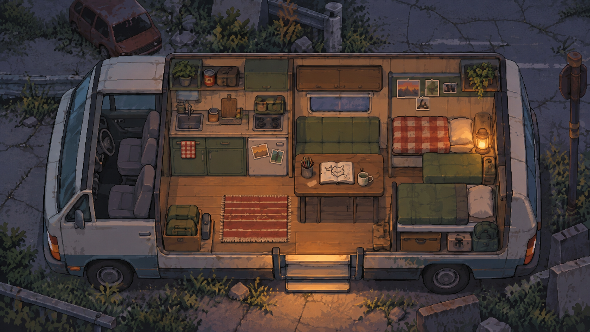

# Live49 · 마지막 여름

따뜻하고 쓸쓸한 아포칼립스 속에서 수혁과 소이가 여행하는 2D 게임의 기획·원화 준비 저장소입니다.

현재는 원화와 제작 기준을 정리하는 단계입니다. 목표 엔진은 Unity 6.6, 렌더링 구성은 URP 2D Renderer이며 Unity 프로젝트는 아직 만들지 않았습니다.

## 첫 플레이 범위

오브젝트 클릭과 정지 행동 포즈로 캠핑카에서 출발 → 편의점 조사 → 물품 획득 또는 조기 귀환 → 저녁 선택과 폴라로이드 대화 → 다음 날의 그림·기록 변화를 연결합니다. 색연필을 가져오지 않은 경우도 진행할 수 있게 합니다.

전체 49일은 내부 개발용 5챕터로 나누는 초안을 작성했습니다. 먼저 1챕터의 첫 3일을 플레이 가능한 시제품으로 검증합니다. 걷기 애니메이션과 자유 이동은 현재 제작 범위에 포함하지 않습니다.

## 시각 기준

현재 합성 배경과 행동 자세는 [챕터 1 장면 수정 v3](art/chapter01/revision-v3/README.ko.md)를 기준으로 합니다. 아래 캠핑카 v1~v3는 별도로 보존한 초기 콘셉트 버전입니다.

높은 시점에서 가로로 보이는 아담한 캠핑카, 따뜻한 실내와 차가운 폐허의 대비를 유지합니다. 원본의 생활감과 은은한 입체감을 살리면서 불규칙한 잔질감을 줄입니다.

| 파일 | 상태 |
| --- | --- |
| [캠핑카 v2](art/concepts/camper-interior-v2.png) | 현재 선호하는 분위기와 구도 기준. 최종 게임 자산은 아님 |
| [캠핑카 v3](art/concepts/camper-interior-v3-base.png) | 조명 분리와 질감 단순화 실험. 최종 화풍으로 채택하지 않음 |
| [캠핑카 v1](art/concepts/camper-interior-v1.png) | 초기 탐색안. 원본과 구도가 달라 보관용 |

## 제작 문서

- [챕터 1 연속 제작 현황](docs/CHAPTER01-PRODUCTION.ko.md)
- [챕터 1 전체 점검 결과](docs/CHAPTER01-REVIEW.ko.md)
- [챕터 1 통합 리소스·미리보기 사용법](art/chapter01/README.ko.md)
- [챕터 1 사건별 리소스 연결표](design/chapter01/RESOURCE-CUES.ko.md)
- [챕터 1 고정 베이스·교체 레이어 제작](art/chapter01/layers/README.ko.md)
- [최신 상호작용 방향: 탐색 위험·캠핑카 확장·편의점](docs/INTERACTION-DIRECTION.ko.md)
- [조사 하이라이트·이름·미니게임 시제품](design/interaction/README.ko.md)
- [첫 3일 리소스 목록과 1차 제작물](docs/RESOURCE-LIST-CH01.ko.md)
- [챕터별 제작 계획 v0.1](docs/DEVELOPMENT-PLAN.ko.md)
- [원화 공간 일관성 기준](art/CONTINUITY.ko.md)
- [캠핑카 내부 첫 확정 후보](art/scenes/01-camper/README.ko.md)
- [원화 제작 목록](docs/ART-PLAN.ko.md)
- [게임 적용 기준](art/concepts/IMPLEMENTATION-NOTES.ko.md)

생성 원화 옆의 `.prompt.txt`에 내장 이미지 생성 도구에서 사용한 프롬프트가 있습니다. 챕터 1은 공통 베이스 3개와 분리 PNG를 조합한 6개 장면·33개 상태의 1차 미리보기까지 연결했습니다. 배치·가림과 작은 화면의 상태 전환을 검사했으며, 확대 선명도 보정·최종 화풍 정리·Unity 적용은 후속 작업입니다. 고정 배경 조명에 포즈를 맞추며 실시간 캐릭터 조명은 필수 범위가 아닙니다.
