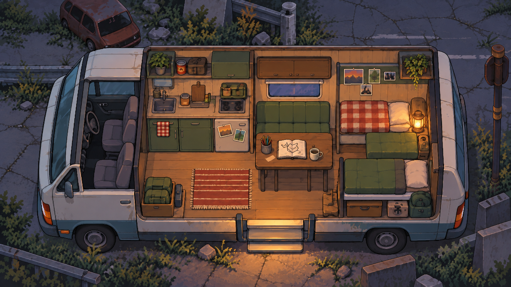

# 01 · 캠핑카 내부

상태: 첫 확정 후보. 사용자 확인 전이며 기존 v2 기준을 대체 확정한 것은 아니다.

v2의 가로형 구도와 저녁 조명을 유지하고 잔질감, 가구 윤곽과 바닥 가독성을 정리한 원화다. 목표 조명 분위기를 포함하는 단일 이미지이며 게임용 레이어는 아직 분리되지 않았다.

## 공간과 상호작용

- 아래쪽 중앙: 출입구와 귀환 지점.
- 왼쪽 러그 및 주방 앞: 주 이동 공간, 요리와 조사.
- 중앙 오른쪽 식탁: 소이와 대화, 색연필 전달, 그림 변화.
- 왼쪽 아래 수납 상자: 물품 보관.
- 오른쪽 침대: 휴식 연출.

## 후속 작업

현재 조작 방향은 오브젝트 클릭 후 고정 행동 포즈로 전환하는 방식이다. 걷기 애니메이션과 자유 이동 충돌 구현을 전제로 하지 않는다. 캐릭터 크기와 위치, 가구 접촉과 가림을 배경 위에서 먼저 검증한다.

배경의 따뜻한 고정 조명을 활용하고, 각 행동 포즈를 해당 위치의 빛에 맞춰 제작한다. 실시간 캐릭터 조명은 필수 범위가 아니다. 필요한 가구 전경, 상호작용 소품, 말풍선은 별도로 처리한다.

폴라로이드 인물 컷은 [공간 일관성 기준](../../CONTINUITY.ko.md)에 따라 이 배경과 같은 가구 배치와 비율을 유지한다. 현재 포즈 배치, 조명 일치, 레이어 정렬, 최종 픽셀 격자 검증은 아직 수행하지 않았다.
