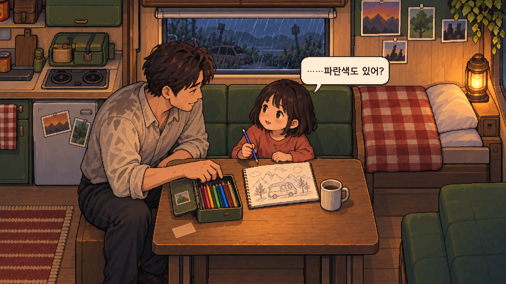

# 연출 시안 01 · 파란 색연필

수혁이 탐색에서 가져온 색연필을 식탁에 놓고, 소이가 파란색을 집어 올려 아빠를 바라보는 순간. 최초 기획서의 확정 사건이 아닌, 교감 연출을 검토하기 위한 추가 제안이다. 인물 외형은 임시 시안이다.

## 연출 의도

전체 캠핑카 화면에서 식탁 중심의 별도 삽화로 전환해 두 사람의 표정과 물건에 시선을 모은다. 단순 확대만으로 원본에서 얻을 수 있는 이미지가 아니라 별도 생성한 연출 삽화다.

## 게임 적용 제안

1. 색연필을 건네는 선택 후 짧게 화면 전환. 빗소리는 이어진다.
2. 이 구도를 보여주고 약 0.6초 후 소이의 말풍선 “……파란색도 있어?”를 표시한다.
3. 플레이어가 읽고 클릭할 때까지 기다린다. 대사 자동 넘김은 강제하지 않는다.
4. 다음 컷에서 종이 긋는 소리와 그림 변화로 이어간다. 다음 컷은 아직 제작하지 않았다.

현재 파일에는 인물·배경·말풍선이 모두 합쳐져 있다. 실제 구현 시 말풍선을 제외한 원화와 별도 UI가 필요하다. 이번 산출물은 정지 연출 이미지이며 사운드, 전환, 클릭 기능은 구현되지 않았다.
