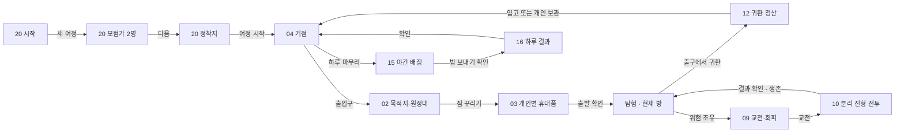
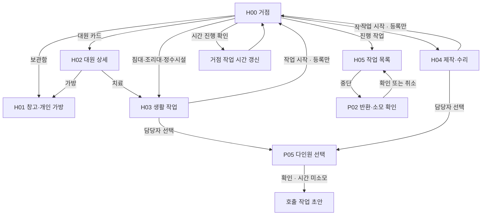
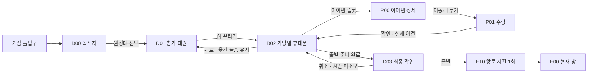
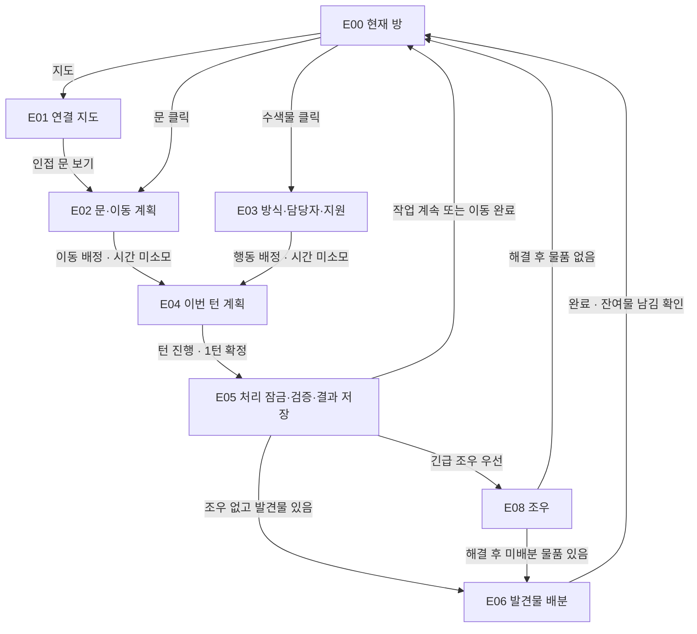
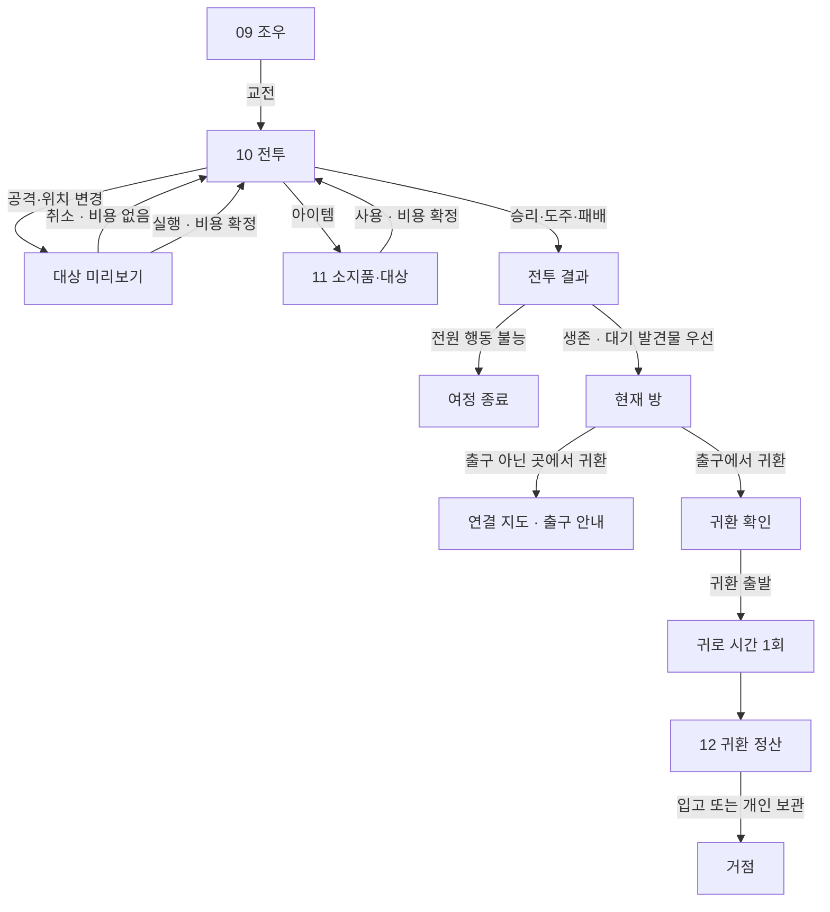
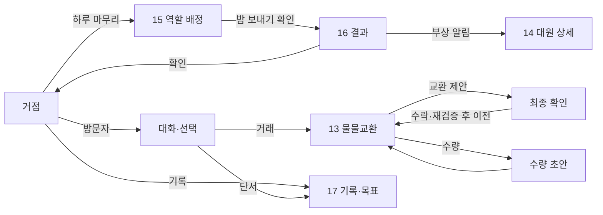
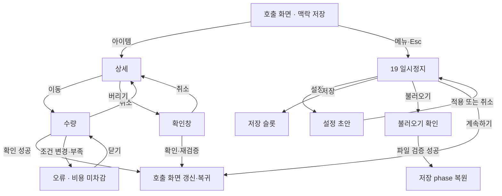

# 인게임 화면·팝업·버튼 연결 명세

작성: 2026-09-23 · 화면/상태 50개 · 버튼/자동 전이 192개.

[클릭형 연결도](index.html) · [상세 규칙·확인창 분기·검증 시나리오](규칙과검토사항.md)

이 문서는 구현 전 명세다. 현재 이미지 문구보다 최신 턴제 방향을 우선한다. 연결도는 핵심 경로 요약이며 아래 버튼 표가 세부 연결을 설명한다. 조건에 따른 분기는 effect/guard와 규칙 문서를 함께 따른다.

## 화면 목록

| ID | 이름 | 종류 | 시안 | 상태 | 역할 |
| --- | --- | --- | --- | --- | --- |
| S00 | 시작 화면 | 화면 | [20](../../%EC%95%84%ED%8A%B8/UI%EC%A0%84%EC%B2%B4%EC%8B%9C%EC%95%88-v1/20-%EC%8B%9C%EC%9E%91%EA%B3%BC%EC%A0%95%EC%B0%A9%EC%A7%80%EC%84%A0%ED%83%9D.png) | 시안 재사용 | 새 여정·이어하기·불러오기 |
| S01 | 초기 모험가 선택 | 화면 | [20](../../%EC%95%84%ED%8A%B8/UI%EC%A0%84%EC%B2%B4%EC%8B%9C%EC%95%88-v1/20-%EC%8B%9C%EC%9E%91%EA%B3%BC%EC%A0%95%EC%B0%A9%EC%A7%80%EC%84%A0%ED%83%9D.png) | 시안 재사용 | 초기 2명 선택. 전체 대원 상한과 무관 |
| S02 | 정착지 선택 | 화면 | [20](../../%EC%95%84%ED%8A%B8/UI%EC%A0%84%EC%B2%B4%EC%8B%9C%EC%95%88-v1/20-%EC%8B%9C%EC%9E%91%EA%B3%BC%EC%A0%95%EC%B0%A9%EC%A7%80%EC%84%A0%ED%83%9D.png) | 시안 재사용 | 시작 정착지와 조건 확인 |
| H00 | 거점 기본 화면 | 화면 | [04](../../%EC%95%84%ED%8A%B8/UI%EC%A0%84%EC%B2%B4%EC%8B%9C%EC%95%88-v1/04-%EA%B1%B0%EC%A0%90%EA%B8%B0%EB%B3%B8%ED%99%94%EB%A9%B4.png) | 시안 있음 | 시설·대원·출입구를 직접 선택 |
| H01 | 공용 창고 / 개인 가방 | 패널 | [01](../../%EC%95%84%ED%8A%B8/UI%EC%A0%84%EC%B2%B4%EC%8B%9C%EC%95%88-v1/01-%EA%B0%9C%EB%B3%84%EC%9D%B8%EB%B2%A4%ED%86%A0%EB%A6%AC.png) | 시안 있음 | 거점에서 두 소유 공간 사이 물자 이동 |
| H02 | 대원 상세 | 패널 | [14](../../%EC%95%84%ED%8A%B8/UI%EC%A0%84%EC%B2%B4%EC%8B%9C%EC%95%88-v1/14-%EB%8C%80%EC%9B%90%EC%83%81%ED%83%9C%EC%99%80%EC%B9%98%EB%A3%8C.png) | 시안 있음 | 상태·장비·가방·치료. 탐험에서는 현장 정보만 |
| H03 | 생활 작업 지정 | 패널 | [05](../../%EC%95%84%ED%8A%B8/UI%EC%A0%84%EC%B2%B4%EC%8B%9C%EC%95%88-v1/05-%EC%83%9D%ED%99%9C%EC%9E%91%EC%97%85%EC%A7%80%EC%A0%95-v2.png) | 시안 재사용 | 휴식·요리·정수·치료의 공통 작업 패널 |
| H04 | 제작 / 수리 / 개선 | 패널 | [06](../../%EC%95%84%ED%8A%B8/UI%EC%A0%84%EC%B2%B4%EC%8B%9C%EC%95%88-v1/06-%EC%A0%9C%EC%9E%91%EC%88%98%EB%A6%AC%EC%99%80%EC%A7%84%ED%96%89%EC%9E%91%EC%97%85-v2.png) | 시안 있음 | 작업 선택, 재료·담당자·시간 확인 |
| H05 | 진행 작업 목록 | 패널 | [06](../../%EC%95%84%ED%8A%B8/UI%EC%A0%84%EC%B2%B4%EC%8B%9C%EC%95%88-v1/06-%EC%A0%9C%EC%9E%91%EC%88%98%EB%A6%AC%EC%99%80%EC%A7%84%ED%96%89%EC%9E%91%EC%97%85-v2.png) | 시안 재사용 | 담당자 변경·중단·완료 확인 |
| H06 | 방문자 대화 | 모달 | [09](../../%EC%95%84%ED%8A%B8/UI%EC%A0%84%EC%B2%B4%EC%8B%9C%EC%95%88-v1/09-%EC%A1%B0%EC%9A%B0%EC%99%80%EC%84%A0%ED%83%9D%EC%9D%B4%EB%B2%A4%ED%8A%B8.png) | 시안 재사용 | 방문 목적과 선택지. 거래·기록 연결 |
| H07 | 물물교환 | 모달 | [13](../../%EC%95%84%ED%8A%B8/UI%EC%A0%84%EC%B2%B4%EC%8B%9C%EC%95%88-v1/13-%EB%B0%A9%EB%AC%B8%EC%9E%90%EA%B1%B0%EB%9E%98.png) | 시안 있음 | 양측 제안 물품과 수량 확인 |
| H08 | 야간 역할 배정 | 모달 | [15](../../%EC%95%84%ED%8A%B8/UI%EC%A0%84%EC%B2%B4%EC%8B%9C%EC%95%88-v1/15-%EC%95%BC%EA%B0%84%EC%97%AD%ED%95%A0%EB%B0%B0%EC%A0%95.png) | 시안 있음 | 휴식·경계 배정. 세부 야간 규칙은 제안 |
| H09 | 하루 결과 | 모달 | [16](../../%EC%95%84%ED%8A%B8/UI%EC%A0%84%EC%B2%B4%EC%8B%9C%EC%95%88-v1/16-%ED%95%98%EB%A3%A8%EA%B2%B0%EA%B3%BC%EC%99%80%EC%95%8C%EB%A6%BC.png) | 시안 있음 | 결과 재열람으로 시간을 다시 진행하지 않음 |
| H10 | 시간 진행 | 모달 | [06](../../%EC%95%84%ED%8A%B8/UI%EC%A0%84%EC%B2%B4%EC%8B%9C%EC%95%88-v1/06-%EC%A0%9C%EC%9E%91%EC%88%98%EB%A6%AC%EC%99%80%EC%A7%84%ED%96%89%EC%9E%91%EC%97%85-v2.png) | 부분 구현 | 15/30/60분 또는 다음 완료까지. 휴식·제작 완료와 기록 조회 |
| D00 | 목적지 지도 | 패널 | [02](../../%EC%95%84%ED%8A%B8/UI%EC%A0%84%EC%B2%B4%EC%8B%9C%EC%95%88-v1/02-%EC%9B%90%EC%A0%95%EA%B3%84%ED%9A%8D.png) | 시안 있음 | 알려진 목적지·왕복 시간·위험 확인 |
| D01 | 원정 대원 선택 | 패널 | [02](../../%EC%95%84%ED%8A%B8/UI%EC%A0%84%EC%B2%B4%EC%8B%9C%EC%95%88-v1/02-%EC%9B%90%EC%A0%95%EA%B3%84%ED%9A%8D.png) | 시안 재사용 | 현재 상태와 원정 참가 조건 확인 |
| D02 | 대원별 짐 꾸리기 | 패널 | [03](../../%EC%95%84%ED%8A%B8/UI%EC%A0%84%EC%B2%B4%EC%8B%9C%EC%95%88-v1/03-%EC%9B%90%EC%A0%95%EC%A7%90%EA%BE%B8%EB%A6%AC%EA%B8%B0-v2.png) | 시안 있음 | 개인 가방마다 휴대품 배분 |
| D03 | 최종 출발 확인 | 모달 | [18](../../%EC%95%84%ED%8A%B8/UI%EC%A0%84%EC%B2%B4%EC%8B%9C%EC%95%88-v1/18-%EA%B3%B5%ED%86%B5%ED%8C%9D%EC%97%85%EA%B3%BC%EC%98%A4%EB%A5%98%EC%83%81%ED%83%9C.png) | 시안 재사용 | 목적지·인원·휴대품·기존 작업 중단 결과 확인 |
| E00 | 현재 방 / 탐험 HUD | 화면 | [07](../../%EC%95%84%ED%8A%B8/UI%EC%A0%84%EC%B2%B4%EC%8B%9C%EC%95%88-v1/07-%ED%83%90%ED%97%98%EC%88%98%EC%83%89%EC%A7%80%EC%A0%95-v2.png) | 추가 필요 | 기존 방 그림 유지, 문·연결 지도·턴 HUD 추가 |
| E01 | 방 연결 지도 | 패널 | — | 추가 필요 | 현재 위치, 미방문·방문·수색 상태 |
| E02 | 문 / 이동 계획 | 패널 | — | 추가 필요 | 잠금·이동 비용·중단할 작업을 확인 |
| E03 | 수색 / 지원 지정 | 패널 | [07](../../%EC%95%84%ED%8A%B8/UI%EC%A0%84%EC%B2%B4%EC%8B%9C%EC%95%88-v1/07-%ED%83%90%ED%97%98%EC%88%98%EC%83%89%EC%A7%80%EC%A0%95-v2.png) | 수정 필요 | 분 표기를 턴으로, 수색 시작 버튼을 행동 배정으로 수정 |
| E04 | 이번 턴 행동 목록 | 패널 | — | 추가 필요 | 대원별 배정·잔여 턴·충돌·원정대 이동을 확인 |
| E05 | 탐험 턴 처리 | 처리 | — | 화면 불필요 | 행동 확정·결과 저장·단일 위험 판정. 중복 실행 잠금 |
| E06 | 발견물 배분 | 모달 | [08](../../%EC%95%84%ED%8A%B8/UI%EC%A0%84%EC%B2%B4%EC%8B%9C%EC%95%88-v1/08-%EB%B0%9C%EA%B2%AC%EB%AC%BC%EA%B3%BC%EA%B0%80%EB%B0%A9%EB%B6%80%EC%A1%B1.png) | 시안 있음 | 현장 컨테이너 → 선택한 대원 가방 |
| E07 | 현장 개인 가방 | 패널 | [01](../../%EC%95%84%ED%8A%B8/UI%EC%A0%84%EC%B2%B4%EC%8B%9C%EC%95%88-v1/01-%EA%B0%9C%EB%B3%84%EC%9D%B8%EB%B2%A4%ED%86%A0%EB%A6%AC.png) | 구현 | 동행 대원 두 가방 비교·양방향 교환. 원격 창고 없음 |
| E08 | 조우 / 선택 이벤트 | 모달 | [09](../../%EC%95%84%ED%8A%B8/UI%EC%A0%84%EC%B2%B4%EC%8B%9C%EC%95%88-v1/09-%EC%A1%B0%EC%9A%B0%EC%99%80%EC%84%A0%ED%83%9D%EC%9D%B4%EB%B2%A4%ED%8A%B8.png) | 시안 있음 | 정보와 조건에 따라 교전·회피·대기 선택 |
| E09 | 귀환 계획 확인 | 모달 | [18](../../%EC%95%84%ED%8A%B8/UI%EC%A0%84%EC%B2%B4%EC%8B%9C%EC%95%88-v1/18-%EA%B3%B5%ED%86%B5%ED%8C%9D%EC%97%85%EA%B3%BC%EC%98%A4%EB%A5%98%EC%83%81%ED%83%9C.png) | 시안 재사용 | 실제 출구 도달 뒤 귀환 이동·남길 물자·중단 작업 확인 |
| E10 | 왕복 이동 처리 | 처리 | — | 화면 불필요 | 출발/귀환 목적을 보관하고 이동 시간을 한 번만 차감 |
| B00 | 분리 진형 전투 | 화면 | [10](../../%EC%95%84%ED%8A%B8/UI%EC%A0%84%EC%B2%B4%EC%8B%9C%EC%95%88-v1/10-%EB%B6%84%EB%A6%AC%EC%A7%84%ED%98%95%EC%A0%84%ED%88%AC.png) | 부분 구현 · 시제품 | 양 진영 3×3·근접·사격·방어·철수 연결. 아이템/메뉴 후속 |
| B01 | 공격 / 이동 대상 선택 | 패널 | [10](../../%EC%95%84%ED%8A%B8/UI%EC%A0%84%EC%B2%B4%EC%8B%9C%EC%95%88-v1/10-%EB%B6%84%EB%A6%AC%EC%A7%84%ED%98%95%EC%A0%84%ED%88%AC.png) | 부분 구현 · 시제품 | 대상과 명중·피해·이동 위치 미리보기 |
| B02 | 전투 아이템 / 대상 | 패널 | [11](../../%EC%95%84%ED%8A%B8/UI%EC%A0%84%EC%B2%B4%EC%8B%9C%EC%95%88-v1/11-%EC%A0%84%ED%88%AC%EC%95%84%EC%9D%B4%ED%85%9C%EA%B3%BC%EB%8C%80%EC%83%81-v2.png) | 시안 있음 | 현재 행동 대원의 소지품과 유효한 대상 |
| B03 | 전투 결과 | 모달 | [12](../../%EC%95%84%ED%8A%B8/UI%EC%A0%84%EC%B2%B4%EC%8B%9C%EC%95%88-v1/12-%EA%B7%80%ED%99%98%EC%A0%95%EC%82%B0.png) | 시제품 구현 | 승리·도주·패배를 결과 데이터로 구분 |
| B04 | 여정 종료 / 전멸 | 모달 | [12](../../%EC%95%84%ED%8A%B8/UI%EC%A0%84%EC%B2%B4%EC%8B%9C%EC%95%88-v1/12-%EA%B7%80%ED%99%98%EC%A0%95%EC%82%B0.png) | 부분 구현 · 시제품 | 전원 행동 불능 시 시작 화면. 불러오기/저장 후속 |
| R00 | 귀환 정산 | 모달 | [12](../../%EC%95%84%ED%8A%B8/UI%EC%A0%84%EC%B2%B4%EC%8B%9C%EC%95%88-v1/12-%EA%B7%80%ED%99%98%EC%A0%95%EC%82%B0.png) | 부분 구현 | 출발/귀환 수량과 체력 비교. 개인 가방 또는 전원 입고. 최근 기록 재열람 |
| C00 | 기록 / 목표 | 패널 | [17](../../%EC%95%84%ED%8A%B8/UI%EC%A0%84%EC%B2%B4%EC%8B%9C%EC%95%88-v1/17-%EA%B8%B0%EB%A1%9D%EA%B3%BC%EB%AA%A9%ED%91%9C.png) | 시안 있음 | 단서·장소·목표와 관련 화면 이동 |
| C01 | 일시정지 메뉴 | 모달 | [19](../../%EC%95%84%ED%8A%B8/UI%EC%A0%84%EC%B2%B4%EC%8B%9C%EC%95%88-v1/19-%EC%9D%BC%EC%8B%9C%EC%A0%95%EC%A7%80%EC%99%80%EC%84%A4%EC%A0%95.png) | 시안 재사용 | 복귀·설정·저장·불러오기·타이틀 |
| C02 | 설정 | 모달 | [19](../../%EC%95%84%ED%8A%B8/UI%EC%A0%84%EC%B2%B4%EC%8B%9C%EC%95%88-v1/19-%EC%9D%BC%EC%8B%9C%EC%A0%95%EC%A7%80%EC%99%80%EC%84%A4%EC%A0%95.png) | 시안 재사용 | 설정 초안 미리보기 후 적용/취소 |
| C03 | 저장 목록 | 모달 | [19](../../%EC%95%84%ED%8A%B8/UI%EC%A0%84%EC%B2%B4%EC%8B%9C%EC%95%88-v1/19-%EC%9D%BC%EC%8B%9C%EC%A0%95%EC%A7%80%EC%99%80%EC%84%A4%EC%A0%95.png) | 시안 재사용 | 안전한 처리 경계에서 저장. 슬롯 덮어쓰기 확인 |
| C04 | 불러오기 목록 | 모달 | [19](../../%EC%95%84%ED%8A%B8/UI%EC%A0%84%EC%B2%B4%EC%8B%9C%EC%95%88-v1/19-%EC%9D%BC%EC%8B%9C%EC%A0%95%EC%A7%80%EC%99%80%EC%84%A4%EC%A0%95.png) | 시안 재사용 | 파일 유효성 검증 후 현재 상태 교체 |
| P00 | 아이템 상세 | 팝업 | [18](../../%EC%95%84%ED%8A%B8/UI%EC%A0%84%EC%B2%B4%EC%8B%9C%EC%95%88-v1/18-%EA%B3%B5%ED%86%B5%ED%8C%9D%EC%97%85%EA%B3%BC%EC%98%A4%EB%A5%98%EC%83%81%ED%83%9C.png) | 시안 재사용 | 현재 맥락에서 가능한 이동·장착·사용·폐기만 노출 |
| P01 | 수량 선택 | 모달 | [18](../../%EC%95%84%ED%8A%B8/UI%EC%A0%84%EC%B2%B4%EC%8B%9C%EC%95%88-v1/18-%EA%B3%B5%ED%86%B5%ED%8C%9D%EC%97%85%EA%B3%BC%EC%98%A4%EB%A5%98%EC%83%81%ED%83%9C.png) | 시안 재사용 | 소유자·대상 가방·실제 수용량 재검증 |
| P02 | 확인창 | 모달 | [18](../../%EC%95%84%ED%8A%B8/UI%EC%A0%84%EC%B2%B4%EC%8B%9C%EC%95%88-v1/18-%EA%B3%B5%ED%86%B5%ED%8C%9D%EC%97%85%EA%B3%BC%EC%98%A4%EB%A5%98%EC%83%81%ED%83%9C.png) | 시안 재사용 | 안전한 기본 선택은 취소. 작업별 confirmActionId |
| P03 | 부족 / 오류 알림 | 팝업 | [18](../../%EC%95%84%ED%8A%B8/UI%EC%A0%84%EC%B2%B4%EC%8B%9C%EC%95%88-v1/18-%EA%B3%B5%ED%86%B5%ED%8C%9D%EC%97%85%EA%B3%BC%EC%98%A4%EB%A5%98%EC%83%81%ED%83%9C.png) | 시안 재사용 | 원인과 해결 경로. 실패한 조작은 차감 없음 |
| P04 | 튜토리얼 안내 | 팝업 | [18](../../%EC%95%84%ED%8A%B8/UI%EC%A0%84%EC%B2%B4%EC%8B%9C%EC%95%88-v1/18-%EA%B3%B5%ED%86%B5%ED%8C%9D%EC%97%85%EA%B3%BC%EC%98%A4%EB%A5%98%EC%83%81%ED%83%9C.png) | 시안 재사용 | 해당 버튼 안내. 임의로 실행하지 않음 |
| P05 | 담당자 선택 | 팝업 | [05](../../%EC%95%84%ED%8A%B8/UI%EC%A0%84%EC%B2%B4%EC%8B%9C%EC%95%88-v1/05-%EC%83%9D%ED%99%9C%EC%9E%91%EC%97%85%EC%A7%80%EC%A0%95-v2.png) | 시안 재사용 | 다인원 스크롤과 상태 필터. 상한 2명 금지 |
| P06 | 완료 / 결과 알림 | 알림 | [16](../../%EC%95%84%ED%8A%B8/UI%EC%A0%84%EC%B2%B4%EC%8B%9C%EC%95%88-v1/16-%ED%95%98%EB%A3%A8%EA%B2%B0%EA%B3%BC%EC%99%80%EC%95%8C%EB%A6%BC.png) | 시안 재사용 | 작업·수색·단서 결과. 모달 위 강제 전환 금지 |
| RETURN | 호출 화면으로 복귀 | 복귀 | — | 화면 불필요 | returnRoute와 선택·스크롤·방·전투 맥락 복원 |
| RESTORE | 저장 상태 복원 | 처리 | — | 화면 불필요 | 검증된 저장 데이터의 phase별 화면 복원 |
| QUIT | 게임 종료 | 종료 | — | 화면 불필요 | 종료 확인 후 애플리케이션 종료 |

## 전체 진행

## 거점 오브젝트와 팝업

## 원정 준비와 소유권

## 방 연결과 탐험 턴

## 전투와 귀환

## 방문자·야간·기록

## 공통 팝업과 복귀

## S00 · 시작 화면

새 여정·이어하기·불러오기

| 버튼 ID | 누르는 대상 / 발생 조건 | 연결 | 동작 | 시간 | 조건 / 실패 | 취소 / 복귀 |
| --- | --- | --- | --- | --- | --- | --- |
| S00.01 | 새 여정 | S01 · 전환 | 저장 데이터가 있으면 P02로 덮어쓰기 여부 먼저 확인 | 0 | 기존 저장 자동 삭제 금지 | S00 |
| S00.02 | 이어하기 | RESTORE · 전환 | 최근 유효 저장 선택·검증·복원 | 0 | 유효 저장이 없으면 비활성 / 오류 P03 | S00 |
| S00.03 | 불러오기 | C04 · 열기 | 조회/선택만 변경 | 0 | 없음 | 호출 화면 복귀 |
| S00.04 | 설정 | C02 · 열기 | 조회/선택만 변경 | 0 | 없음 | 호출 화면 복귀 |
| S00.05 | 종료 | P02 · 열기 | confirm=Quit → QUIT | 0 | 없음 | S00 |

## S01 · 초기 모험가 선택

초기 2명 선택. 전체 대원 상한과 무관

| 버튼 ID | 누르는 대상 / 발생 조건 | 연결 | 동작 | 시간 | 조건 / 실패 | 취소 / 복귀 |
| --- | --- | --- | --- | --- | --- | --- |
| S01.01 | 후보 카드 / 선택 해제 | S01 · 내부 선택 | 초기 선택 초안 갱신 | 0 | 중복 선택 금지 / 초기 2명은 제안 아닌 기존 방향 | S00 |
| S01.02 | 다음 | S02 · 전환 | 대원 선택 초안 전달 | 0 | 초기 인원 조건 충족 | S01 |
| S01.03 | 뒤로 | S00 · 열기 | 조회/선택만 변경 | 0 | 없음 | 호출 화면 복귀 |

## S02 · 정착지 선택

시작 정착지와 조건 확인

| 버튼 ID | 누르는 대상 / 발생 조건 | 연결 | 동작 | 시간 | 조건 / 실패 | 취소 / 복귀 |
| --- | --- | --- | --- | --- | --- | --- |
| S02.01 | 정착지 카드 | S02 · 내부 선택 | 정착지 선택 초안 갱신 | 0 | 선택 가능한 장소 | S01 |
| S02.02 | 여정 시작 | H00 · 전환 | 새 여정 생성. 기존 저장 교체는 확인 이후만 | 0 | 대원·정착지 선택 완료 | S01 |
| S02.03 | 뒤로 | S01 · 열기 | 조회/선택만 변경 | 0 | 없음 | 호출 화면 복귀 |

## H00 · 거점 기본 화면

시설·대원·출입구를 직접 선택

| 버튼 ID | 누르는 대상 / 발생 조건 | 연결 | 동작 | 시간 | 조건 / 실패 | 취소 / 복귀 |
| --- | --- | --- | --- | --- | --- | --- |
| H00.01 | 보관함 클릭 | H01 · 열기 | 조회/선택만 변경 | 0 | 없음 | 호출 화면 복귀 |
| H00.02 | 대원 상태 카드 | H02 · 열기 | 선택 대원 ID 전달 | 0 | 없음 | 호출 화면 복귀 |
| H00.03 | 침대 / 조리대 / 정수시설 클릭 | H03 · 열기 | 시설과 가능한 작업 전달 | 0 | 없음 | 호출 화면 복귀 |
| H00.04 | 작업대 클릭 | H04 · 열기 | 조회/선택만 변경 | 0 | 없음 | 호출 화면 복귀 |
| H00.05 | 진행 작업 버튼 | H05 · 열기 | 조회/선택만 변경 | 0 | 없음 | 호출 화면 복귀 |
| H00.06 | 출입구 / 원정 버튼 | D00 · 열기 | 조회/선택만 변경 | 0 | 없음 | 호출 화면 복귀 |
| H00.07 | 방문자 클릭 | H06 · 열기 | 방문 이벤트 전달 | 0 | 방문자가 있을 때 | 호출 화면 복귀 |
| H00.08 | 하루 마무리 | H08 · 열기 | 조회/선택만 변경 | 0 | 없음 | 호출 화면 복귀 |
| H00.09 | 시간 진행 | H10 · 열기 | 예약 작업과 완료 예정 미리보기 | 0 | 정착지에서만 | H00 |
| H00.10 | 기록 | C00 · 열기 | 조회/선택만 변경 | 0 | 없음 | 호출 화면 복귀 |
| H00.11 | 메뉴 / Esc | C01 · 열기 | 조회/선택만 변경 | 0 | 없음 | 호출 화면 복귀 |
| H00.12 | 최초 시설 안내 | P04 · 자동 | 조건부 자동 안내 | 0 | 해당 안내 미완료 | H00 |
| H00.13 | 기록 · 최근 원정 | R00 · 열기 | 귀환 시점 기록 재열람 | 0 | 원정 기록이 있을 때 | H00 |

## H01 · 공용 창고 / 개인 가방

거점에서 두 소유 공간 사이 물자 이동

| 버튼 ID | 누르는 대상 / 발생 조건 | 연결 | 동작 | 시간 | 조건 / 실패 | 취소 / 복귀 |
| --- | --- | --- | --- | --- | --- | --- |
| H01.01 | 대원 카드 / 창고 탭 | H01 · 내부 선택 | 선택 소유자만 변경 | 0 | 존재하는 대원 | H00 |
| H01.02 | 아이템 슬롯 | P00 · 열기 | context=shelter, sourceOwnerId 전달 | 0 | 없음 | 호출 화면 복귀 |
| H01.03 | 전체 옮기기 | H01 · 내부 실행 | 수용 가능한 수량만 원자적으로 이전, 남은 수량 안내 | 0 | 출발지/목적지 다름 / 예약 재료 제외 | H01 |
| H01.04 | 닫기 | RETURN · 열기 | 조회/선택만 변경 | 0 | 없음 | 호출 화면 복귀 |

## H02 · 대원 상세

상태·장비·가방·치료. 탐험에서는 현장 정보만

| 버튼 ID | 누르는 대상 / 발생 조건 | 연결 | 동작 | 시간 | 조건 / 실패 | 취소 / 복귀 |
| --- | --- | --- | --- | --- | --- | --- |
| H02.01 | 가방 | H01 · 열기 | 거점 맥락일 때 개인 가방 | 0 | 없음 | 호출 화면 복귀 |
| H02.02 | 현장 가방 | E07 · 열기 | 탐험 맥락일 때 동행 가방 | 0 | 현장에는 창고 탭 없음 | 호출 화면 복귀 |
| H02.03 | 치료 | H03 · 열기 | 거점 치료 작업·대상 고정 | 0 | 거점 상태 / 치료 필요 | 호출 화면 복귀 |
| H02.04 | 현장 치료품 보기 | E07 · 열기 | 현장 소지품으로만 치료 경로 제공 | 0 | 전투 중에는 B02 경유 | 호출 화면 복귀 |
| H02.05 | 닫기 | RETURN · 열기 | 조회/선택만 변경 | 0 | 없음 | 호출 화면 복귀 |

## H03 · 생활 작업 지정

휴식·요리·정수·치료의 공통 작업 패널

| 버튼 ID | 누르는 대상 / 발생 조건 | 연결 | 동작 | 시간 | 조건 / 실패 | 취소 / 복귀 |
| --- | --- | --- | --- | --- | --- | --- |
| H03.01 | 작업 / 레시피 선택 | H03 · 내부 선택 | 비용·예상 시간·결과 미리보기 | 0 | 해금·시설 조건 | RETURN |
| H03.02 | 담당자 선택 | P05 · 열기 | facilityId와 jobId 전달 | 0 | 없음 | 호출 화면 복귀 |
| H03.03 | 작업 시작 | H00 · 확정 | 조건 재검증 후 작업 등록·재료 예약. 배정만으로 시간 진행 없음 | 0 | 담당자·시설·재료 조건 / 변경 시 P03 | H03 |
| H03.04 | 취소 / 닫기 | RETURN · 열기 | 초안 폐기. 등록된 다른 작업은 유지 | 0 | 없음 | 호출 화면 복귀 |

## H04 · 제작 / 수리 / 개선

작업 선택, 재료·담당자·시간 확인

| 버튼 ID | 누르는 대상 / 발생 조건 | 연결 | 동작 | 시간 | 조건 / 실패 | 취소 / 복귀 |
| --- | --- | --- | --- | --- | --- | --- |
| H04.01 | 작업 / 레시피 선택 | H04 · 내부 선택 | 비용·예상 시간·결과 미리보기 | 0 | 해금·시설 조건 | RETURN |
| H04.02 | 담당자 선택 | P05 · 열기 | facilityId와 jobId 전달 | 0 | 없음 | 호출 화면 복귀 |
| H04.03 | 작업 시작 | H00 · 확정 | 조건 재검증 후 작업 등록·재료 예약. 배정만으로 시간 진행 없음 | 0 | 담당자·시설·재료 조건 / 변경 시 P03 | H04 |
| H04.04 | 취소 / 닫기 | RETURN · 열기 | 초안 폐기. 등록된 다른 작업은 유지 | 0 | 없음 | 호출 화면 복귀 |

## H05 · 진행 작업 목록

담당자 변경·중단·완료 확인

| 버튼 ID | 누르는 대상 / 발생 조건 | 연결 | 동작 | 시간 | 조건 / 실패 | 취소 / 복귀 |
| --- | --- | --- | --- | --- | --- | --- |
| H05.01 | 작업 행 | H05 · 내부 선택 | 진행도·잔여 시간·담당자 상세 | 0 | 없음 | H00 |
| H05.02 | 담당자 변경 | P05 · 열기 | 현재 작업 맥락 전달 | 0 | 교체 가능한 작업 단계 | 호출 화면 복귀 |
| H05.03 | 중단 | P02 · 열기 | confirm=CancelJob → H05. 반환/소모 재료를 미리 표시 | 0 | 중단 가능 | H05 |
| H05.04 | 닫기 | RETURN · 열기 | 조회/선택만 변경 | 0 | 없음 | 호출 화면 복귀 |

## H06 · 방문자 대화

방문 목적과 선택지. 거래·기록 연결

| 버튼 ID | 누르는 대상 / 발생 조건 | 연결 | 동작 | 시간 | 조건 / 실패 | 취소 / 복귀 |
| --- | --- | --- | --- | --- | --- | --- |
| H06.01 | 대화 선택지 | H06 · 내부 실행 | 이벤트별 선택 결과·기록 갱신 | 이벤트별 사전 표시 | 요구 조건 충족 | H06 |
| H06.02 | 거래하기 | H07 · 열기 | 조회/선택만 변경 | 0 | 없음 | 호출 화면 복귀 |
| H06.03 | 단서 보기 | C00 · 열기 | 조회/선택만 변경 | 0 | 없음 | 호출 화면 복귀 |
| H06.04 | 대화 종료 | H00 · 열기 | 조회/선택만 변경 | 0 | 없음 | 호출 화면 복귀 |

## H07 · 물물교환

양측 제안 물품과 수량 확인

| 버튼 ID | 누르는 대상 / 발생 조건 | 연결 | 동작 | 시간 | 조건 / 실패 | 취소 / 복귀 |
| --- | --- | --- | --- | --- | --- | --- |
| H07.01 | 물품 / 수량 선택 | P01 · 열기 | mode=tradeDraft. 가방 이전 없이 제안만 편집 | 0 | 없음 | 호출 화면 복귀 |
| H07.02 | 교환 제안 | P02 · 열기 | confirm=Trade → H07. 수락·재고 재검증 뒤 양쪽 소유권 동시 교환 | 0 | 상대 수락 조건 / 재고 / 수용량 | H07 |
| H07.03 | 닫기 | H06 · 열기 | 미확정 거래 초안 폐기 | 0 | 없음 | 호출 화면 복귀 |

## H08 · 야간 역할 배정

휴식·경계 배정. 세부 야간 규칙은 제안

| 버튼 ID | 누르는 대상 / 발생 조건 | 연결 | 동작 | 시간 | 조건 / 실패 | 취소 / 복귀 |
| --- | --- | --- | --- | --- | --- | --- |
| H08.01 | 대원별 역할 | P05 · 열기 | 야간 역할 초안 갱신 | 0 | 없음 | 호출 화면 복귀 |
| H08.02 | 밤 보내기 | P02 · 열기 | confirm=AdvanceNight → H09. 야간 결과 저장 | 야간 1회 | 원정 미복귀는 차단 제안 / 침대·경계 부족은 경고 | H08 |
| H08.03 | 취소 | H00 · 열기 | 조회/선택만 변경 | 0 | 없음 | 호출 화면 복귀 |

## H09 · 하루 결과

결과 재열람으로 시간을 다시 진행하지 않음

| 버튼 ID | 누르는 대상 / 발생 조건 | 연결 | 동작 | 시간 | 조건 / 실패 | 취소 / 복귀 |
| --- | --- | --- | --- | --- | --- | --- |
| H09.01 | 부상 대원 알림 | H02 · 열기 | 조회/선택만 변경 | 0 | 없음 | 호출 화면 복귀 |
| H09.02 | 완료 작업 알림 | H05 · 열기 | 조회/선택만 변경 | 0 | 없음 | 호출 화면 복귀 |
| H09.03 | 확인 / 닫기 | H00 · 열기 | 결과 읽음 처리. 시간 추가 차감 없음 | 0 | 없음 | 호출 화면 복귀 |

## H10 · 시간 진행

15/30/60분 또는 다음 완료까지. 휴식·제작 완료와 기록 조회

| 버튼 ID | 누르는 대상 / 발생 조건 | 연결 | 동작 | 시간 | 조건 / 실패 | 취소 / 복귀 |
| --- | --- | --- | --- | --- | --- | --- |
| H10.01 | 15분 / 30분 / 1시간 / 다음 완료까지 | H10 · 내부 선택 | 소요 시간과 완료 예정 갱신 | 0 | 다음 완료는 작업이 있을 때 | H00 |
| H10.02 | 시간 진행 확정 | H10 · 확정 | 시계·작업 남은 시간·회복·생산·시설 효과 반영 | 선택한 분 | 중복 지급 없음 | H00 |
| H10.03 | 돌아가기 | H00 · 열기 | 추가 시간 소모 없이 닫기 | 0 | 없음 | 호출 화면 복귀 |

## D00 · 목적지 지도

알려진 목적지·왕복 시간·위험 확인

| 버튼 ID | 누르는 대상 / 발생 조건 | 연결 | 동작 | 시간 | 조건 / 실패 | 취소 / 복귀 |
| --- | --- | --- | --- | --- | --- | --- |
| D00.01 | 목적지 마커 | D00 · 내부 선택 | 목적지 정보 선택 | 0 | 알려진 장소 | H00 |
| D00.02 | 원정대 선택 | D01 · 열기 | destinationId 전달 | 0 | 접근 가능한 목적지 | D00 |
| D00.03 | 취소 | H00 · 열기 | 조회/선택만 변경 | 0 | 없음 | 호출 화면 복귀 |

## D01 · 원정 대원 선택

현재 상태와 원정 참가 조건 확인

| 버튼 ID | 누르는 대상 / 발생 조건 | 연결 | 동작 | 시간 | 조건 / 실패 | 취소 / 복귀 |
| --- | --- | --- | --- | --- | --- | --- |
| D01.01 | 참가 / 제외 | D01 · 내부 선택 | 원정 구성 초안 갱신 | 0 | 부상·작업 상태 검증 / 상한은 데이터 | D00 |
| D01.02 | 짐 꾸리기 | D02 · 열기 | 선택한 원정대 전달 | 0 | 참가자 한 명 이상 등 데이터 조건 | D01 |
| D01.03 | 뒤로 | D00 · 열기 | 조회/선택만 변경 | 0 | 없음 | 호출 화면 복귀 |

## D02 · 대원별 짐 꾸리기

개인 가방마다 휴대품 배분

| 버튼 ID | 누르는 대상 / 발생 조건 | 연결 | 동작 | 시간 | 조건 / 실패 | 취소 / 복귀 |
| --- | --- | --- | --- | --- | --- | --- |
| D02.01 | 아이템 슬롯 | P00 · 열기 | context=packing, 개인 가방/창고 소유자 전달 | 0 | 없음 | 호출 화면 복귀 |
| D02.02 | 대원 전환 | D02 · 내부 선택 | 다른 대원 짐 확인 | 0 | 원정 참가자 | D01 |
| D02.03 | 출발 준비 완료 | D03 · 열기 | 휴대품·목적지·작업 중단 결과 요약 | 0 | 필수 조건 부족 차단 / 권장품 부족은 경고 | D02 |
| D02.04 | 뒤로 | D01 · 열기 | 이미 옮긴 물품은 해당 가방에 유지. 이동을 몰래 되돌리지 않음 | 0 | 없음 | 호출 화면 복귀 |

## D03 · 최종 출발 확인

목적지·인원·휴대품·기존 작업 중단 결과 확인

| 버튼 ID | 누르는 대상 / 발생 조건 | 연결 | 동작 | 시간 | 조건 / 실패 | 취소 / 복귀 |
| --- | --- | --- | --- | --- | --- | --- |
| D03.01 | 출발 | E10 · 확정 | travelKind=outbound. 원정 상태 변경·거점 작업 정리 | 왕로 이동 시간 1회 | 최종 재검증 / 연타 잠금 | D02 |
| D03.02 | 취소 | D02 · 열기 | 조회/선택만 변경 | 0 | 없음 | 호출 화면 복귀 |

## E00 · 현재 방 / 탐험 HUD

기존 방 그림 유지, 문·연결 지도·턴 HUD 추가

| 버튼 ID | 누르는 대상 / 발생 조건 | 연결 | 동작 | 시간 | 조건 / 실패 | 취소 / 복귀 |
| --- | --- | --- | --- | --- | --- | --- |
| E00.01 | 방 연결 지도 | E01 · 열기 | 조회/선택만 변경 | 0 | 없음 | 호출 화면 복귀 |
| E00.02 | 문 클릭 | E02 · 열기 | 인접 방·문 상태 전달 | 0 | 없음 | 호출 화면 복귀 |
| E00.03 | 상자 / 선반 등 수색물 클릭 | E03 · 열기 | roomId와 containerId 전달 | 0 | 수색 가능한 사물 | 호출 화면 복귀 |
| E00.04 | 대원 행동 카드 / 턴 계획 | E04 · 열기 | 조회/선택만 변경 | 0 | 없음 | 호출 화면 복귀 |
| E00.05 | 턴 진행 | E05 · 확정 | 현재 배정 확인 후 단일 턴 확정 | 탐험 1턴 | 행동 충돌 없음 / 전원 대기는 P02에서 확인 / 연타 금지 | E00 |
| E00.06 | 가방 | E07 · 열기 | 조회/선택만 변경 | 0 | 없음 | 호출 화면 복귀 |
| E00.07 | 대원 상태 | H02 · 열기 | context=field | 0 | 없음 | 호출 화면 복귀 |
| E00.08 | 출구 클릭 / 귀환 | E09 · 열기 | 출구에서만 귀환 이동 시작 가능 | 0 | 출구 밖에서는 E01로 복귀 경로 안내 | 호출 화면 복귀 |
| E00.09 | 기록 | C00 · 열기 | 조회/선택만 변경 | 0 | 없음 | 호출 화면 복귀 |
| E00.10 | 메뉴 / Esc | C01 · 열기 | 조회/선택만 변경 | 0 | 없음 | 호출 화면 복귀 |

## E01 · 방 연결 지도

현재 위치, 미방문·방문·수색 상태

| 버튼 ID | 누르는 대상 / 발생 조건 | 연결 | 동작 | 시간 | 조건 / 실패 | 취소 / 복귀 |
| --- | --- | --- | --- | --- | --- | --- |
| E01.01 | 방 노드 선택 | E01 · 내부 선택 | 방문 정보와 경로 보기. 선택만으로 이동하지 않음 | 0 | 미방문 실내 정보 숨김 | E00 |
| E01.02 | 인접 문 보기 | E02 · 열기 | 선택한 인접 문 표시 | 0 | 현재 방과 연결된 문 | 호출 화면 복귀 |
| E01.03 | 닫기 | RETURN · 열기 | 조회/선택만 변경 | 0 | 없음 | 호출 화면 복귀 |

## E02 · 문 / 이동 계획

잠금·이동 비용·중단할 작업을 확인

| 버튼 ID | 누르는 대상 / 발생 조건 | 연결 | 동작 | 시간 | 조건 / 실패 | 취소 / 복귀 |
| --- | --- | --- | --- | --- | --- | --- |
| E02.01 | 이동 배정 | E04 · 배정 | 원정대 공통 이동 초안. 중단 작업이 있으면 P02 확인 후 배정 | 0 | 열린 문 / 인접 방 / 이동 가능한 원정대 | E02 |
| E02.02 | 잠금 해제 배정 | E04 · 배정 | 도구·담당자·비용을 가진 작업으로 배정 | 0 | 필요 도구와 능력 조건 / 비용은 데이터 | E02 |
| E02.03 | 취소 | E00 · 열기 | 조회/선택만 변경 | 0 | 없음 | 호출 화면 복귀 |

## E03 · 수색 / 지원 지정

분 표기를 턴으로, 수색 시작 버튼을 행동 배정으로 수정

| 버튼 ID | 누르는 대상 / 발생 조건 | 연결 | 동작 | 시간 | 조건 / 실패 | 취소 / 복귀 |
| --- | --- | --- | --- | --- | --- | --- |
| E03.01 | 빠름 / 보통 / 정밀 | E03 · 내부 선택 | 수색 방식 초안 갱신 | 0 | 예상 턴·소음 표시 | E00 |
| E03.02 | 담당자 / 지원 선택 | E03 · 내부 선택 | 실제 동행 대원 선택. 조명은 다른 생존 동료의 손전등 필요; 기본 +20%p, 중첩 없음 | 0 | 휴대 가방/행동 가능 조건 재검증 | E03 |
| E03.03 | 행동 배정 | E04 · 배정 | 작업 초안 등록. 물품·시간 차감 없음 | 0 | 사물 수색도 / 담당자 / 지원 장비 / 배정 중복 | E03 |
| E03.04 | 취소 | E00 · 열기 | 조회/선택만 변경 | 0 | 없음 | 호출 화면 복귀 |

## E04 · 이번 턴 행동 목록

대원별 배정·잔여 턴·충돌·원정대 이동을 확인

| 버튼 ID | 누르는 대상 / 발생 조건 | 연결 | 동작 | 시간 | 조건 / 실패 | 취소 / 복귀 |
| --- | --- | --- | --- | --- | --- | --- |
| E04.01 | 대원 행동 수정 | E03 · 열기 | 선택 수색 작업을 편집. 이동 작업은 E02로 분기 | 0 | 없음 | 호출 화면 복귀 |
| E04.02 | 행동 해제 | E04 · 내부 선택 | 초안 해제. 진행 작업 중단은 P02 경유 | 0 | 진행 작업과 새 초안 구분 | E04 |
| E04.03 | 턴 진행 | E05 · 확정 | 배정 전체를 한 번에 확정 | 탐험 1턴 | 충돌·자원·도구 재검증 / 전원 대기 P02 확인 | E04 |
| E04.04 | 닫기 | E00 · 열기 | 배정 초안은 유지 | 0 | 없음 | 호출 화면 복귀 |

## E05 · 탐험 턴 처리

행동 확정·결과 저장·단일 위험 판정. 중복 실행 잠금

| 버튼 ID | 누르는 대상 / 발생 조건 | 연결 | 동작 | 시간 | 조건 / 실패 | 취소 / 복귀 |
| --- | --- | --- | --- | --- | --- | --- |
| E05.01 | 턴 결과: 긴급 조우 | E08 · 자동 | 완료 결과 먼저 저장, 미배분 발견물은 대기열 보존 | 이미 소비한 턴 | 위험 판정은 원정대 턴당 1회 | 취소 없음 |
| E05.02 | 턴 결과: 발견물 | E06 · 자동 | 이번 처리 ID의 현장 물품 목록을 열기 | 이미 소비한 턴 | 긴급 조우가 없고 배분 대상 있음 | 취소 없음 |
| E05.03 | 턴 결과: 작업 진행 / 이동 완료 | E00 · 자동 | 잔여 턴·방·문·수색도 갱신 및 알림 | 이미 소비한 턴 | 위 결과가 없을 때 | 취소 없음 |
| E05.04 | 턴 확정 전 검증 실패 | P03 · 자동 | 현재 배정 복원. 턴 ID를 소비 완료로 기록하지 않음 | 0 | 도구·대원·배정 충돌 등 실패 | E00 또는 E04 |
| E05.05 | 일반 완료 알림 | P06 · 알림 | 기본 화면 복귀와 함께 비차단 알림 큐에 등록 | 이미 소비한 턴 | 상위 긴급 모달 처리 후 표시 | 현재 화면 유지 |

## E06 · 발견물 배분

현장 컨테이너 → 선택한 대원 가방

| 버튼 ID | 누르는 대상 / 발생 조건 | 연결 | 동작 | 시간 | 조건 / 실패 | 취소 / 복귀 |
| --- | --- | --- | --- | --- | --- | --- |
| E06.01 | 아이템 / 수량 선택 | P01 · 열기 | mode=loot. 현장 → 대원 가방 | 0 | 없음 | 호출 화면 복귀 |
| E06.02 | 받을 대원 전환 | E06 · 내부 선택 | 가방 소유자와 여유 표시 | 0 | 동행 대원 | E06 |
| E06.03 | 가방 정리 | E07 · 열기 | returnRoute=E06 | 0 | 없음 | 호출 화면 복귀 |
| E06.04 | 가능한 만큼 줍기 | E06 · 내부 실행 | 수용량만큼 한 번 이전. 나머지는 현장 보관 | 0 | 소유권·수량·슬롯 재검증 | E06 |
| E06.05 | 완료 / 닫기 | E00 · 전환 | 남은 물건이 있으면 P02에서 남겨두기 확인 | 0 | 현장 잔여물 보존 / 다음 방문 재열람 가능 | E06 |

## E07 · 현장 개인 가방

동행 대원 두 가방 비교·양방향 교환. 원격 창고 없음

| 버튼 ID | 누르는 대상 / 발생 조건 | 연결 | 동작 | 시간 | 조건 / 실패 | 취소 / 복귀 |
| --- | --- | --- | --- | --- | --- | --- |
| E07.01 | 동행 대원 카드 | E07 · 내부 선택 | 개인 가방 변경 | 0 | 현장 동행자만 | RETURN |
| E07.02 | 아이템 슬롯 / 수량 | E07 · 내부 선택 | 상세·수량 선택. 좌우 선택으로 교환 방향 변경 | 0 | 휴대품만 | E07 |
| E07.03 | 왼쪽 / 오른쪽 대원에게 | E07 · 확정 | 동행 가방 사이 원자적 이전. 총자원·창고 불변 | 0 | 행동 가능 / 다른 대원 / 수량·용량 재검증 | E07 |
| E07.04 | 닫기 | RETURN · 열기 | 조회/선택만 변경 | 0 | 없음 | 호출 화면 복귀 |

## E08 · 조우 / 선택 이벤트

정보와 조건에 따라 교전·회피·대기 선택

| 버튼 ID | 누르는 대상 / 발생 조건 | 연결 | 동작 | 시간 | 조건 / 실패 | 취소 / 복귀 |
| --- | --- | --- | --- | --- | --- | --- |
| E08.01 | 교전 | B00 · 확정 | 조우 상태 저장·탐험 작업 일시 정지 | 전투 별도 시간 규칙 | 전투 참가 가능 / 이중 진입 방지 | 취소 없음 |
| E08.02 | 회피 | E00 · 확정 | 성공 시 현재/후퇴 방 반영, 실패 시 B00. 대기 발견물 유지 | 결과별 사전 표시 | 회피 가능한 이벤트 | E08 |
| E08.03 | 숨죽여 대기 | E08 · 확정 | 위험 이벤트의 비용과 다음 상태 적용 | 이벤트 비용 별도 표시 | 이벤트가 허용할 때 / 별도 탐험 턴 판정 중복 금지 | E08 |

## E09 · 귀환 계획 확인

실제 출구 도달 뒤 귀환 이동·남길 물자·중단 작업 확인

| 버튼 ID | 누르는 대상 / 발생 조건 | 연결 | 동작 | 시간 | 조건 / 실패 | 취소 / 복귀 |
| --- | --- | --- | --- | --- | --- | --- |
| E09.01 | 귀환 출발 | E10 · 확정 | travelKind=return. 작업 중단·현장 잔여물 보존 | 귀로 이동 시간 1회 | 실제 출구 도달 / 이동 가능 / 귀환 시간 미리 표시 | E00 |
| E09.02 | 계속 탐험 | E00 · 열기 | 조회/선택만 변경 | 0 | 없음 | 호출 화면 복귀 |

## E10 · 왕복 이동 처리

출발/귀환 목적을 보관하고 이동 시간을 한 번만 차감

| 버튼 ID | 누르는 대상 / 발생 조건 | 연결 | 동작 | 시간 | 조건 / 실패 | 취소 / 복귀 |
| --- | --- | --- | --- | --- | --- | --- |
| E10.01 | 왕로 도착 | E00 · 자동 | 현장 입구 로드 / arrival 처리 1회 | 0 | travelKind=outbound | 취소 없음 |
| E10.02 | 귀환 도착 | R00 · 자동 | 회수 목록 생성 / 입고는 아직 실행하지 않음 | 0 | travelKind=return | 취소 없음 |

## B00 · 분리 진형 전투

양 진영 3×3·근접·사격·방어·철수 연결. 아이템/메뉴 후속

| 버튼 ID | 누르는 대상 / 발생 조건 | 연결 | 동작 | 시간 | 조건 / 실패 | 취소 / 복귀 |
| --- | --- | --- | --- | --- | --- | --- |
| B00.01 | 공격 / 기술 | B01 · 열기 | 행동 종류 선택 후 대상 미리보기 | 0 | 자기 차례 / 사용 비용 보유 | B00 |
| B00.02 | 아군 칸 클릭 / 위치 변경 | B01 · 열기 | 자기 진영 유효 칸만 선택 | 0 | 위치 변경 횟수·점유 검사 | B00 |
| B00.03 | 아이템 | B02 · 열기 | 조회/선택만 변경 | 0 | 없음 | 호출 화면 복귀 |
| B00.04 | 방어 / 차례 종료 | B00 · 확정 | 명시적 행동 확정 후 다음 대원 | 전투 행동 비용 | 자기 차례 / 처리 잠금 | B00 |
| B00.05 | 도주 | P02 · 열기 | confirm=Flee → B03(성공) / B00(실패) | 전투 규칙상 비용 | 도주 가능 / 위험 표시 | B00 |
| B00.06 | 메뉴 / Esc | C01 · 열기 | 조회/선택만 변경 | 0 | 없음 | 호출 화면 복귀 |
| B00.07 | 전투 판정 종료 | B03 · 자동 | 승패·획득물·부상 기록 | 전투 종료 시간 1회 | 전투 종료됨 / 모든 입력 잠금 | 취소 없음 |

## B01 · 공격 / 이동 대상 선택

대상과 명중·피해·이동 위치 미리보기

| 버튼 ID | 누르는 대상 / 발생 조건 | 연결 | 동작 | 시간 | 조건 / 실패 | 취소 / 복귀 |
| --- | --- | --- | --- | --- | --- | --- |
| B01.01 | 대상 / 칸 선택 | B01 · 내부 선택 | 미리보기만 갱신 | 0 | 범위·점유·엄폐 조건 | B00 |
| B01.02 | 실행 | B00 · 확정 | 유효성 재검증 후 비용·탄약·피해/위치 반영 | 전투 행동 또는 위치 변경 비용 | 유효 대상 / 잔여 행동 / 전투 ID 일치 | B00 |
| B01.03 | 취소 / Esc | B00 · 열기 | 선택 해제. 차례·아이템 미소모 | 0 | 없음 | 호출 화면 복귀 |

## B02 · 전투 아이템 / 대상

현재 행동 대원의 소지품과 유효한 대상

| 버튼 ID | 누르는 대상 / 발생 조건 | 연결 | 동작 | 시간 | 조건 / 실패 | 취소 / 복귀 |
| --- | --- | --- | --- | --- | --- | --- |
| B02.01 | 아이템 / 치료 대상 | B02 · 내부 선택 | 아이템과 대상 미리보기 | 0 | 현재 행동 대원 소지품 / 대상 조건 | B00 |
| B02.02 | 사용하기 | B00 · 확정 | 아이템과 행동 비용을 한 번 차감 후 효과 | 전투 행동 비용 | 소유자·수량·대상·행동 재검증 | B00 |
| B02.03 | 취소 / 닫기 | B00 · 열기 | 미소모 | 0 | 없음 | 호출 화면 복귀 |

## B03 · 전투 결과

승리·도주·패배를 결과 데이터로 구분

| 버튼 ID | 누르는 대상 / 발생 조건 | 연결 | 동작 | 시간 | 조건 / 실패 | 취소 / 복귀 |
| --- | --- | --- | --- | --- | --- | --- |
| B03.01 | 계속 탐험 | E00 · 확정 | 생존자와 방 상태 복구. 미배분 획득물 있으면 E06 우선 | 0 | 전멸 아님 / 복귀할 방 존재 | 취소 없음 |
| B03.02 | 전원 행동 불능 | B04 · 자동 | 탐험 재개 제거 | 0 | 전멸 판정 | 취소 없음 |

## B04 · 여정 종료 / 전멸

전원 행동 불능 시 시작 화면. 불러오기/저장 후속

| 버튼 ID | 누르는 대상 / 발생 조건 | 연결 | 동작 | 시간 | 조건 / 실패 | 취소 / 복귀 |
| --- | --- | --- | --- | --- | --- | --- |
| B04.01 | 불러오기 | C04 · 열기 | 조회/선택만 변경 | 0 | 없음 | 호출 화면 복귀 |
| B04.02 | 시작 화면 | S00 · 전환 | 종료 결과 보존 | 0 | 없음 | B04 |

## R00 · 귀환 정산

출발/귀환 수량과 체력 비교. 개인 가방 또는 전원 입고. 최근 기록 재열람

| 버튼 ID | 누르는 대상 / 발생 조건 | 연결 | 동작 | 시간 | 조건 / 실패 | 취소 / 복귀 |
| --- | --- | --- | --- | --- | --- | --- |
| R00.01 | 가방별 정리 | H01 · 열기 | 원정 첫 대원 가방을 열어 개별 정리 | 0 | 정착지 | H00 |
| R00.02 | 휴대품 모두 보관 | R00 · 확정 | 현재 원정대 전원 가방 물품 입고, 캠페인 총량 중복 증가 없음 | 0 | 가방 물품이 있을 때 | R00 |
| R00.03 | 돌아가기 | H00 · 열기 | 가방 상태 유지 | 0 | 없음 | H00 |

## C00 · 기록 / 목표

단서·장소·목표와 관련 화면 이동

| 버튼 ID | 누르는 대상 / 발생 조건 | 연결 | 동작 | 시간 | 조건 / 실패 | 취소 / 복귀 |
| --- | --- | --- | --- | --- | --- | --- |
| C00.01 | 기록 탭 / 항목 | C00 · 내부 선택 | 읽음 처리·상세 보기 | 0 | 미발견 단서 스포일러 금지 | RETURN |
| C00.02 | 지도에서 보기 | D00 · 열기 | 거점에서는 목적지 지도 | 0 | 거점 맥락 / 탐험 이동 강제 금지 | 호출 화면 복귀 |
| C00.03 | 현재 장소에서 보기 | E01 · 열기 | 현장에서는 연결 지도 | 0 | 탐험 맥락 | 호출 화면 복귀 |
| C00.04 | 닫기 | RETURN · 열기 | 조회/선택만 변경 | 0 | 없음 | 호출 화면 복귀 |

## C01 · 일시정지 메뉴

복귀·설정·저장·불러오기·타이틀

| 버튼 ID | 누르는 대상 / 발생 조건 | 연결 | 동작 | 시간 | 조건 / 실패 | 취소 / 복귀 |
| --- | --- | --- | --- | --- | --- | --- |
| C01.01 | 계속하기 / Esc | RETURN · 열기 | 조회/선택만 변경 | 0 | 없음 | 호출 화면 복귀 |
| C01.02 | 설정 | C02 · 열기 | 조회/선택만 변경 | 0 | 없음 | 호출 화면 복귀 |
| C01.03 | 저장 | C03 · 열기 | 안전 상태의 스냅샷 | 0 | 처리 중·조우 미결·전투 중은 저장 비활성 제안 | 호출 화면 복귀 |
| C01.04 | 불러오기 | C04 · 열기 | 조회/선택만 변경 | 0 | 없음 | 호출 화면 복귀 |
| C01.05 | 시작 화면으로 | P02 · 열기 | confirm=GoToTitle → S00 | 0 | 저장되지 않은 진행 경고 | C01 |
| C01.06 | 게임 종료 | P02 · 열기 | confirm=Quit → QUIT | 0 | 저장되지 않은 진행 경고 | C01 |

## C02 · 설정

설정 초안 미리보기 후 적용/취소

| 버튼 ID | 누르는 대상 / 발생 조건 | 연결 | 동작 | 시간 | 조건 / 실패 | 취소 / 복귀 |
| --- | --- | --- | --- | --- | --- | --- |
| C02.01 | 설정값 변경 | C02 · 내부 선택 | 초안과 미리보기만 변경 | 0 | 유효 범위 | RETURN |
| C02.02 | 적용 | RETURN · 열기 | 설정 저장 | 0 | 없음 | 호출 화면 복귀 |
| C02.03 | 취소 / Esc | RETURN · 열기 | 변경 전 설정으로 복구 | 0 | 없음 | 호출 화면 복귀 |

## C03 · 저장 목록

안전한 처리 경계에서 저장. 슬롯 덮어쓰기 확인

| 버튼 ID | 누르는 대상 / 발생 조건 | 연결 | 동작 | 시간 | 조건 / 실패 | 취소 / 복귀 |
| --- | --- | --- | --- | --- | --- | --- |
| C03.01 | 빈 슬롯에 저장 | C03 · 확정 | 완전한 저장 성공 후 완료 알림 | 0 | 저장 가능한 안전 상태 / 실패 P03 | C03 |
| C03.02 | 기존 슬롯 덮어쓰기 | P02 · 열기 | confirm=OverwriteSave → C03. 실패 시 기존 파일 보존 | 0 | 슬롯 유효 / 저장 가능 | C03 |
| C03.03 | 뒤로 | RETURN · 열기 | 조회/선택만 변경 | 0 | 없음 | 호출 화면 복귀 |

## C04 · 불러오기 목록

파일 유효성 검증 후 현재 상태 교체

| 버튼 ID | 누르는 대상 / 발생 조건 | 연결 | 동작 | 시간 | 조건 / 실패 | 취소 / 복귀 |
| --- | --- | --- | --- | --- | --- | --- |
| C04.01 | 슬롯 선택 / 불러오기 | P02 · 열기 | confirm=Load → RESTORE. 실패 시 C04+P03, 현재 여정 유지 | 0 | 저장 파일 검증 성공 후에만 현재 상태 교체 | C04 |
| C04.02 | 뒤로 | RETURN · 열기 | 조회/선택만 변경 | 0 | 없음 | 호출 화면 복귀 |

## P00 · 아이템 상세

현재 맥락에서 가능한 이동·장착·사용·폐기만 노출

| 버튼 ID | 누르는 대상 / 발생 조건 | 연결 | 동작 | 시간 | 조건 / 실패 | 취소 / 복귀 |
| --- | --- | --- | --- | --- | --- | --- |
| P00.01 | 이동 / 나누기 | P01 · 열기 | sourceOwner와 targetOwner를 명시 | 0 | 맥락상 이동 허용 / 예약 물품 제외 | P00 |
| P00.02 | 장착 / 해제 | RETURN · 확정 | 같은 아이템의 장착 상태 변경. 복제 금지 | 0 | 장비·직업 조건 / 전투 중은 금지 제안 | P00 |
| P00.03 | 사용 | RETURN · 확정 | 거점 사용은 효과 확정. 현장 즉시 효과 사용은 E04에 행동 배정 | 거점 0 또는 현장 작업 비용: 검토안 | 현장 효과 아이템은 턴 우회 사용 금지 / 전투는 B02 전용 | P00 |
| P00.04 | 버리기 | P02 · 열기 | confirm=Discard → 호출 가방. 물품·수량·결과 표시 | 0 | 예약/퀘스트 필수품 금지 여부는 데이터 | P00 |
| P00.05 | 닫기 | RETURN · 열기 | 조회/선택만 변경 | 0 | 없음 | 호출 화면 복귀 |

## P01 · 수량 선택

소유자·대상 가방·실제 수용량 재검증

| 버튼 ID | 누르는 대상 / 발생 조건 | 연결 | 동작 | 시간 | 조건 / 실패 | 취소 / 복귀 |
| --- | --- | --- | --- | --- | --- | --- |
| P01.01 | 수량 +/- / 최대 | P01 · 내부 선택 | 실제 보유·수용량 안에서 초안 변경 | 0 | 1 이상 / 사용 가능 수량 이하 | RETURN |
| P01.02 | 확인 | RETURN · 확정 | mode별 이전 또는 거래 초안 반영. 트랜잭션 한 번 | 0 | 확인 시 최신 소유·수량·용량 재검증 | P01 |
| P01.03 | 취소 / Esc | RETURN · 열기 | 수량 변경 미적용 | 0 | 없음 | 호출 화면 복귀 |
| P01.04 | 수량 확인 실패 | P03 · 자동 | 현재 소유권·수량 유지 | 0 | 수량/소유권/용량 변경 | P01 |

## P02 · 확인창

안전한 기본 선택은 취소. 작업별 confirmActionId

| 버튼 ID | 누르는 대상 / 발생 조건 | 연결 | 동작 | 시간 | 조건 / 실패 | 취소 / 복귀 |
| --- | --- | --- | --- | --- | --- | --- |
| P02.01 | 확인 | RETURN · 확정 | confirmActionId를 실행한 뒤 해당 작업의 성공 목적지로 이동 | 요청 작업의 비용만 | 진입 시 등록한 허용 동작만 / 재검증 / 연타 금지 | 호출 화면 |
| P02.02 | 취소 / Esc | RETURN · 열기 | 작업 미실행·미차감 | 0 | 없음 | 호출 화면 복귀 |
| P02.03 | 확인 분기: StartNewJourney | S01 · 조건 분기 | 기존 저장 교체 승인만 보관, 아직 삭제하지 않음 | 0 | confirmActionId 일치 / 한 분기만 실행 / 비용 중복 차감 금지 | 호출 화면 유지 |
| P02.04 | 확인 분기: AdvanceShelterTime | H00 · 조건 분기 | 거점 작업 시간 처리 | 거점 시간 미정 | confirmActionId 일치 / 한 분기만 실행 / 비용 중복 차감 금지 | 호출 화면 유지 |
| P02.05 | 확인 분기: AdvanceNight | H09 · 조건 분기 | 야간 결과를 한 번 저장 | 야간 1회 | confirmActionId 일치 / 한 분기만 실행 / 비용 중복 차감 금지 | 호출 화면 유지 |
| P02.06 | 확인 분기: CancelJob | H05 · 조건 분기 | 작업 중단과 반환 확정 | 0 | confirmActionId 일치 / 한 분기만 실행 / 비용 중복 차감 금지 | 호출 화면 유지 |
| P02.07 | 확인 분기: ReplaceMovementPlan | E04 · 조건 분기 | 중단 승인과 이동 초안 반영 | 0 | confirmActionId 일치 / 한 분기만 실행 / 비용 중복 차감 금지 | 호출 화면 유지 |
| P02.08 | 확인 분기: CancelFieldJob | E04 · 조건 분기 | 현장 작업 중단 승인 반영 | 0 | confirmActionId 일치 / 한 분기만 실행 / 비용 중복 차감 금지 | 호출 화면 유지 |
| P02.09 | 확인 분기: WaitTurn | E05 · 조건 분기 | 대기하는 탐험 턴을 한 번 처리 | 탐험 1턴 | confirmActionId 일치 / 한 분기만 실행 / 비용 중복 차감 금지 | 호출 화면 유지 |
| P02.10 | 확인 분기: LeaveLoot | E00 · 조건 분기 | 물건은 현장에 남기고 닫기 | 0 | confirmActionId 일치 / 한 분기만 실행 / 비용 중복 차감 금지 | 호출 화면 유지 |
| P02.11 | 확인 분기: Trade | H07 · 조건 분기 | 소유권 동시 이전 | 0 | confirmActionId 일치 / 한 분기만 실행 / 비용 중복 차감 금지 | 호출 화면 유지 |
| P02.12 | 확인 분기: Discard | RETURN · 조건 분기 | 호출 가방에서 승인 수량 처리 | 0 | confirmActionId 일치 / 한 분기만 실행 / 비용 중복 차감 금지 | 호출 화면 유지 |
| P02.13 | 확인 분기: FleeSuccess | B03 · 조건 분기 | 도주 성공 결과 | 전투 도주 비용 | confirmActionId 일치 / 한 분기만 실행 / 비용 중복 차감 금지 | 호출 화면 유지 |
| P02.14 | 확인 분기: FleeFailure | B00 · 조건 분기 | 도주 실패 후 전투 유지 | 전투 도주 비용 | confirmActionId 일치 / 한 분기만 실행 / 비용 중복 차감 금지 | 호출 화면 유지 |
| P02.15 | 확인 분기: OverwriteSave | C03 · 조건 분기 | 저장 성공 표시 | 0 | confirmActionId 일치 / 한 분기만 실행 / 비용 중복 차감 금지 | 호출 화면 유지 |
| P02.16 | 확인 분기: Load | RESTORE · 조건 분기 | 검증된 저장 상태 복원 | 0 | confirmActionId 일치 / 한 분기만 실행 / 비용 중복 차감 금지 | 호출 화면 유지 |
| P02.17 | 확인 분기: GoToTitle | S00 · 조건 분기 | 시작 화면으로 전환 | 0 | confirmActionId 일치 / 한 분기만 실행 / 비용 중복 차감 금지 | 호출 화면 유지 |
| P02.18 | 확인 분기: Quit | QUIT · 조건 분기 | 게임 종료 | 0 | confirmActionId 일치 / 한 분기만 실행 / 비용 중복 차감 금지 | 호출 화면 유지 |

## P03 · 부족 / 오류 알림

원인과 해결 경로. 실패한 조작은 차감 없음

| 버튼 ID | 누르는 대상 / 발생 조건 | 연결 | 동작 | 시간 | 조건 / 실패 | 취소 / 복귀 |
| --- | --- | --- | --- | --- | --- | --- |
| P03.01 | 확인 / 닫기 | RETURN · 열기 | 실패 전 유효한 상태 유지 | 0 | 없음 | 호출 화면 복귀 |
| P03.02 | 가방 정리 / 담당자 변경 | RETURN · 열기 | 오류 요청자가 지정한 해결 화면으로 연결 | 0 | 허용된 해결 경로만 | 호출 화면 복귀 |

## P04 · 튜토리얼 안내

해당 버튼 안내. 임의로 실행하지 않음

| 버튼 ID | 누르는 대상 / 발생 조건 | 연결 | 동작 | 시간 | 조건 / 실패 | 취소 / 복귀 |
| --- | --- | --- | --- | --- | --- | --- |
| P04.01 | 다음 / 확인 | RETURN · 열기 | 안내 단계만 완료. 버튼 행동은 사용자가 별도 실행 | 0 | 없음 | 호출 화면 복귀 |

## P05 · 담당자 선택

다인원 스크롤과 상태 필터. 상한 2명 금지

| 버튼 ID | 누르는 대상 / 발생 조건 | 연결 | 동작 | 시간 | 조건 / 실패 | 취소 / 복귀 |
| --- | --- | --- | --- | --- | --- | --- |
| P05.01 | 대원 선택 / 역할 변경 | P05 · 내부 선택 | 임시 선택 갱신 | 0 | 상태·시설·장비 조건 / 스크롤 목록 | RETURN |
| P05.02 | 배정 확인 | RETURN · 배정 | 호출 작업 초안에 반영. 턴·시간 차감 없음 | 0 | 최신 상태 재검증 | P05 |
| P05.03 | 취소 / Esc | RETURN · 열기 | 조회/선택만 변경 | 0 | 없음 | 호출 화면 복귀 |

## P06 · 완료 / 결과 알림

작업·수색·단서 결과. 모달 위 강제 전환 금지

| 버튼 ID | 누르는 대상 / 발생 조건 | 연결 | 동작 | 시간 | 조건 / 실패 | 취소 / 복귀 |
| --- | --- | --- | --- | --- | --- | --- |
| P06.01 | 알림 선택 | RETURN · 열기 | 알림의 targetRoute를 사용자 클릭 때 열기 | 0 | 모달 처리 중에는 예약 / 처리 완료 뒤 열기 | 호출 화면 복귀 |
| P06.02 | 닫기 / 자동 숨김 | RETURN · 열기 | 읽음 처리만 | 0 | 없음 | 호출 화면 복귀 |

## RESTORE · 저장 상태 복원

검증된 저장 데이터의 phase별 화면 복원

| 버튼 ID | 누르는 대상 / 발생 조건 | 연결 | 동작 | 시간 | 조건 / 실패 | 취소 / 복귀 |
| --- | --- | --- | --- | --- | --- | --- |
| RESTORE.01 | 복원 성공 | RETURN · 자동 | 저장된 phase에 따라 H00/E00 등 복원. returnRoute 대신 복원 목적지 사용 | 0 | 지원하는 저장 버전·정합성 | 취소 없음 |
