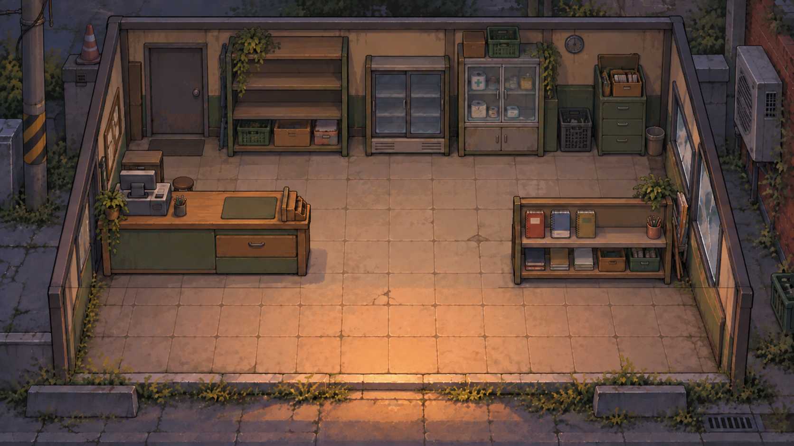
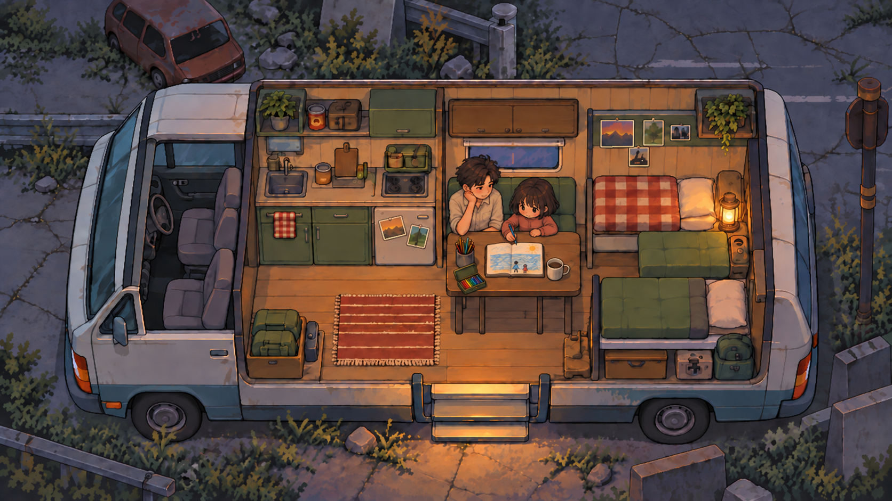
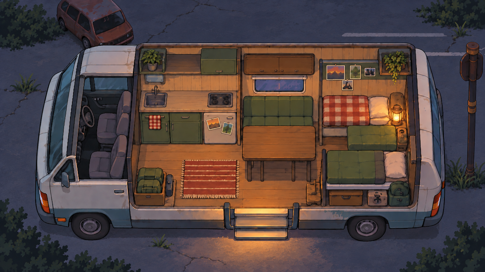
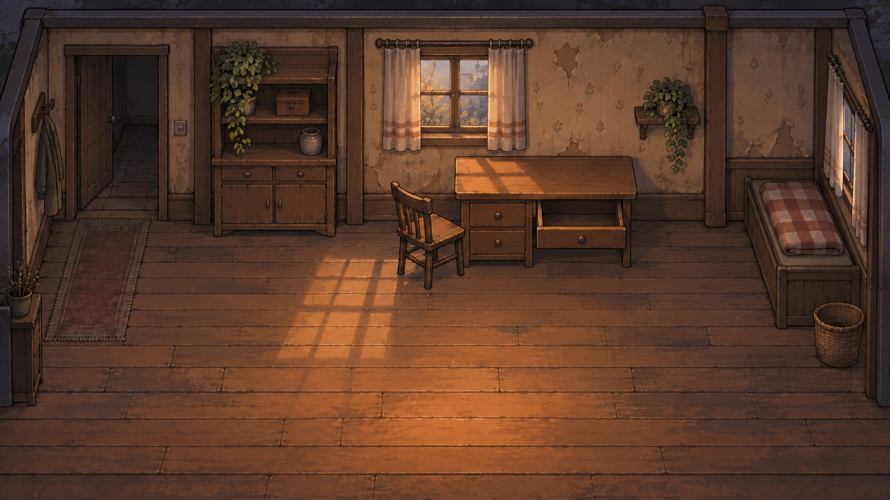

# 챕터 0~1 · 콘티와 실제 파일 연결표

> 2026-09-10 최신 차수: [첫 주 25개 사건 원화·검수 현황](../05-원화/CH01-WEEK01-ART-REVIEW.ko.md)과 [E15~25 후반 콘티](../03-콘티/챕터1/CH01-E15-25-LIVING-DEPARTURE-STORYBOARD.ko.md)를 우선한다. 아래 이전 차수의 미제작 표시는 이력이며, 현재 실제 파일은 전체 연결표로 확인한다. 최종 대사·표정·Unity·목표 해상도 검수는 후속이다.

> 1일 차 낮 신규 UI·종이·빈 책과 파일 연결은 [최신 상세 콘티](../03-콘티/챕터1/CH01-DAY01-NOON-STORYBOARD.ko.md), `design/ui/day01-v1/manifest.json`, `design/chapter01/day01-flow-v1.json`에서 관리한다. 아래 기존 장면 인덱스의 1일 차 흐름보다 이 최신 자료가 우선한다.

2026-09-10. Unity 개발 시 장면과 파일을 함께 확인하는 인계 문서. `D:/Demo3`가 현재 프로젝트 루트이며 아래 링크는 저장소 상대 경로다. 다른 PC에서도 저장소 내부 구조를 유지하면 연결된다.

## 사용 순서

세부 연출 검토: [시작 클릭·카메라·글자 출력·소리·페이드 타임라인](../03-콘티/챕터0/C0-OPENING-DIRECTION.ko.md). 아직 제안값이며 각 구간을 사용자와 함께 선택한다. 이후 장면도 같은 항목을 채운다.

1. [합의한 시작 흐름](UNITY-OPENING-HANDOFF.ko.md)을 읽고 장면 ID를 찾는다.
2. 각 장면의 합성 이미지로 구도를 확인하고, 표의 배경·인물·소품·UI 파일을 개별로 연결한다.
3. [기계 판독 파일 목록](../../design/unity-handoff/storyboard-assets-v1.json)의 좌표·크기·SHA-256·상태를 확인한다.
4. 임시/미제작/보완 필요 항목은 그대로 개발 완료로 처리하지 않는다. 후속 장면 UI는 사용자와 하나씩 검토한다.

## 좌표·레이어 공통 규칙

- 게임 화면은 1920×1080. 기존 원화의 배치 좌표는 1672×941이며 `[x,y,w,h]` 순서다. UI는 각 JSON의 1920 논리 좌표와 3840 편집 좌표를 구분한다.
- 원화는 비율을 유지하여 화면 안에 맞춘다: `s=min(1920/1672,1080/941)`, `ox=(1920-1672*s)/2`, `oy=(1080-941*s)/2`. `(x,y,w,h)`는 `(ox+x*s,oy+y*s,w*s,h*s)`로 변환한다. 독립 축 늘리기로 미세하게 뒤틀지 않는다.
- 캠핑카 식탁 가림은 현재 밝음/소등 베이스의 `[835,432,257,201]` 영역을 같은 위치에 복사한다. 오래된 v1 식탁 픽셀을 v3에 새로 덮지 않는다.
- 합성 순서: 배경→앉은 몸→식탁 가림→소품→손. 점검 때는 앉은 수혁을 숨기고 배경 국소광→접지 그림자→점검 인물 순서로 그린다. 구현 상세는 `tools/prepare-ch00-camper.py`와 JSON에 있다.
- 일반 야간 인물 RGB 배율은 검수 스크립트에서 `[0.39,0.47,0.66]`, 점검 인물은 `[0.57,0.61,0.73]`이다. Unity 최종 조명 값으로 확정된 것은 아니다.
- 동일한 손·연결부의 전후 레이어를 동시에 켜지 않는다. 물·담요 순서가 바뀌어도 준비 완료 상태는 동일하고 소등은 한 번만 발생한다.
- PNG는 실제 크기·알파, PSD는 실제 레이어 범위만 보장한다. 합성 검수 이미지와 작은 크롭을 최종 분리 원본으로 사용하지 않는다.

장면 세부 ID는 문서 연결용으로 부여했으며 Unity Scene 이름이나 실행 코드가 이미 존재한다는 뜻은 아니다. C0-00/A, C0-01 구성 외의 UI는 후속 검토 대상이다.

## C0-00 · 시작 화면 · A 채택

**UI 상태:** A 화풍 채택 / 실행 구현 없음

그림 파일: [design/ui/ch00-01/review/C0-00-A-first-start.jpg](../../design/ui/ch00-01/review/C0-00-A-first-start.jpg). 현재 합성/원화 검수본이며 제작 상태는 아래 표를 따른다.

- 진입: 앱 시작 또는 메뉴 복귀
- 입력·전환: 시작 선택 → 메뉴·로고 페이드 시작. 최초 시작 확인창 없음
- 다음: C0-01
- 주의: 저장이 있을 때만 이어하기 표시. 동일 시작 입력이 다음 대사를 넘기지 않게 소비한다.

| 역할 | 실제 파일 | 원본 크기 | 배치 `[x,y,w,h]` |
| --- | --- | --- | --- |
| 임시 배경 / 실제 손 화풍 교체 예정 | [art/title/title-background-v1.png](../../art/title/title-background-v1.png) | 1672×941 | 해당 JSON 또는 원본 전체 |
| 기존 투명 로고 | [art/title/logo-v1.png](../../art/title/logo-v1.png) | 2560×976 | 해당 JSON 또는 원본 전체 |
| 최초 시작 UI PSD | [design/ui/ch00-01/psd/C0-00-A-first-start.psd](../../design/ui/ch00-01/psd/C0-00-A-first-start.psd) | 3840×2160 | 해당 JSON 또는 원본 전체 |
| 저장 있음 UI PSD | [design/ui/ch00-01/psd/C0-00-A-returning.psd](../../design/ui/ch00-01/psd/C0-00-A-returning.psd) | 3840×2160 | 해당 JSON 또는 원본 전체 |
| UI 좌표·클릭 영역·문자 참조 | [design/ui/ch00-01/manifest.json](../../design/ui/ch00-01/manifest.json) | 데이터/폰트 | 해당 JSON 또는 원본 전체 |
| 별도 런타임 문구 | [design/ui/ch00-01/strings.ko.json](../../design/ui/ch00-01/strings.ko.json) | 데이터/폰트 | 해당 JSON 또는 원본 전체 |
| 메뉴 폰트 / OFL 고지 함께 사용 | [art/title/fonts/Live49MenuSerif-Regular.ttf](../../art/title/fonts/Live49MenuSerif-Regular.ttf) | 데이터/폰트 | 해당 JSON 또는 원본 전체 |

## C0-01 · 흐린 벽 사진과 첫 부름

**UI 상태:** 흐름 채택 / 실행 시안

그림 파일: [art/chapter00/memory/dialogue-v1/family-polaroid-clean-review-v1.png](../../art/chapter00/memory/dialogue-v1/family-polaroid-clean-review-v1.png). 현재 합성/원화 검수본이며 제작 상태는 아래 표를 따른다.

- 진입: 기존 책 시작 카메라 1.35초 후 사진 디졸브
- 입력·전환: 사진 진입 2.40초 수혁아. / 새 입력으로 회상
- 다음: C0-02a
- 주의: 첨부 PNG는 효과 없는 원본 합성이다. 실제 진입은 사진만 블러. 종이 [1442,269,44,28.34]→[300,70,1320,850.16].

| 역할 | 실제 파일 | 원본 크기 | 배치 `[x,y,w,h]` |
| --- | --- | --- | --- |
| 동일 사진 원본 / 1672×941 | [art/chapter00/memory/dialogue-v1/family-sunset-source-v1.png](../../art/chapter00/memory/dialogue-v1/family-sunset-source-v1.png) | 1672×941 | 해당 JSON 또는 원본 전체 |
| 투명 구멍이 있는 별도 종이 | [art/chapter00/memory/dialogue-v1/polaroid-frame-v1.png](../../art/chapter00/memory/dialogue-v1/polaroid-frame-v1.png) | 1784×1149 | 해당 JSON 또는 원본 전체 |
| 얼굴 효과 영역 | [art/chapter00/memory/dialogue-v1/seoyeon-face-mask-v1.png](../../art/chapter00/memory/dialogue-v1/seoyeon-face-mask-v1.png) | 1672×941 | 해당 JSON 또는 원본 전체 |
| 사진·종이·숨김 얼굴 마스크 3레이어 | [art/chapter00/memory/dialogue-v1/family-polaroid-layers-v1.psd](../../art/chapter00/memory/dialogue-v1/family-polaroid-layers-v1.psd) | 1784×1149 | 해당 JSON 또는 원본 전체 |
| 고정 캠핑카 | [art/chapter01/revision-v3/camper-clean-base-v3.png](../../art/chapter01/revision-v3/camper-clean-base-v3.png) | 1672×941 | 해당 JSON 또는 원본 전체 |
| 최신 초 단위 콘티 | [docs/03-콘티/챕터0/C0-PHOTO-MEMORY-IMPLEMENTATION.ko.md](../03-콘티/챕터0/C0-PHOTO-MEMORY-IMPLEMENTATION.ko.md) | 데이터/폰트 | 해당 JSON 또는 원본 전체 |
| 사진 효과·임시 잡음 | [design/ui/ch00-01/photo-memory.mjs](../../design/ui/ch00-01/photo-memory.mjs) | 데이터/폰트 | 해당 JSON 또는 원본 전체 |

## C0-02a · 멈춘 발 · 나레이션에서 인물 대화로

**UI 상태:** 흐름 채택 / 브라우저·PNG·레이어 PSD 시안 제작

그림 파일: [art/chapter00/memory/dialogue-v1/feet-scene-review-v1.png](../../art/chapter00/memory/dialogue-v1/feet-scene-review-v1.png). 현재 합성/원화 검수본이며 제작 상태는 아래 표를 따른다.

- 진입: 첫 부름 완료 뒤 새 입력 → 발 근접 회상 → 0.6초 여백
- 입력·전환: 같은 배경에서 나레이션 → 서연 2문장 → 수혁 응답. 출력 중 완성, 다음 입력으로 진행
- 다음: C0-02b
- 주의: 모녀 전신 즉시 공개를 대체. 초상·문구·세부 UI는 검토 중. 좌표는 1920×1080 기준. 원본 해상도 목표 미달은 개별 문서 참조.

| 역할 | 실제 파일 | 원본 크기 | 배치 `[x,y,w,h]` |
| --- | --- | --- | --- |
| 원래 길 배경 | [art/chapter00/memory/memory-path-base-v1.png](../../art/chapter00/memory/memory-path-base-v1.png) | 1672×941 | 해당 JSON 또는 원본 전체 |
| 새 발 분리 원화 | [art/chapter00/memory/dialogue-v1/feet-paused-v1.png](../../art/chapter00/memory/dialogue-v1/feet-paused-v1.png) | 1672×941 | 해당 JSON 또는 원본 전체 |
| 길 원본·근접 배치·발 3레이어 | [art/chapter00/memory/dialogue-v1/feet-scene-layers-v1.psd](../../art/chapter00/memory/dialogue-v1/feet-scene-layers-v1.psd) | 1672×941 | 해당 JSON 또는 원본 전체 |
| 서연 초상 보관 / 현재 런타임 비표시 | [art/chapter00/memory/dialogue-v1/seoyeon-speaking-soft-v3.png](../../art/chapter00/memory/dialogue-v1/seoyeon-speaking-soft-v3.png) | 1024×1536 | [1120, 70, 700, 1050] |
| 수혁 기존 초상 복귀 | [art/chapter00/memory/dialogue-v1/suhyeok-response-soft-v3.png](../../art/chapter00/memory/dialogue-v1/suhyeok-response-soft-v3.png) | 1024×1536 | [100, 50, 720, 1080] |
| 공통 하단 대화창 5레이어 PSD | [design/ui/ch00-01/psd/C0-02-dialogue.psd](../../design/ui/ch00-01/psd/C0-02-dialogue.psd) | 3840×2160 | 해당 JSON 또는 원본 전체 |
| 나레이션·대사·화자·1920 기준 배치·입력 | [design/ui/ch00-01/memory-dialogue.json](../../design/ui/ch00-01/memory-dialogue.json) | 데이터/폰트 | 해당 JSON 또는 원본 전체 |
| 세부 콘티와 편집 범위 | [docs/03-콘티/챕터0/C0-MEMORY-DIALOGUE.ko.md](../03-콘티/챕터0/C0-MEMORY-DIALOGUE.ko.md) | 데이터/폰트 | 해당 JSON 또는 원본 전체 |

## C0-02b · 두 손을 맞잡기 · 수정 v2

**UI 상태:** 두 손 수정 시안 / 사용자 검토 대기

그림 파일: [art/chapter00/memory/dialogue-v1/hands-held-review-v2.png](../../art/chapter00/memory/dialogue-v1/hands-held-review-v2.png). 현재 합성/원화 검수본이며 제작 상태는 아래 표를 따른다.

- 진입: 수혁 응답 확인
- 입력·전환: 두 손 컷 0.3초 등장+0.8초 여백 뒤 엄마 질문→소이 답→엄마 마무리. 각각 새 입력, 마지막 입력에 사진 복귀
- 다음: C0-02c
- 주의: 세 손 포개기 구도는 사용자 지적으로 제외. 서연이 손을 놓는 중간 동작을 생략한다. C0-02c는 같은 그림을 유지하는 후속 상태이며 별도 새 손 컷이 아니다.

| 역할 | 실제 파일 | 원본 크기 | 배치 `[x,y,w,h]` |
| --- | --- | --- | --- |
| 기존 길 근접 배경 시안 | [art/chapter00/memory/dialogue-v1/path-closeup-review-v1.png](../../art/chapter00/memory/dialogue-v1/path-closeup-review-v1.png) | 1672×941 | 해당 JSON 또는 원본 전체 |
| 수혁·소이 두 손 접촉 그룹 | [art/chapter00/memory/dialogue-v1/hands-held-v2.png](../../art/chapter00/memory/dialogue-v1/hands-held-v2.png) | 1672×941 | [0, 0, 1672, 941] |
| 원본 숨김·길·두 손 3레이어 | [art/chapter00/memory/dialogue-v1/hands-held-layers-v2.psd](../../art/chapter00/memory/dialogue-v1/hands-held-layers-v2.psd) | 1672×941 | 해당 JSON 또는 원본 전체 |
| 수정 이유·검증·원본 상태 | [art/chapter00/memory/dialogue-v1/hands-held-v2.json](../../art/chapter00/memory/dialogue-v1/hands-held-v2.json) | 데이터/폰트 | 해당 JSON 또는 원본 전체 |
| 소이 답변 초상 시안 | [art/chapter00/memory/dialogue-v1/soi-answer-soft-v3.png](../../art/chapter00/memory/dialogue-v1/soi-answer-soft-v3.png) | 1024×1536 | [1100, 180, 700, 1050] |
| 소이 원본·투명 초상 2레이어 | [art/chapter00/memory/dialogue-v1/soi-answer-layers-v1.psd](../../art/chapter00/memory/dialogue-v1/soi-answer-layers-v1.psd) | 1024×1536 | 해당 JSON 또는 원본 전체 |

## C0-02c · 다시 엄마 손 잡을래 · 소이의 답

**UI 상태:** 두 손 수정 시안 / 사용자 검토 대기

그림 파일: [design/ui/ch00-01/review/C0-02-closing.png](../../design/ui/ch00-01/review/C0-02-closing.png). 현재 합성/원화 검수본이며 제작 상태는 아래 표를 따른다.

- 진입: 두 손 잡은 상태 유지
- 입력·전환: 두 손 컷 0.3초 등장+0.8초 여백 뒤 엄마 질문→소이 답→엄마 마무리. 각각 새 입력, 마지막 입력에 사진 복귀
- 다음: C0-03a
- 주의: 세 손 포개기 구도는 사용자 지적으로 제외. 서연이 손을 놓는 중간 동작을 생략한다. C0-02c는 같은 그림을 유지하는 후속 상태이며 별도 새 손 컷이 아니다.

| 역할 | 실제 파일 | 원본 크기 | 배치 `[x,y,w,h]` |
| --- | --- | --- | --- |
| 기존 길 근접 배경 시안 | [art/chapter00/memory/dialogue-v1/path-closeup-review-v1.png](../../art/chapter00/memory/dialogue-v1/path-closeup-review-v1.png) | 1672×941 | 해당 JSON 또는 원본 전체 |
| 수혁·소이 두 손 접촉 그룹 | [art/chapter00/memory/dialogue-v1/hands-held-v2.png](../../art/chapter00/memory/dialogue-v1/hands-held-v2.png) | 1672×941 | [0, 0, 1672, 941] |
| 원본 숨김·길·두 손 3레이어 | [art/chapter00/memory/dialogue-v1/hands-held-layers-v2.psd](../../art/chapter00/memory/dialogue-v1/hands-held-layers-v2.psd) | 1672×941 | 해당 JSON 또는 원본 전체 |
| 수정 이유·검증·원본 상태 | [art/chapter00/memory/dialogue-v1/hands-held-v2.json](../../art/chapter00/memory/dialogue-v1/hands-held-v2.json) | 데이터/폰트 | 해당 JSON 또는 원본 전체 |
| 소이 답변 초상 시안 | [art/chapter00/memory/dialogue-v1/soi-answer-soft-v3.png](../../art/chapter00/memory/dialogue-v1/soi-answer-soft-v3.png) | 1024×1536 | [1100, 180, 700, 1050] |
| 소이 원본·투명 초상 2레이어 | [art/chapter00/memory/dialogue-v1/soi-answer-layers-v1.psd](../../art/chapter00/memory/dialogue-v1/soi-answer-layers-v1.psd) | 1024×1536 | 해당 JSON 또는 원본 전체 |

## C0-03a · 같은 사진 복귀 · 서연 얼굴 소실

**UI 상태:** 실행 시안 / 소이 부름 후 입력으로 현재 대화

그림 파일: [art/chapter00/memory/dialogue-v1/family-polaroid-clean-review-v1.png](../../art/chapter00/memory/dialogue-v1/family-polaroid-clean-review-v1.png). 현재 합성/원화 검수본이며 제작 상태는 아래 표를 따른다.

- 진입: 서연 마지막 대사를 읽은 후 새 입력
- 입력·전환: 암전 .4초→사진 등장 .5초→블러 해제→1.42~1.58초 지지직→3.10초 아빠?
- 다음: C0-03b
- 주의: 첨부는 효과 없는 원본 합성. 얼굴은 마스크로 계속 불분명. 이후 현재 대화 3문장까지 연결. 선택지는 후속 제작. 원본·프레임·마스크는 분리.

| 역할 | 실제 파일 | 원본 크기 | 배치 `[x,y,w,h]` |
| --- | --- | --- | --- |
| 동일 사진 원본 / 1672×941 | [art/chapter00/memory/dialogue-v1/family-sunset-source-v1.png](../../art/chapter00/memory/dialogue-v1/family-sunset-source-v1.png) | 1672×941 | 해당 JSON 또는 원본 전체 |
| 투명 구멍이 있는 별도 종이 | [art/chapter00/memory/dialogue-v1/polaroid-frame-v1.png](../../art/chapter00/memory/dialogue-v1/polaroid-frame-v1.png) | 1784×1149 | 해당 JSON 또는 원본 전체 |
| 얼굴 효과 영역 | [art/chapter00/memory/dialogue-v1/seoyeon-face-mask-v1.png](../../art/chapter00/memory/dialogue-v1/seoyeon-face-mask-v1.png) | 1672×941 | 해당 JSON 또는 원본 전체 |
| 사진·종이·숨김 얼굴 마스크 3레이어 | [art/chapter00/memory/dialogue-v1/family-polaroid-layers-v1.psd](../../art/chapter00/memory/dialogue-v1/family-polaroid-layers-v1.psd) | 1784×1149 | 해당 JSON 또는 원본 전체 |
| 고정 캠핑카 | [art/chapter01/revision-v3/camper-clean-base-v3.png](../../art/chapter01/revision-v3/camper-clean-base-v3.png) | 1672×941 | 해당 JSON 또는 원본 전체 |
| 최신 초 단위 콘티 | [docs/03-콘티/챕터0/C0-PHOTO-MEMORY-IMPLEMENTATION.ko.md](../03-콘티/챕터0/C0-PHOTO-MEMORY-IMPLEMENTATION.ko.md) | 데이터/폰트 | 해당 JSON 또는 원본 전체 |
| 사진 효과·임시 잡음 | [design/ui/ch00-01/photo-memory.mjs](../../design/ui/ch00-01/photo-memory.mjs) | 데이터/폰트 | 해당 JSON 또는 원본 전체 |

## C0-03b · 현재 소이와 대화

**UI 상태:** 현재 대화 3문장 실행 시안; 수혁·소이 실명 표시; 선택지 다음 검토

그림 파일: [design/ui/ch00-01/review/C0-03-response.png](../../design/ui/ch00-01/review/C0-03-response.png). 현재 합성/원화 검수본이며 제작 상태는 아래 표를 따른다.

- 진입: 현재 컷 진입
- 입력·전환: 응. 잠깐 옛날 생각했어. → 수혁 내면 → 내일도 여기 있어?; 문장별 새 입력, 마지막 정지
- 다음: C0-03c 상세 초안 → C0-04a; 실행 시안은 소이 질문에서 정지
- 주의: 사진 .65초 디졸브+.35초 여백. 서연 초상 없음, 수혁·소이는 앞선 대사로 이름 공개, 서연 회상은 ?. 다음 선택지는 후속 검토. docs/03-콘티/챕터0/C0-PRESENT-DIALOGUE.ko.md 우선.

| 역할 | 실제 파일 | 원본 크기 | 배치 `[x,y,w,h]` |
| --- | --- | --- | --- |
| 고정 배경 | [art/chapter01/revision-v3/camper-clean-base-v3.png](../../art/chapter01/revision-v3/camper-clean-base-v3.png) | 1672×941 | [0, 0, 1672, 941] |
| suhyeok-seated-body | [art/style-revision/soft-storybook-v1/sprites/suhyeok-seated-body.png](../../art/style-revision/soft-storybook-v1/sprites/suhyeok-seated-body.png) | 1070×1449 | [840, 289, 109, 155] |
| suhyeok-seated-hands | [art/style-revision/soft-storybook-v1/sprites/suhyeok-seated-hands.png](../../art/style-revision/soft-storybook-v1/sprites/suhyeok-seated-hands.png) | 1070×1449 | [840, 289, 109, 155] |
| soi-seated-body | [art/chapter01/layers/characters/soi-seated-body-v1.png](../../art/chapter01/layers/characters/soi-seated-body-v1.png) | 112×132 | [938, 330, 112, 132] |
| soi-seated-hands | [art/chapter01/layers/characters/soi-seated-hands-v1.png](../../art/chapter01/layers/characters/soi-seated-hands-v1.png) | 112×132 | [938, 330, 112, 132] |
| 식탁 위 스케치북 | [art/chapter01/layers/pages/sketchbook-blank-v1.png](../../art/chapter01/layers/pages/sketchbook-blank-v1.png) | 102×73 | [904, 454, 102, 73] |
| 컵 | [art/chapter01/layers/sprites/mug-source-v1.png](../../art/chapter01/layers/sprites/mug-source-v1.png) | 53×52 | [1010, 480, 53, 52] |
| water-before | [art/chapter00/camper/layers/water-jug-v1.png](../../art/chapter00/camper/layers/water-jug-v1.png) | 1009×1321 | [630, 325, 47, 60] |
| blanket-before | [art/chapter00/camper/layers/folded-blanket-v1.png](../../art/chapter00/camper/layers/folded-blanket-v1.png) | 1348×908 | [1194, 550, 124, 84] |
| panel-loose | [art/chapter00/camper/layers/power-panel-loose-v1.png](../../art/chapter00/camper/layers/power-panel-loose-v1.png) | 1277×910 | [604, 426, 86, 61] |
| flashlight-stored | [art/chapter00/camper/layers/flashlight-off-v1.png](../../art/chapter00/camper/layers/flashlight-off-v1.png) | 1502×985 | [504, 586, 55, 37] |
| 수혁 최신 부드러운 동화풍 초상 | [art/chapter00/memory/dialogue-v1/suhyeok-response-soft-v3.png](../../art/chapter00/memory/dialogue-v1/suhyeok-response-soft-v3.png) | 1024×1536 | [100, 50, 720, 1080] |
| 수혁 생성 원본·투명 초상 실제 2레이어 | [art/style-revision/soft-storybook-v1/psd/suhyeok-dialogue.psd](../../art/style-revision/soft-storybook-v1/psd/suhyeok-dialogue.psd) | 1024×1536 | 해당 JSON 또는 원본 전체 |

상태 기록: `{"packed": false, "water_packed": false, "blanket_packed": false, "light": "warm", "repair_pose": false, "connection_secured": false, "book_packed": false, "journal_open": false}`

## C0-04a · 물·담요 준비 전

**UI 상태:** 미제작

그림 파일: [art/chapter00/camper/review/01-current-conversation.png](../../art/chapter00/camper/review/01-current-conversation.png). 현재 합성/원화 검수본이며 제작 상태는 아래 표를 따른다.

- 진입: 출발 준비 대화 종료
- 입력·전환: 물 또는 여분 담요 챙기기
- 다음: C0-04b 또는 C0-04c
- 주의: 순서·상태는 최신 콘티 기준이며 입력·저장 로직은 아직 없음. 소이는 물리 조작을 하지 않음.

| 역할 | 실제 파일 | 원본 크기 | 배치 `[x,y,w,h]` |
| --- | --- | --- | --- |
| 고정 배경 | [art/chapter01/revision-v3/camper-clean-base-v3.png](../../art/chapter01/revision-v3/camper-clean-base-v3.png) | 1672×941 | [0, 0, 1672, 941] |
| suhyeok-seated-body | [art/style-revision/soft-storybook-v1/sprites/suhyeok-seated-body.png](../../art/style-revision/soft-storybook-v1/sprites/suhyeok-seated-body.png) | 1070×1449 | [840, 289, 109, 155] |
| suhyeok-seated-hands | [art/style-revision/soft-storybook-v1/sprites/suhyeok-seated-hands.png](../../art/style-revision/soft-storybook-v1/sprites/suhyeok-seated-hands.png) | 1070×1449 | [840, 289, 109, 155] |
| soi-seated-body | [art/chapter01/layers/characters/soi-seated-body-v1.png](../../art/chapter01/layers/characters/soi-seated-body-v1.png) | 112×132 | [938, 330, 112, 132] |
| soi-seated-hands | [art/chapter01/layers/characters/soi-seated-hands-v1.png](../../art/chapter01/layers/characters/soi-seated-hands-v1.png) | 112×132 | [938, 330, 112, 132] |
| 식탁 위 스케치북 | [art/chapter01/layers/pages/sketchbook-blank-v1.png](../../art/chapter01/layers/pages/sketchbook-blank-v1.png) | 102×73 | [904, 454, 102, 73] |
| 컵 | [art/chapter01/layers/sprites/mug-source-v1.png](../../art/chapter01/layers/sprites/mug-source-v1.png) | 53×52 | [1010, 480, 53, 52] |
| water-before | [art/chapter00/camper/layers/water-jug-v1.png](../../art/chapter00/camper/layers/water-jug-v1.png) | 1009×1321 | [630, 325, 47, 60] |
| blanket-before | [art/chapter00/camper/layers/folded-blanket-v1.png](../../art/chapter00/camper/layers/folded-blanket-v1.png) | 1348×908 | [1194, 550, 124, 84] |
| panel-loose | [art/chapter00/camper/layers/power-panel-loose-v1.png](../../art/chapter00/camper/layers/power-panel-loose-v1.png) | 1277×910 | [604, 426, 86, 61] |
| flashlight-stored | [art/chapter00/camper/layers/flashlight-off-v1.png](../../art/chapter00/camper/layers/flashlight-off-v1.png) | 1502×985 | [504, 586, 55, 37] |

상태 기록: `{"packed": false, "water_packed": false, "blanket_packed": false, "light": "warm", "repair_pose": false, "connection_secured": false, "book_packed": false, "journal_open": false}`

## C0-04b · 물만 준비

**UI 상태:** 미제작

그림 파일: [art/chapter00/camper/review/02a-water-only.png](../../art/chapter00/camper/review/02a-water-only.png). 현재 합성/원화 검수본이며 제작 상태는 아래 표를 따른다.

- 진입: 물 먼저 챙김
- 입력·전환: 담요 챙기기
- 다음: C0-04d
- 주의: 순서·상태는 최신 콘티 기준이며 입력·저장 로직은 아직 없음. 소이는 물리 조작을 하지 않음.

| 역할 | 실제 파일 | 원본 크기 | 배치 `[x,y,w,h]` |
| --- | --- | --- | --- |
| 고정 배경 | [art/chapter01/revision-v3/camper-clean-base-v3.png](../../art/chapter01/revision-v3/camper-clean-base-v3.png) | 1672×941 | [0, 0, 1672, 941] |
| suhyeok-seated-body | [art/style-revision/soft-storybook-v1/sprites/suhyeok-seated-body.png](../../art/style-revision/soft-storybook-v1/sprites/suhyeok-seated-body.png) | 1070×1449 | [840, 289, 109, 155] |
| suhyeok-seated-hands | [art/style-revision/soft-storybook-v1/sprites/suhyeok-seated-hands.png](../../art/style-revision/soft-storybook-v1/sprites/suhyeok-seated-hands.png) | 1070×1449 | [840, 289, 109, 155] |
| soi-seated-body | [art/chapter01/layers/characters/soi-seated-body-v1.png](../../art/chapter01/layers/characters/soi-seated-body-v1.png) | 112×132 | [938, 330, 112, 132] |
| soi-seated-hands | [art/chapter01/layers/characters/soi-seated-hands-v1.png](../../art/chapter01/layers/characters/soi-seated-hands-v1.png) | 112×132 | [938, 330, 112, 132] |
| 식탁 위 스케치북 | [art/chapter01/layers/pages/sketchbook-blank-v1.png](../../art/chapter01/layers/pages/sketchbook-blank-v1.png) | 102×73 | [904, 454, 102, 73] |
| 컵 | [art/chapter01/layers/sprites/mug-source-v1.png](../../art/chapter01/layers/sprites/mug-source-v1.png) | 53×52 | [1010, 480, 53, 52] |
| water-packed | [art/chapter00/camper/layers/water-jug-v1.png](../../art/chapter00/camper/layers/water-jug-v1.png) | 1009×1321 | [564, 604, 47, 60] |
| blanket-before | [art/chapter00/camper/layers/folded-blanket-v1.png](../../art/chapter00/camper/layers/folded-blanket-v1.png) | 1348×908 | [1194, 550, 124, 84] |
| panel-loose | [art/chapter00/camper/layers/power-panel-loose-v1.png](../../art/chapter00/camper/layers/power-panel-loose-v1.png) | 1277×910 | [604, 426, 86, 61] |
| flashlight-stored | [art/chapter00/camper/layers/flashlight-off-v1.png](../../art/chapter00/camper/layers/flashlight-off-v1.png) | 1502×985 | [504, 586, 55, 37] |

상태 기록: `{"packed": false, "water_packed": true, "blanket_packed": false, "light": "warm", "repair_pose": false, "connection_secured": false, "book_packed": false, "journal_open": false}`

## C0-04c · 담요만 준비

**UI 상태:** 미제작

그림 파일: [art/chapter00/camper/review/02b-blanket-only.png](../../art/chapter00/camper/review/02b-blanket-only.png). 현재 합성/원화 검수본이며 제작 상태는 아래 표를 따른다.

- 진입: 담요 먼저 챙김
- 입력·전환: 물 챙기기
- 다음: C0-04d
- 주의: 순서·상태는 최신 콘티 기준이며 입력·저장 로직은 아직 없음. 소이는 물리 조작을 하지 않음.

| 역할 | 실제 파일 | 원본 크기 | 배치 `[x,y,w,h]` |
| --- | --- | --- | --- |
| 고정 배경 | [art/chapter01/revision-v3/camper-clean-base-v3.png](../../art/chapter01/revision-v3/camper-clean-base-v3.png) | 1672×941 | [0, 0, 1672, 941] |
| suhyeok-seated-body | [art/style-revision/soft-storybook-v1/sprites/suhyeok-seated-body.png](../../art/style-revision/soft-storybook-v1/sprites/suhyeok-seated-body.png) | 1070×1449 | [840, 289, 109, 155] |
| suhyeok-seated-hands | [art/style-revision/soft-storybook-v1/sprites/suhyeok-seated-hands.png](../../art/style-revision/soft-storybook-v1/sprites/suhyeok-seated-hands.png) | 1070×1449 | [840, 289, 109, 155] |
| soi-seated-body | [art/chapter01/layers/characters/soi-seated-body-v1.png](../../art/chapter01/layers/characters/soi-seated-body-v1.png) | 112×132 | [938, 330, 112, 132] |
| soi-seated-hands | [art/chapter01/layers/characters/soi-seated-hands-v1.png](../../art/chapter01/layers/characters/soi-seated-hands-v1.png) | 112×132 | [938, 330, 112, 132] |
| 식탁 위 스케치북 | [art/chapter01/layers/pages/sketchbook-blank-v1.png](../../art/chapter01/layers/pages/sketchbook-blank-v1.png) | 102×73 | [904, 454, 102, 73] |
| 컵 | [art/chapter01/layers/sprites/mug-source-v1.png](../../art/chapter01/layers/sprites/mug-source-v1.png) | 53×52 | [1010, 480, 53, 52] |
| water-before | [art/chapter00/camper/layers/water-jug-v1.png](../../art/chapter00/camper/layers/water-jug-v1.png) | 1009×1321 | [630, 325, 47, 60] |
| blanket-packed | [art/chapter00/camper/layers/folded-blanket-v1.png](../../art/chapter00/camper/layers/folded-blanket-v1.png) | 1348×908 | [465, 584, 107, 75] |
| panel-loose | [art/chapter00/camper/layers/power-panel-loose-v1.png](../../art/chapter00/camper/layers/power-panel-loose-v1.png) | 1277×910 | [604, 426, 86, 61] |
| flashlight-stored | [art/chapter00/camper/layers/flashlight-off-v1.png](../../art/chapter00/camper/layers/flashlight-off-v1.png) | 1502×985 | [504, 586, 55, 37] |

상태 기록: `{"packed": false, "water_packed": false, "blanket_packed": true, "light": "warm", "repair_pose": false, "connection_secured": false, "book_packed": false, "journal_open": false}`

## C0-04d · 준비 완료

**UI 상태:** 미제작

그림 파일: [art/chapter00/camper/review/02-preparation-complete.png](../../art/chapter00/camper/review/02-preparation-complete.png). 현재 합성/원화 검수본이며 제작 상태는 아래 표를 따른다.

- 진입: 물·담요 두 행동 완료
- 입력·전환: 준비 몽타주 후 소등 1회
- 다음: C0-05
- 주의: 순서·상태는 최신 콘티 기준이며 입력·저장 로직은 아직 없음. 소이는 물리 조작을 하지 않음. 가방 속 담요와 정리된 짐의 확대 원화는 미제작, 작은 크롭은 대체 시안.

| 역할 | 실제 파일 | 원본 크기 | 배치 `[x,y,w,h]` |
| --- | --- | --- | --- |
| 고정 배경 | [art/chapter01/revision-v3/camper-clean-base-v3.png](../../art/chapter01/revision-v3/camper-clean-base-v3.png) | 1672×941 | [0, 0, 1672, 941] |
| suhyeok-seated-body | [art/style-revision/soft-storybook-v1/sprites/suhyeok-seated-body.png](../../art/style-revision/soft-storybook-v1/sprites/suhyeok-seated-body.png) | 1070×1449 | [840, 289, 109, 155] |
| suhyeok-seated-hands | [art/style-revision/soft-storybook-v1/sprites/suhyeok-seated-hands.png](../../art/style-revision/soft-storybook-v1/sprites/suhyeok-seated-hands.png) | 1070×1449 | [840, 289, 109, 155] |
| soi-seated-body | [art/chapter01/layers/characters/soi-seated-body-v1.png](../../art/chapter01/layers/characters/soi-seated-body-v1.png) | 112×132 | [938, 330, 112, 132] |
| soi-seated-hands | [art/chapter01/layers/characters/soi-seated-hands-v1.png](../../art/chapter01/layers/characters/soi-seated-hands-v1.png) | 112×132 | [938, 330, 112, 132] |
| 식탁 위 스케치북 | [art/chapter01/layers/pages/sketchbook-blank-v1.png](../../art/chapter01/layers/pages/sketchbook-blank-v1.png) | 102×73 | [904, 454, 102, 73] |
| 컵 | [art/chapter01/layers/sprites/mug-source-v1.png](../../art/chapter01/layers/sprites/mug-source-v1.png) | 53×52 | [1010, 480, 53, 52] |
| water-packed | [art/chapter00/camper/layers/water-jug-v1.png](../../art/chapter00/camper/layers/water-jug-v1.png) | 1009×1321 | [564, 604, 47, 60] |
| blanket-packed | [art/chapter00/camper/layers/folded-blanket-v1.png](../../art/chapter00/camper/layers/folded-blanket-v1.png) | 1348×908 | [465, 584, 107, 75] |
| panel-loose | [art/chapter00/camper/layers/power-panel-loose-v1.png](../../art/chapter00/camper/layers/power-panel-loose-v1.png) | 1277×910 | [604, 426, 86, 61] |
| flashlight-stored | [art/chapter00/camper/layers/flashlight-off-v1.png](../../art/chapter00/camper/layers/flashlight-off-v1.png) | 1502×985 | [504, 586, 55, 37] |

상태 기록: `{"packed": true, "water_packed": true, "blanket_packed": true, "light": "warm", "repair_pose": false, "connection_secured": false, "book_packed": false, "journal_open": false}`

## C0-05 · 소등·소이에게 답하기

**UI 상태:** 선택지·조사 UI 미제작

그림 파일: [art/chapter00/camper/review/03-outage-answer-soi.png](../../art/chapter00/camper/review/03-outage-answer-soi.png). 현재 합성/원화 검수본이며 제작 상태는 아래 표를 따른다.

- 진입: 두 준비 행동 완료 뒤 최초 소등
- 입력·전환: 소이에게 답변 선택 → 수납함 조사
- 다음: C0-06a
- 주의: 순서·상태는 최신 콘티 기준이며 입력·저장 로직은 아직 없음. 소이는 물리 조작을 하지 않음.

| 역할 | 실제 파일 | 원본 크기 | 배치 `[x,y,w,h]` |
| --- | --- | --- | --- |
| 고정 배경 | [art/chapter00/camper/layers/camper-outage-stable-v1.png](../../art/chapter00/camper/layers/camper-outage-stable-v1.png) | 1672×941 | [0, 0, 1672, 941] |
| suhyeok-seated-body | [art/style-revision/soft-storybook-v1/sprites/suhyeok-seated-body.png](../../art/style-revision/soft-storybook-v1/sprites/suhyeok-seated-body.png) | 1070×1449 | [840, 289, 109, 155] |
| suhyeok-seated-hands | [art/style-revision/soft-storybook-v1/sprites/suhyeok-seated-hands.png](../../art/style-revision/soft-storybook-v1/sprites/suhyeok-seated-hands.png) | 1070×1449 | [840, 289, 109, 155] |
| soi-seated-body | [art/chapter01/layers/characters/soi-seated-body-v1.png](../../art/chapter01/layers/characters/soi-seated-body-v1.png) | 112×132 | [938, 330, 112, 132] |
| soi-seated-hands | [art/chapter01/layers/characters/soi-seated-hands-v1.png](../../art/chapter01/layers/characters/soi-seated-hands-v1.png) | 112×132 | [938, 330, 112, 132] |
| 식탁 위 스케치북 | [art/chapter01/layers/pages/sketchbook-blank-v1.png](../../art/chapter01/layers/pages/sketchbook-blank-v1.png) | 102×73 | [904, 454, 102, 73] |
| 컵 | [art/chapter01/layers/sprites/mug-source-v1.png](../../art/chapter01/layers/sprites/mug-source-v1.png) | 53×52 | [1010, 480, 53, 52] |
| water-packed | [art/chapter00/camper/layers/water-jug-v1.png](../../art/chapter00/camper/layers/water-jug-v1.png) | 1009×1321 | [564, 604, 47, 60] |
| blanket-packed | [art/chapter00/camper/layers/folded-blanket-v1.png](../../art/chapter00/camper/layers/folded-blanket-v1.png) | 1348×908 | [465, 584, 107, 75] |
| panel-loose | [art/chapter00/camper/layers/power-panel-loose-v1.png](../../art/chapter00/camper/layers/power-panel-loose-v1.png) | 1277×910 | [604, 426, 86, 61] |
| flashlight-stored | [art/chapter00/camper/layers/flashlight-off-v1.png](../../art/chapter00/camper/layers/flashlight-off-v1.png) | 1502×985 | [504, 586, 55, 37] |

상태 기록: `{"packed": true, "water_packed": true, "blanket_packed": true, "light": "off", "repair_pose": false, "connection_secured": false, "book_packed": false, "journal_open": false}`

## C0-06a · 손전등으로 조사

**UI 상태:** 조사 UI 미제작

그림 파일: [art/chapter00/camper/review/04-flashlight-investigation.png](../../art/chapter00/camper/review/04-flashlight-investigation.png). 현재 합성/원화 검수본이며 제작 상태는 아래 표를 따른다.

- 진입: 손전등 확보
- 입력·전환: 스위치와 연결부 모두 조사, 관계 대사 확인
- 다음: C0-06b
- 주의: 순서·상태는 최신 콘티 기준이며 입력·저장 로직은 아직 없음. 소이는 물리 조작을 하지 않음. 손 포즈는 연결부를 실제로 잡지 못하므로 보강 필요. 밝은 배경 국소광을 인물 뒤에 합성.

| 역할 | 실제 파일 | 원본 크기 | 배치 `[x,y,w,h]` |
| --- | --- | --- | --- |
| 고정 배경 | [art/chapter00/camper/layers/camper-outage-stable-v1.png](../../art/chapter00/camper/layers/camper-outage-stable-v1.png) | 1672×941 | [0, 0, 1672, 941] |
| soi-seated-body | [art/chapter01/layers/characters/soi-seated-body-v1.png](../../art/chapter01/layers/characters/soi-seated-body-v1.png) | 112×132 | [938, 330, 112, 132] |
| soi-seated-hands | [art/chapter01/layers/characters/soi-seated-hands-v1.png](../../art/chapter01/layers/characters/soi-seated-hands-v1.png) | 112×132 | [938, 330, 112, 132] |
| 식탁 위 스케치북 | [art/chapter01/layers/pages/sketchbook-blank-v1.png](../../art/chapter01/layers/pages/sketchbook-blank-v1.png) | 102×73 | [904, 454, 102, 73] |
| 컵 | [art/chapter01/layers/sprites/mug-source-v1.png](../../art/chapter01/layers/sprites/mug-source-v1.png) | 53×52 | [1010, 480, 53, 52] |
| water-packed | [art/chapter00/camper/layers/water-jug-v1.png](../../art/chapter00/camper/layers/water-jug-v1.png) | 1009×1321 | [564, 604, 47, 60] |
| blanket-packed | [art/chapter00/camper/layers/folded-blanket-v1.png](../../art/chapter00/camper/layers/folded-blanket-v1.png) | 1348×908 | [465, 584, 107, 75] |
| panel-loose | [art/chapter00/camper/layers/power-panel-loose-v1.png](../../art/chapter00/camper/layers/power-panel-loose-v1.png) | 1277×910 | [604, 426, 86, 61] |
| repair | [art/style-revision/soft-storybook-v1/sprites/suhyeok-repair-trim.png](../../art/style-revision/soft-storybook-v1/sprites/suhyeok-repair-trim.png) | 872×1343 | [616, 418, 170, 254] |
| 그림자/국소광 보조 레이어 | [art/chapter00/camper/layers/repair-contact-shadow-v1.png](../../art/chapter00/camper/layers/repair-contact-shadow-v1.png) | 1672×941 | [0, 0, 1672, 941] |
| 그림자/국소광 보조 레이어 | [art/chapter00/camper/layers/flashlight-local-reveal-mask-v1.png](../../art/chapter00/camper/layers/flashlight-local-reveal-mask-v1.png) | 1672×941 | [0, 0, 1672, 941] |
| 그림자/국소광 보조 레이어 | [art/chapter00/camper/layers/flashlight-bounce-overlay-v1.png](../../art/chapter00/camper/layers/flashlight-bounce-overlay-v1.png) | 1672×941 | [0, 0, 1672, 941] |

상태 기록: `{"packed": true, "water_packed": true, "blanket_packed": true, "light": "off", "repair_pose": true, "connection_secured": false, "book_packed": false, "journal_open": false}`

## C0-06b · 연결 고정

**UI 상태:** 행동 UI 미제작

그림 파일: [art/chapter00/camper/review/05-connection-secured.png](../../art/chapter00/camper/review/05-connection-secured.png). 현재 합성/원화 검수본이며 제작 상태는 아래 표를 따른다.

- 진입: 조사·대화 조건 완료
- 입력·전환: 연결 고정 후 실내등 켜기
- 다음: C0-07a
- 주의: 순서·상태는 최신 콘티 기준이며 입력·저장 로직은 아직 없음. 소이는 물리 조작을 하지 않음. 손 포즈는 연결부를 실제로 잡지 못하므로 보강 필요. 밝은 배경 국소광을 인물 뒤에 합성.

| 역할 | 실제 파일 | 원본 크기 | 배치 `[x,y,w,h]` |
| --- | --- | --- | --- |
| 고정 배경 | [art/chapter00/camper/layers/camper-outage-stable-v1.png](../../art/chapter00/camper/layers/camper-outage-stable-v1.png) | 1672×941 | [0, 0, 1672, 941] |
| soi-seated-body | [art/chapter01/layers/characters/soi-seated-body-v1.png](../../art/chapter01/layers/characters/soi-seated-body-v1.png) | 112×132 | [938, 330, 112, 132] |
| soi-seated-hands | [art/chapter01/layers/characters/soi-seated-hands-v1.png](../../art/chapter01/layers/characters/soi-seated-hands-v1.png) | 112×132 | [938, 330, 112, 132] |
| 식탁 위 스케치북 | [art/chapter01/layers/pages/sketchbook-blank-v1.png](../../art/chapter01/layers/pages/sketchbook-blank-v1.png) | 102×73 | [904, 454, 102, 73] |
| 컵 | [art/chapter01/layers/sprites/mug-source-v1.png](../../art/chapter01/layers/sprites/mug-source-v1.png) | 53×52 | [1010, 480, 53, 52] |
| water-packed | [art/chapter00/camper/layers/water-jug-v1.png](../../art/chapter00/camper/layers/water-jug-v1.png) | 1009×1321 | [564, 604, 47, 60] |
| blanket-packed | [art/chapter00/camper/layers/folded-blanket-v1.png](../../art/chapter00/camper/layers/folded-blanket-v1.png) | 1348×908 | [465, 584, 107, 75] |
| panel-fixed | [art/chapter00/camper/layers/power-panel-fixed-v1.png](../../art/chapter00/camper/layers/power-panel-fixed-v1.png) | 1277×910 | [604, 426, 86, 61] |
| repair | [art/style-revision/soft-storybook-v1/sprites/suhyeok-repair-trim.png](../../art/style-revision/soft-storybook-v1/sprites/suhyeok-repair-trim.png) | 872×1343 | [616, 418, 170, 254] |
| 그림자/국소광 보조 레이어 | [art/chapter00/camper/layers/repair-contact-shadow-v1.png](../../art/chapter00/camper/layers/repair-contact-shadow-v1.png) | 1672×941 | [0, 0, 1672, 941] |
| 그림자/국소광 보조 레이어 | [art/chapter00/camper/layers/flashlight-local-reveal-mask-v1.png](../../art/chapter00/camper/layers/flashlight-local-reveal-mask-v1.png) | 1672×941 | [0, 0, 1672, 941] |
| 그림자/국소광 보조 레이어 | [art/chapter00/camper/layers/flashlight-bounce-overlay-v1.png](../../art/chapter00/camper/layers/flashlight-bounce-overlay-v1.png) | 1672×941 | [0, 0, 1672, 941] |

상태 기록: `{"packed": true, "water_packed": true, "blanket_packed": true, "light": "off", "repair_pose": true, "connection_secured": true, "book_packed": false, "journal_open": false}`

## C0-07a · 조명 복구

**UI 상태:** 대화·행동 UI 미제작

그림 파일: [art/chapter00/camper/review/06-light-restored.png](../../art/chapter00/camper/review/06-light-restored.png). 현재 합성/원화 검수본이며 제작 상태는 아래 표를 따른다.

- 진입: 실내등 켜기
- 입력·전환: 소이와 대화, 손전등 반환, 책 챙기기
- 다음: C0-07b
- 주의: 순서·상태는 최신 콘티 기준이며 입력·저장 로직은 아직 없음. 소이는 물리 조작을 하지 않음.

| 역할 | 실제 파일 | 원본 크기 | 배치 `[x,y,w,h]` |
| --- | --- | --- | --- |
| 고정 배경 | [art/chapter01/revision-v3/camper-clean-base-v3.png](../../art/chapter01/revision-v3/camper-clean-base-v3.png) | 1672×941 | [0, 0, 1672, 941] |
| suhyeok-seated-body | [art/style-revision/soft-storybook-v1/sprites/suhyeok-seated-body.png](../../art/style-revision/soft-storybook-v1/sprites/suhyeok-seated-body.png) | 1070×1449 | [840, 289, 109, 155] |
| suhyeok-seated-hands | [art/style-revision/soft-storybook-v1/sprites/suhyeok-seated-hands.png](../../art/style-revision/soft-storybook-v1/sprites/suhyeok-seated-hands.png) | 1070×1449 | [840, 289, 109, 155] |
| soi-seated-body | [art/chapter01/layers/characters/soi-seated-body-v1.png](../../art/chapter01/layers/characters/soi-seated-body-v1.png) | 112×132 | [938, 330, 112, 132] |
| soi-seated-hands | [art/chapter01/layers/characters/soi-seated-hands-v1.png](../../art/chapter01/layers/characters/soi-seated-hands-v1.png) | 112×132 | [938, 330, 112, 132] |
| 식탁 위 스케치북 | [art/chapter01/layers/pages/sketchbook-blank-v1.png](../../art/chapter01/layers/pages/sketchbook-blank-v1.png) | 102×73 | [904, 454, 102, 73] |
| 컵 | [art/chapter01/layers/sprites/mug-source-v1.png](../../art/chapter01/layers/sprites/mug-source-v1.png) | 53×52 | [1010, 480, 53, 52] |
| water-packed | [art/chapter00/camper/layers/water-jug-v1.png](../../art/chapter00/camper/layers/water-jug-v1.png) | 1009×1321 | [564, 604, 47, 60] |
| blanket-packed | [art/chapter00/camper/layers/folded-blanket-v1.png](../../art/chapter00/camper/layers/folded-blanket-v1.png) | 1348×908 | [465, 584, 107, 75] |
| panel-fixed | [art/chapter00/camper/layers/power-panel-fixed-v1.png](../../art/chapter00/camper/layers/power-panel-fixed-v1.png) | 1277×910 | [604, 426, 86, 61] |
| flashlight-stored | [art/chapter00/camper/layers/flashlight-off-v1.png](../../art/chapter00/camper/layers/flashlight-off-v1.png) | 1502×985 | [504, 586, 55, 37] |

상태 기록: `{"packed": true, "water_packed": true, "blanket_packed": true, "light": "warm", "repair_pose": false, "connection_secured": true, "book_packed": false, "journal_open": false}`

## C0-07b · 책 정리·첫 기록

**UI 상태:** 기록 UI 미제작

그림 파일: [art/chapter00/camper/review/07-book-packed-journal-open.png](../../art/chapter00/camper/review/07-book-packed-journal-open.png). 현재 합성/원화 검수본이며 제작 상태는 아래 표를 따른다.

- 진입: 책 챙김
- 입력·전환: 첫 문장 선택·저널 확인, 내일 약속
- 다음: C0-08
- 주의: 순서·상태는 최신 콘티 기준이며 입력·저장 로직은 아직 없음. 소이는 물리 조작을 하지 않음.

| 역할 | 실제 파일 | 원본 크기 | 배치 `[x,y,w,h]` |
| --- | --- | --- | --- |
| 고정 배경 | [art/chapter01/revision-v3/camper-clean-base-v3.png](../../art/chapter01/revision-v3/camper-clean-base-v3.png) | 1672×941 | [0, 0, 1672, 941] |
| suhyeok-seated-body | [art/style-revision/soft-storybook-v1/sprites/suhyeok-seated-body.png](../../art/style-revision/soft-storybook-v1/sprites/suhyeok-seated-body.png) | 1070×1449 | [840, 289, 109, 155] |
| suhyeok-seated-hands | [art/style-revision/soft-storybook-v1/sprites/suhyeok-seated-hands.png](../../art/style-revision/soft-storybook-v1/sprites/suhyeok-seated-hands.png) | 1070×1449 | [840, 289, 109, 155] |
| soi-seated-body | [art/chapter01/layers/characters/soi-seated-body-v1.png](../../art/chapter01/layers/characters/soi-seated-body-v1.png) | 112×132 | [938, 330, 112, 132] |
| soi-seated-hands | [art/chapter01/layers/characters/soi-seated-hands-v1.png](../../art/chapter01/layers/characters/soi-seated-hands-v1.png) | 112×132 | [938, 330, 112, 132] |
| 컵 | [art/chapter01/layers/sprites/mug-source-v1.png](../../art/chapter01/layers/sprites/mug-source-v1.png) | 53×52 | [1010, 480, 53, 52] |
| water-packed | [art/chapter00/camper/layers/water-jug-v1.png](../../art/chapter00/camper/layers/water-jug-v1.png) | 1009×1321 | [564, 604, 47, 60] |
| blanket-packed | [art/chapter00/camper/layers/folded-blanket-v1.png](../../art/chapter00/camper/layers/folded-blanket-v1.png) | 1348×908 | [465, 584, 107, 75] |
| panel-fixed | [art/chapter00/camper/layers/power-panel-fixed-v1.png](../../art/chapter00/camper/layers/power-panel-fixed-v1.png) | 1277×910 | [604, 426, 86, 61] |
| flashlight-stored | [art/chapter00/camper/layers/flashlight-off-v1.png](../../art/chapter00/camper/layers/flashlight-off-v1.png) | 1502×985 | [504, 586, 55, 37] |
| journal | [art/chapter00/camper/layers/journal-open-v1.png](../../art/chapter00/camper/layers/journal-open-v1.png) | 1444×986 | [863, 455, 104, 77] |

상태 기록: `{"packed": true, "water_packed": true, "blanket_packed": true, "light": "warm", "repair_pose": false, "connection_secured": true, "book_packed": true, "journal_open": true}`

## C0-08 · 스스로 불을 끄고 쉬기

**UI 상태:** 날짜·소등 UI 미제작

그림 파일: [art/chapter00/camper/review/08-voluntary-lights-off.png](../../art/chapter00/camper/review/08-voluntary-lights-off.png). 현재 합성/원화 검수본이며 제작 상태는 아래 표를 따른다.

- 진입: 약속 뒤 소등 입력
- 입력·전환: 암전·작품명·1일 차로 연결
- 다음: C1-01
- 주의: 순서·상태는 최신 콘티 기준이며 입력·저장 로직은 아직 없음. 소이는 물리 조작을 하지 않음.

| 역할 | 실제 파일 | 원본 크기 | 배치 `[x,y,w,h]` |
| --- | --- | --- | --- |
| 고정 배경 | [art/chapter00/camper/layers/camper-outage-stable-v1.png](../../art/chapter00/camper/layers/camper-outage-stable-v1.png) | 1672×941 | [0, 0, 1672, 941] |
| suhyeok-seated-body | [art/style-revision/soft-storybook-v1/sprites/suhyeok-seated-body.png](../../art/style-revision/soft-storybook-v1/sprites/suhyeok-seated-body.png) | 1070×1449 | [840, 289, 109, 155] |
| suhyeok-seated-hands | [art/style-revision/soft-storybook-v1/sprites/suhyeok-seated-hands.png](../../art/style-revision/soft-storybook-v1/sprites/suhyeok-seated-hands.png) | 1070×1449 | [840, 289, 109, 155] |
| soi-seated-body | [art/chapter01/layers/characters/soi-seated-body-v1.png](../../art/chapter01/layers/characters/soi-seated-body-v1.png) | 112×132 | [938, 330, 112, 132] |
| soi-seated-hands | [art/chapter01/layers/characters/soi-seated-hands-v1.png](../../art/chapter01/layers/characters/soi-seated-hands-v1.png) | 112×132 | [938, 330, 112, 132] |
| 컵 | [art/chapter01/layers/sprites/mug-source-v1.png](../../art/chapter01/layers/sprites/mug-source-v1.png) | 53×52 | [1010, 480, 53, 52] |
| water-packed | [art/chapter00/camper/layers/water-jug-v1.png](../../art/chapter00/camper/layers/water-jug-v1.png) | 1009×1321 | [564, 604, 47, 60] |
| blanket-packed | [art/chapter00/camper/layers/folded-blanket-v1.png](../../art/chapter00/camper/layers/folded-blanket-v1.png) | 1348×908 | [465, 584, 107, 75] |
| panel-fixed | [art/chapter00/camper/layers/power-panel-fixed-v1.png](../../art/chapter00/camper/layers/power-panel-fixed-v1.png) | 1277×910 | [604, 426, 86, 61] |
| flashlight-stored | [art/chapter00/camper/layers/flashlight-off-v1.png](../../art/chapter00/camper/layers/flashlight-off-v1.png) | 1502×985 | [504, 586, 55, 37] |

상태 기록: `{"packed": true, "water_packed": true, "blanket_packed": true, "light": "off", "repair_pose": false, "connection_secured": true, "book_packed": true, "journal_open": false}`

## C0-03c · 첫 응답·빈 페이지·출발 결정 · 상세 초안

**UI 상태:** 상세 글 콘티 초안; 선택 UI·책 인서트·실행 연결 미제작

대응하는 완성 이미지 없음. 후속 제작 대상.

- 진입: C0-03-D02 내일도 여기 있어? 읽기 완료 후 새 입력
- 입력·전환: 말투 선택 2갈래 → 빈 페이지 클릭·대화 → 내일 떠나자 → 준비 대상 열기
- 다음: C0-04a
- 주의: 기존 컷09~11의 대사를 연결한 신규 연출안. 시간과 세부 대사 채택 전. 두 분기 모두 합류하며 책은 복구 뒤 챙긴다.

| 역할 | 실제 파일 | 원본 크기 | 배치 `[x,y,w,h]` |
| --- | --- | --- | --- |
| 대사·카메라·입력·분기·저장 경계 신규 초안 | [docs/03-콘티/챕터0/C0-NEXT-DEPARTURE-STORYBOARD.ko.md](../03-콘티/챕터0/C0-NEXT-DEPARTURE-STORYBOARD.ko.md) | 데이터/폰트 | 해당 JSON 또는 원본 전체 |
| 챕터 0~1 첫 주 상세 콘티 목표와 진행표 | [docs/00-제작관리/CH00-WEEK01-STORYBOARD-PROGRESS.ko.md](CH00-WEEK01-STORYBOARD-PROGRESS.ko.md) | 데이터/폰트 | 해당 JSON 또는 원본 전체 |
| 1536×1024 RGB 큰 책 참고 원본; 체크 배경 분리·일치 검수 필요 | [art/chapter01/layers/sketchbook-open-blank-v1.png](../../art/chapter01/layers/sketchbook-open-blank-v1.png) | 1536×1024 | 해당 JSON 또는 원본 전체 |
| 부드러운 동화풍 수혁 응답 | [art/chapter00/memory/dialogue-v1/suhyeok-response-soft-v3.png](../../art/chapter00/memory/dialogue-v1/suhyeok-response-soft-v3.png) | 1024×1536 | 해당 JSON 또는 원본 전체 |
| 부드러운 동화풍 소이 응답 | [art/chapter00/memory/dialogue-v1/soi-answer-soft-v3.png](../../art/chapter00/memory/dialogue-v1/soi-answer-soft-v3.png) | 1024×1536 | 해당 JSON 또는 원본 전체 |

## C1-01 · 첫 출발·편의점·귀환

**UI 상태:** 미제작

그림 파일: [art/chapter01/revision-v3/store-clean-base-v3.png](../../art/chapter01/revision-v3/store-clean-base-v3.png). 챕터 1 참고 원화이며 이 장면의 UI 합성 완료본은 아니다.

- 진입: C0 종료 후 첫 낮
- 입력·전환: 물 확보·귀환·약속 확인
- 다음: C1-02
- 주의: 지도·목표·회수·가방·상태 UI 미제작. 기존 파일은 배경/단품이며 완성 UI 합성본 아님.

| 역할 | 실제 파일 | 원본 크기 | 배치 `[x,y,w,h]` |
| --- | --- | --- | --- |
| 후속 장면 재사용 후보 / 개별 검수 필요 | [art/chapter01/revision-v3/store-clean-base-v3.png](../../art/chapter01/revision-v3/store-clean-base-v3.png) | 1672×941 | 해당 JSON 또는 원본 전체 |
| 후속 장면 재사용 후보 / 개별 검수 필요 | [art/style-revision/soft-storybook-v1/sprites/suhyeok-investigate-trim.png](../../art/style-revision/soft-storybook-v1/sprites/suhyeok-investigate-trim.png) | 1086×1281 | 해당 JSON 또는 원본 전체 |
| 후속 장면 재사용 후보 / 개별 검수 필요 | [art/chapter01/store/drink-bottle-v1.png](../../art/chapter01/store/drink-bottle-v1.png) | 17×32 | 해당 JSON 또는 원본 전체 |

## C1-02 · 색연필 전달·첫 그림

**UI 상태:** 미제작

그림 파일: [art/chapter01/01-camper-evening/camper-drawing-v2.png](../../art/chapter01/01-camper-evening/camper-drawing-v2.png). 챕터 1 참고 원화이며 이 장면의 UI 합성 완료본은 아니다.

- 진입: 첫 귀환·소이의 부탁
- 입력·전환: 도구 전달→함께 그리기→완성 확인
- 다음: C1-03
- 주의: 첫 그림 필수 튜토리얼. 이미 가진 색연필 인정. 기존 바다 그림은 재사용 후보이며 최종 그림 내용과 대사집 대조 필요.

| 역할 | 실제 파일 | 원본 크기 | 배치 `[x,y,w,h]` |
| --- | --- | --- | --- |
| 후속 장면 재사용 후보 / 개별 검수 필요 | [art/chapter01/revision-v3/camper-clean-base-v3.png](../../art/chapter01/revision-v3/camper-clean-base-v3.png) | 1672×941 | 해당 JSON 또는 원본 전체 |
| 후속 장면 재사용 후보 / 개별 검수 필요 | [art/chapter01/shared-props/pencil-tin-open-v1.png](../../art/chapter01/shared-props/pencil-tin-open-v1.png) | 377×432 | 해당 JSON 또는 원본 전체 |
| 후속 장면 재사용 후보 / 개별 검수 필요 | [art/chapter01/layers/pages/sketchbook-blank-v1.png](../../art/chapter01/layers/pages/sketchbook-blank-v1.png) | 102×73 | 해당 JSON 또는 원본 전체 |
| 후속 장면 재사용 후보 / 개별 검수 필요 | [art/chapter01/layers/pages/sea-started-overlay-v1.png](../../art/chapter01/layers/pages/sea-started-overlay-v1.png) | 102×73 | 해당 JSON 또는 원본 전체 |
| 후속 장면 재사용 후보 / 개별 검수 필요 | [art/chapter01/layers/pages/sea-complete-overlay-v1.png](../../art/chapter01/layers/pages/sea-complete-overlay-v1.png) | 102×73 | 해당 JSON 또는 원본 전체 |

## C1-03 · 세진·공구·첫 사진

**UI 상태:** 미제작

대응하는 완성 이미지 없음. 후속 제작 대상.

- 진입: 첫 그림 후 길 정보 안내
- 입력·전환: 공구 전달→카메라 확보→촬영·앨범 확인
- 다음: C1-05 또는 선택 사건
- 주의: 주유소·수리점·하천 쉼터 배경, 세진 대화용 원화, 카메라·공구 상세 자산과 촬영 UI는 이 인계에 연결된 납품 파일 없음. 연료 부족 필수 조건 아님.

## C1-04a · 요리·생활 제작

**UI 상태:** 미제작

그림 파일: [art/chapter01/revision-v3/camper-clean-base-v3.png](../../art/chapter01/revision-v3/camper-clean-base-v3.png). 챕터 1 참고 원화이며 이 장면의 UI 합성 완료본은 아니다.

- 진입: 식재료 확보 등 조건
- 입력·전환: 요리 또는 생활 제작 결과 확인
- 다음: 현재 장소로 복귀
- 주의: UI·레시피 수치·미니게임 상세 미정. 후보 원화만 연결.

| 역할 | 실제 파일 | 원본 크기 | 배치 `[x,y,w,h]` |
| --- | --- | --- | --- |
| 후속 장면 재사용 후보 / 개별 검수 필요 | [art/chapter01/revision-v3/camper-clean-base-v3.png](../../art/chapter01/revision-v3/camper-clean-base-v3.png) | 1672×941 | 해당 JSON 또는 원본 전체 |
| 후속 장면 재사용 후보 / 개별 검수 필요 | [art/style-revision/soft-storybook-v1/sprites/suhyeok-cook-trim.png](../../art/style-revision/soft-storybook-v1/sprites/suhyeok-cook-trim.png) | 726×1503 | 해당 JSON 또는 원본 전체 |
| 후속 장면 재사용 후보 / 개별 검수 필요 | [art/chapter01/kitchen/soup-pot-v1.png](../../art/chapter01/kitchen/soup-pot-v1.png) | 714×523 | 해당 JSON 또는 원본 전체 |
| 후속 장면 재사용 후보 / 개별 검수 필요 | [art/chapter01/shared-props/soup-bowl-v1.png](../../art/chapter01/shared-props/soup-bowl-v1.png) | 347×275 | 해당 JSON 또는 원본 전체 |

## C1-04b · 낡은 집·별똥이

**UI 상태:** 미제작

그림 파일: [art/chapter01/revision-v3/house-clean-base-v3.png](../../art/chapter01/revision-v3/house-clean-base-v3.png). 챕터 1 참고 원화이며 이 장면의 UI 합성 완료본은 아니다.

- 진입: 낡은 집 조사와 동행 조건
- 입력·전환: 거리를 두고 교감, 후속 재방문
- 다음: 현재 장소로 복귀
- 주의: 별똥이의 집 앞 접지·포즈 배치는 미검증. 기존 캠핑카 배치 좌표를 집으로 자동 복사하지 않음. 첫 편지는 챕터 3으로 이관.

| 역할 | 실제 파일 | 원본 크기 | 배치 `[x,y,w,h]` |
| --- | --- | --- | --- |
| 후속 장면 재사용 후보 / 개별 검수 필요 | [art/chapter01/revision-v3/house-clean-base-v3.png](../../art/chapter01/revision-v3/house-clean-base-v3.png) | 1672×941 | 해당 JSON 또는 원본 전체 |
| 후속 장면 재사용 후보 / 개별 검수 필요 | [art/chapter01/dog/byeolddongi-sit-v1.png](../../art/chapter01/dog/byeolddongi-sit-v1.png) | 326×439 | 해당 JSON 또는 원본 전체 |
| 후속 장면 재사용 후보 / 개별 검수 필요 | [art/chapter01/dog/byeolddongi-rest-v1.png](../../art/chapter01/dog/byeolddongi-rest-v1.png) | 396×233 | 해당 JSON 또는 원본 전체 |
| 후속 장면 재사용 후보 / 개별 검수 필요 | [art/style-revision/soft-storybook-v1/sprites/suhyeok-befriend-trim.png](../../art/style-revision/soft-storybook-v1/sprites/suhyeok-befriend-trim.png) | 1221×1223 | 해당 JSON 또는 원본 전체 |

## C1-05 · 다음 지역 출발

**UI 상태:** 미제작

대응하는 완성 이미지 없음. 후속 제작 대상.

- 진입: 첫 그림·첫 사진과 길 정보 조건 완료
- 입력·전환: 남은 일 안내→목적지·물자 확인→출발
- 다음: 다음 챕터
- 주의: 지도·고갯길 UI/원화 연결 미제작. 정확한 날짜·비용·재방문 정책 미정.

## 전체 관련 파일 인덱스

가공 전 소스·프롬프트·PSD·스크립트까지 포함한다. 소스 PNG의 체크무늬/색 배경은 런타임 투명 자산이 아니다. 목록의 존재 여부와 해시는 실제 파일에서 읽었다.

| 분류 | 경로 | 원본 크기 / 형식 |
| --- | --- | --- |
| 제작·조합·보완 참고; 파일별 상태 문서 우선 | [art/chapter00/camper/camper-light-states-v1.psd](../../art/chapter00/camper/camper-light-states-v1.psd) | 1672×941 RGB |
| 고정 배경 | [art/chapter00/camper/layers/camper-outage-stable-v1.png](../../art/chapter00/camper/layers/camper-outage-stable-v1.png) | 1672×941 RGBA |
| 그림자/국소광 보조 레이어 | [art/chapter00/camper/layers/flashlight-bounce-overlay-v1.png](../../art/chapter00/camper/layers/flashlight-bounce-overlay-v1.png) | 1672×941 RGBA |
| 그림자/국소광 보조 레이어 | [art/chapter00/camper/layers/flashlight-local-reveal-mask-v1.png](../../art/chapter00/camper/layers/flashlight-local-reveal-mask-v1.png) | 1672×941 L |
| flashlight-stored | [art/chapter00/camper/layers/flashlight-off-v1.png](../../art/chapter00/camper/layers/flashlight-off-v1.png) | 1502×985 RGBA |
| blanket-before | [art/chapter00/camper/layers/folded-blanket-v1.png](../../art/chapter00/camper/layers/folded-blanket-v1.png) | 1348×908 RGBA |
| journal | [art/chapter00/camper/layers/journal-open-v1.png](../../art/chapter00/camper/layers/journal-open-v1.png) | 1444×986 RGBA |
| panel-fixed | [art/chapter00/camper/layers/power-panel-fixed-v1.png](../../art/chapter00/camper/layers/power-panel-fixed-v1.png) | 1277×910 RGBA |
| panel-loose | [art/chapter00/camper/layers/power-panel-loose-v1.png](../../art/chapter00/camper/layers/power-panel-loose-v1.png) | 1277×910 RGBA |
| 그림자/국소광 보조 레이어 | [art/chapter00/camper/layers/repair-contact-shadow-v1.png](../../art/chapter00/camper/layers/repair-contact-shadow-v1.png) | 1672×941 RGBA |
| 캠핑카 분리 원화 | [art/chapter00/camper/layers/water-jug-held-v1.png](../../art/chapter00/camper/layers/water-jug-held-v1.png) | 1122×1392 RGBA |
| water-before | [art/chapter00/camper/layers/water-jug-v1.png](../../art/chapter00/camper/layers/water-jug-v1.png) | 1009×1321 RGBA |
| 제작·조합·보완 참고; 파일별 상태 문서 우선 | [art/chapter00/camper/power-panel-states-v1.psd](../../art/chapter00/camper/power-panel-states-v1.psd) | 1277×910 RGB |
| 가공 전 생성 소스 또는 프롬프트 / 직접 배치하지 않음 | [art/chapter00/camper/prompts/camper-outage-light-study-v1.txt](../../art/chapter00/camper/prompts/camper-outage-light-study-v1.txt) | .txt |
| 가공 전 생성 소스 또는 프롬프트 / 직접 배치하지 않음 | [art/chapter00/camper/prompts/flashlight-off-v1.txt](../../art/chapter00/camper/prompts/flashlight-off-v1.txt) | .txt |
| 가공 전 생성 소스 또는 프롬프트 / 직접 배치하지 않음 | [art/chapter00/camper/prompts/folded-blanket-v1.txt](../../art/chapter00/camper/prompts/folded-blanket-v1.txt) | .txt |
| 가공 전 생성 소스 또는 프롬프트 / 직접 배치하지 않음 | [art/chapter00/camper/prompts/journal-open-v1.txt](../../art/chapter00/camper/prompts/journal-open-v1.txt) | .txt |
| 가공 전 생성 소스 또는 프롬프트 / 직접 배치하지 않음 | [art/chapter00/camper/prompts/power-panel-fixed-v1.txt](../../art/chapter00/camper/prompts/power-panel-fixed-v1.txt) | .txt |
| 가공 전 생성 소스 또는 프롬프트 / 직접 배치하지 않음 | [art/chapter00/camper/prompts/power-panel-loose-v1.txt](../../art/chapter00/camper/prompts/power-panel-loose-v1.txt) | .txt |
| 가공 전 생성 소스 또는 프롬프트 / 직접 배치하지 않음 | [art/chapter00/camper/prompts/suhyeok-flashlight-repair-v1.txt](../../art/chapter00/camper/prompts/suhyeok-flashlight-repair-v1.txt) | .txt |
| 가공 전 생성 소스 또는 프롬프트 / 직접 배치하지 않음 | [art/chapter00/camper/prompts/suhyeok-flashlight-repair-v2.txt](../../art/chapter00/camper/prompts/suhyeok-flashlight-repair-v2.txt) | .txt |
| 가공 전 생성 소스 또는 프롬프트 / 직접 배치하지 않음 | [art/chapter00/camper/prompts/water-jug-held-v1.txt](../../art/chapter00/camper/prompts/water-jug-held-v1.txt) | .txt |
| 가공 전 생성 소스 또는 프롬프트 / 직접 배치하지 않음 | [art/chapter00/camper/prompts/water-jug-v1.txt](../../art/chapter00/camper/prompts/water-jug-v1.txt) | .txt |
| 합성 또는 장면 참고 이미지 / 분리 원본 여부 확인 | [art/chapter00/camper/review/01-current-conversation.png](../../art/chapter00/camper/review/01-current-conversation.png) | 1672×941 RGBA |
| 합성 또는 장면 참고 이미지 / 분리 원본 여부 확인 | [art/chapter00/camper/review/02-preparation-complete.png](../../art/chapter00/camper/review/02-preparation-complete.png) | 1672×941 RGBA |
| 합성 또는 장면 참고 이미지 / 분리 원본 여부 확인 | [art/chapter00/camper/review/02a-water-only.png](../../art/chapter00/camper/review/02a-water-only.png) | 1672×941 RGBA |
| 합성 또는 장면 참고 이미지 / 분리 원본 여부 확인 | [art/chapter00/camper/review/02b-blanket-only.png](../../art/chapter00/camper/review/02b-blanket-only.png) | 1672×941 RGBA |
| 합성 또는 장면 참고 이미지 / 분리 원본 여부 확인 | [art/chapter00/camper/review/03-outage-answer-soi.png](../../art/chapter00/camper/review/03-outage-answer-soi.png) | 1672×941 RGBA |
| 합성 또는 장면 참고 이미지 / 분리 원본 여부 확인 | [art/chapter00/camper/review/04-flashlight-investigation.png](../../art/chapter00/camper/review/04-flashlight-investigation.png) | 1672×941 RGBA |
| 합성 또는 장면 참고 이미지 / 분리 원본 여부 확인 | [art/chapter00/camper/review/05-connection-secured.png](../../art/chapter00/camper/review/05-connection-secured.png) | 1672×941 RGBA |
| 합성 또는 장면 참고 이미지 / 분리 원본 여부 확인 | [art/chapter00/camper/review/06-light-restored.png](../../art/chapter00/camper/review/06-light-restored.png) | 1672×941 RGBA |
| 합성 또는 장면 참고 이미지 / 분리 원본 여부 확인 | [art/chapter00/camper/review/07-book-packed-journal-open.png](../../art/chapter00/camper/review/07-book-packed-journal-open.png) | 1672×941 RGBA |
| 합성 또는 장면 참고 이미지 / 분리 원본 여부 확인 | [art/chapter00/camper/review/08-voluntary-lights-off.png](../../art/chapter00/camper/review/08-voluntary-lights-off.png) | 1672×941 RGBA |
| 제작·조합·보완 참고; 파일별 상태 문서 우선 | [art/chapter00/camper/review/montage-blanket.png](../../art/chapter00/camper/review/montage-blanket.png) | 1672×941 RGBA |
| 제작·조합·보완 참고; 파일별 상태 문서 우선 | [art/chapter00/camper/review/montage-water.png](../../art/chapter00/camper/review/montage-water.png) | 1672×941 RGBA |
| 제작·조합·보완 참고; 파일별 상태 문서 우선 | [art/chapter00/camper/review/prepared-supplies-closeup.png](../../art/chapter00/camper/review/prepared-supplies-closeup.png) | 200×175 RGBA |
| 가공 전 생성 소스 또는 프롬프트 / 직접 배치하지 않음 | [art/chapter00/camper/sources/camper-outage-light-study-v1.png](../../art/chapter00/camper/sources/camper-outage-light-study-v1.png) | 1672×941 RGB |
| 가공 전 생성 소스 또는 프롬프트 / 직접 배치하지 않음 | [art/chapter00/camper/sources/flashlight-off-v1.png](../../art/chapter00/camper/sources/flashlight-off-v1.png) | 1536×1024 RGBA |
| 가공 전 생성 소스 또는 프롬프트 / 직접 배치하지 않음 | [art/chapter00/camper/sources/folded-blanket-v1.png](../../art/chapter00/camper/sources/folded-blanket-v1.png) | 1448×1086 RGB |
| 가공 전 생성 소스 또는 프롬프트 / 직접 배치하지 않음 | [art/chapter00/camper/sources/journal-open-v1.png](../../art/chapter00/camper/sources/journal-open-v1.png) | 1448×1086 RGB |
| 가공 전 생성 소스 또는 프롬프트 / 직접 배치하지 않음 | [art/chapter00/camper/sources/power-panel-fixed-v1.png](../../art/chapter00/camper/sources/power-panel-fixed-v1.png) | 1374×1145 RGB |
| 가공 전 생성 소스 또는 프롬프트 / 직접 배치하지 않음 | [art/chapter00/camper/sources/power-panel-loose-v1.png](../../art/chapter00/camper/sources/power-panel-loose-v1.png) | 1374×1145 RGB |
| 가공 전 생성 소스 또는 프롬프트 / 직접 배치하지 않음 | [art/chapter00/camper/sources/suhyeok-flashlight-repair-v1.png](../../art/chapter00/camper/sources/suhyeok-flashlight-repair-v1.png) | 1024×1536 RGB |
| 가공 전 생성 소스 또는 프롬프트 / 직접 배치하지 않음 | [art/chapter00/camper/sources/suhyeok-flashlight-repair-v2.png](../../art/chapter00/camper/sources/suhyeok-flashlight-repair-v2.png) | 1024×1536 RGB |
| 가공 전 생성 소스 또는 프롬프트 / 직접 배치하지 않음 | [art/chapter00/camper/sources/water-jug-held-v1.png](../../art/chapter00/camper/sources/water-jug-held-v1.png) | 1122×1402 RGBA |
| 가공 전 생성 소스 또는 프롬프트 / 직접 배치하지 않음 | [art/chapter00/camper/sources/water-jug-v1.png](../../art/chapter00/camper/sources/water-jug-v1.png) | 1122×1402 RGBA |
| 합성 또는 장면 참고 이미지 / 분리 원본 여부 확인 | [art/chapter00/memory/dialogue-v1/family-polaroid-clean-review-v1.png](../../art/chapter00/memory/dialogue-v1/family-polaroid-clean-review-v1.png) | 1784×1149 RGBA |
| 사진·종이·숨김 얼굴 마스크 3레이어 | [art/chapter00/memory/dialogue-v1/family-polaroid-layers-v1.psd](../../art/chapter00/memory/dialogue-v1/family-polaroid-layers-v1.psd) | 1784×1149 RGBA |
| 동일 사진 원본 / 1672×941 | [art/chapter00/memory/dialogue-v1/family-sunset-source-v1.png](../../art/chapter00/memory/dialogue-v1/family-sunset-source-v1.png) | 1672×941 RGB |
| 회상 대화 제작 자산·원본·프롬프트·검수; manifest 상태 우선 | [art/chapter00/memory/dialogue-v1/family-sunset-v1.prompt.txt](../../art/chapter00/memory/dialogue-v1/family-sunset-v1.prompt.txt) | .txt |
| 새 발 분리 원화 | [art/chapter00/memory/dialogue-v1/feet-paused-v1.png](../../art/chapter00/memory/dialogue-v1/feet-paused-v1.png) | 1672×941 RGBA |
| 회상 대화 제작 자산·원본·프롬프트·검수; manifest 상태 우선 | [art/chapter00/memory/dialogue-v1/feet-paused-v1.prompt.txt](../../art/chapter00/memory/dialogue-v1/feet-paused-v1.prompt.txt) | .txt |
| 길 원본·근접 배치·발 3레이어 | [art/chapter00/memory/dialogue-v1/feet-scene-layers-v1.psd](../../art/chapter00/memory/dialogue-v1/feet-scene-layers-v1.psd) | 1672×941 RGBA |
| 합성 또는 장면 참고 이미지 / 분리 원본 여부 확인 | [art/chapter00/memory/dialogue-v1/feet-scene-review-v1.png](../../art/chapter00/memory/dialogue-v1/feet-scene-review-v1.png) | 1672×941 RGBA |
| 원본 숨김·길·두 손 3레이어 | [art/chapter00/memory/dialogue-v1/hands-held-layers-v2.psd](../../art/chapter00/memory/dialogue-v1/hands-held-layers-v2.psd) | 1672×941 RGBA |
| 합성 또는 장면 참고 이미지 / 분리 원본 여부 확인 | [art/chapter00/memory/dialogue-v1/hands-held-review-v2.png](../../art/chapter00/memory/dialogue-v1/hands-held-review-v2.png) | 1672×941 RGBA |
| 회상 대화 제작 자산·원본·프롬프트·검수; manifest 상태 우선 | [art/chapter00/memory/dialogue-v1/hands-held-source-v2.png](../../art/chapter00/memory/dialogue-v1/hands-held-source-v2.png) | 1672×941 RGB |
| 수정 이유·검증·원본 상태 | [art/chapter00/memory/dialogue-v1/hands-held-v2.json](../../art/chapter00/memory/dialogue-v1/hands-held-v2.json) | .json |
| 수혁·소이 두 손 접촉 그룹 | [art/chapter00/memory/dialogue-v1/hands-held-v2.png](../../art/chapter00/memory/dialogue-v1/hands-held-v2.png) | 1672×941 RGBA |
| 회상 대화 제작 자산·원본·프롬프트·검수; manifest 상태 우선 | [art/chapter00/memory/dialogue-v1/hands-held-v2.prompt.txt](../../art/chapter00/memory/dialogue-v1/hands-held-v2.prompt.txt) | .txt |
| 기존 길 근접 배경 시안 | [art/chapter00/memory/dialogue-v1/path-closeup-review-v1.png](../../art/chapter00/memory/dialogue-v1/path-closeup-review-v1.png) | 1672×941 RGBA |
| 회상 대화 제작 자산·원본·프롬프트·검수; manifest 상태 우선 | [art/chapter00/memory/dialogue-v1/photo-memory-assets-v1.json](../../art/chapter00/memory/dialogue-v1/photo-memory-assets-v1.json) | .json |
| 투명 구멍이 있는 별도 종이 | [art/chapter00/memory/dialogue-v1/polaroid-frame-v1.png](../../art/chapter00/memory/dialogue-v1/polaroid-frame-v1.png) | 1784×1149 RGBA |
| 회상 대화 제작 자산·원본·프롬프트·검수; manifest 상태 우선 | [art/chapter00/memory/dialogue-v1/seoyeon-alpha-attempt-v1.png](../../art/chapter00/memory/dialogue-v1/seoyeon-alpha-attempt-v1.png) | 1024×1536 RGB |
| 회상 대화 제작 자산·원본·프롬프트·검수; manifest 상태 우선 | [art/chapter00/memory/dialogue-v1/seoyeon-alpha-attempt-v1.prompt.txt](../../art/chapter00/memory/dialogue-v1/seoyeon-alpha-attempt-v1.prompt.txt) | .txt |
| 얼굴 효과 영역 | [art/chapter00/memory/dialogue-v1/seoyeon-face-mask-v1.png](../../art/chapter00/memory/dialogue-v1/seoyeon-face-mask-v1.png) | 1672×941 RGBA |
| 회상 대화 제작 자산·원본·프롬프트·검수; manifest 상태 우선 | [art/chapter00/memory/dialogue-v1/seoyeon-speaking-alpha-review.jpg](../../art/chapter00/memory/dialogue-v1/seoyeon-speaking-alpha-review.jpg) | 1024×768 RGB |
| 회상 대화 제작 자산·원본·프롬프트·검수; manifest 상태 우선 | [art/chapter00/memory/dialogue-v1/seoyeon-speaking-layers-v1.psd](../../art/chapter00/memory/dialogue-v1/seoyeon-speaking-layers-v1.psd) | 1024×1536 RGBA |
| 서연 초상 보관 / 현재 런타임 비표시 | [art/chapter00/memory/dialogue-v1/seoyeon-speaking-soft-v3.png](../../art/chapter00/memory/dialogue-v1/seoyeon-speaking-soft-v3.png) | 1024×1536 RGBA |
| 회상 대화 제작 자산·원본·프롬프트·검수; manifest 상태 우선 | [art/chapter00/memory/dialogue-v1/seoyeon-speaking-source-v1.png](../../art/chapter00/memory/dialogue-v1/seoyeon-speaking-source-v1.png) | 1024×1536 RGB |
| 회상 대화 제작 자산·원본·프롬프트·검수; manifest 상태 우선 | [art/chapter00/memory/dialogue-v1/seoyeon-speaking-v1.prompt.txt](../../art/chapter00/memory/dialogue-v1/seoyeon-speaking-v1.prompt.txt) | .txt |
| 회상 대화 제작 자산·원본·프롬프트·검수; manifest 상태 우선 | [art/chapter00/memory/dialogue-v1/soi-answer-alpha-review.jpg](../../art/chapter00/memory/dialogue-v1/soi-answer-alpha-review.jpg) | 1024×768 RGB |
| 소이 원본·투명 초상 2레이어 | [art/chapter00/memory/dialogue-v1/soi-answer-layers-v1.psd](../../art/chapter00/memory/dialogue-v1/soi-answer-layers-v1.psd) | 1024×1536 RGBA |
| 소이 답변 초상 시안 | [art/chapter00/memory/dialogue-v1/soi-answer-soft-v3.png](../../art/chapter00/memory/dialogue-v1/soi-answer-soft-v3.png) | 1024×1536 RGBA |
| 회상 대화 제작 자산·원본·프롬프트·검수; manifest 상태 우선 | [art/chapter00/memory/dialogue-v1/soi-answer-source-v1.png](../../art/chapter00/memory/dialogue-v1/soi-answer-source-v1.png) | 1024×1536 RGB |
| 회상 대화 제작 자산·원본·프롬프트·검수; manifest 상태 우선 | [art/chapter00/memory/dialogue-v1/soi-answer-v1.prompt.txt](../../art/chapter00/memory/dialogue-v1/soi-answer-v1.prompt.txt) | .txt |
| 회상 대화 제작 자산·원본·프롬프트·검수; manifest 상태 우선 | [art/chapter00/memory/dialogue-v1/suhyeok-response-alpha-review.jpg](../../art/chapter00/memory/dialogue-v1/suhyeok-response-alpha-review.jpg) | 1024×768 RGB |
| 회상 대화 제작 자산·원본·프롬프트·검수; manifest 상태 우선 | [art/chapter00/memory/dialogue-v1/suhyeok-response-layers-v1.psd](../../art/chapter00/memory/dialogue-v1/suhyeok-response-layers-v1.psd) | 1024×1536 RGBA |
| 회상 대화 제작 자산·원본·프롬프트·검수; manifest 상태 우선 | [art/chapter00/memory/dialogue-v1/suhyeok-response-semi-alpha-review-v2.jpg](../../art/chapter00/memory/dialogue-v1/suhyeok-response-semi-alpha-review-v2.jpg) | 1024×768 RGB |
| 회상 대화 제작 자산·원본·프롬프트·검수; manifest 상태 우선 | [art/chapter00/memory/dialogue-v1/suhyeok-response-semi-layers-v2.psd](../../art/chapter00/memory/dialogue-v1/suhyeok-response-semi-layers-v2.psd) | 1024×1536 RGBA |
| 회상 대화 제작 자산·원본·프롬프트·검수; manifest 상태 우선 | [art/chapter00/memory/dialogue-v1/suhyeok-response-semi-source-v2.png](../../art/chapter00/memory/dialogue-v1/suhyeok-response-semi-source-v2.png) | 1024×1536 RGB |
| 회상 대화 제작 자산·원본·프롬프트·검수; manifest 상태 우선 | [art/chapter00/memory/dialogue-v1/suhyeok-response-semi-v2.json](../../art/chapter00/memory/dialogue-v1/suhyeok-response-semi-v2.json) | .json |
| 회상 대화 제작 자산·원본·프롬프트·검수; manifest 상태 우선 | [art/chapter00/memory/dialogue-v1/suhyeok-response-semi-v2.png](../../art/chapter00/memory/dialogue-v1/suhyeok-response-semi-v2.png) | 1024×1536 RGBA |
| 회상 대화 제작 자산·원본·프롬프트·검수; manifest 상태 우선 | [art/chapter00/memory/dialogue-v1/suhyeok-response-semi-v2.prompt.txt](../../art/chapter00/memory/dialogue-v1/suhyeok-response-semi-v2.prompt.txt) | .txt |
| 수혁 기존 초상 복귀 | [art/chapter00/memory/dialogue-v1/suhyeok-response-soft-v3.png](../../art/chapter00/memory/dialogue-v1/suhyeok-response-soft-v3.png) | 1024×1536 RGBA |
| 회상 대화 제작 자산·원본·프롬프트·검수; manifest 상태 우선 | [art/chapter00/memory/dialogue-v1/suhyeok-response-source-v1.png](../../art/chapter00/memory/dialogue-v1/suhyeok-response-source-v1.png) | 1024×1536 RGB |
| 회상 대화 제작 자산·원본·프롬프트·검수; manifest 상태 우선 | [art/chapter00/memory/dialogue-v1/suhyeok-response-v1.prompt.txt](../../art/chapter00/memory/dialogue-v1/suhyeok-response-v1.prompt.txt) | .txt |
| 회상 원본·분리 PNG / first draft | [art/chapter00/memory/hands-handover-v1.png](../../art/chapter00/memory/hands-handover-v1.png) | 1672×941 RGBA |
| 회상 원본·분리 PNG / first draft | [art/chapter00/memory/hands-received-v1.png](../../art/chapter00/memory/hands-received-v1.png) | 1672×941 RGBA |
| 회상 원본·분리 PNG / first draft | [art/chapter00/memory/memory-ground-shadow-review-v1.png](../../art/chapter00/memory/memory-ground-shadow-review-v1.png) | 1672×941 RGBA |
| 원래 길 배경 | [art/chapter00/memory/memory-path-base-v1.png](../../art/chapter00/memory/memory-path-base-v1.png) | 1672×941 RGB |
| 회상 원본·분리 PNG / first draft | [art/chapter00/memory/seoyeon-soi-holding-v1.png](../../art/chapter00/memory/seoyeon-soi-holding-v1.png) | 701×1364 RGBA |
| 회상 원본·분리 PNG / first draft | [art/chapter00/present/hand-on-book-v1.png](../../art/chapter00/present/hand-on-book-v1.png) | 1672×941 RGB |
| 가공 전 생성 소스 또는 프롬프트 / 직접 배치하지 않음 | [art/chapter00/prompts/hand-on-book-v1.txt](../../art/chapter00/prompts/hand-on-book-v1.txt) | .txt |
| 가공 전 생성 소스 또는 프롬프트 / 직접 배치하지 않음 | [art/chapter00/prompts/hands-handover-v1.txt](../../art/chapter00/prompts/hands-handover-v1.txt) | .txt |
| 가공 전 생성 소스 또는 프롬프트 / 직접 배치하지 않음 | [art/chapter00/prompts/hands-received-v1.txt](../../art/chapter00/prompts/hands-received-v1.txt) | .txt |
| 가공 전 생성 소스 또는 프롬프트 / 직접 배치하지 않음 | [art/chapter00/prompts/memory-path-base-v1.txt](../../art/chapter00/prompts/memory-path-base-v1.txt) | .txt |
| 가공 전 생성 소스 또는 프롬프트 / 직접 배치하지 않음 | [art/chapter00/prompts/seoyeon-soi-holding-v1.txt](../../art/chapter00/prompts/seoyeon-soi-holding-v1.txt) | .txt |
| 회상 원본·분리 PNG / first draft | [art/chapter00/sources/hands-handover-source-v1.png](../../art/chapter00/sources/hands-handover-source-v1.png) | 1672×941 RGB |
| 회상 원본·분리 PNG / first draft | [art/chapter00/sources/hands-received-source-v1.png](../../art/chapter00/sources/hands-received-source-v1.png) | 1672×941 RGB |
| 회상 원본·분리 PNG / first draft | [art/chapter00/sources/seoyeon-soi-holding-source-v1.png](../../art/chapter00/sources/seoyeon-soi-holding-source-v1.png) | 1122×1402 RGB |
| 합성 또는 장면 참고 이미지 / 분리 원본 여부 확인 | [art/chapter01/01-camper-evening/camper-drawing-v2.png](../../art/chapter01/01-camper-evening/camper-drawing-v2.png) | 1672×941 RGB |
| 후속 장면 재사용 후보 / 개별 검수 필요 | [art/chapter01/dog/byeolddongi-rest-v1.png](../../art/chapter01/dog/byeolddongi-rest-v1.png) | 396×233 RGBA |
| 후속 장면 재사용 후보 / 개별 검수 필요 | [art/chapter01/dog/byeolddongi-sit-v1.png](../../art/chapter01/dog/byeolddongi-sit-v1.png) | 326×439 RGBA |
| 후속 장면 재사용 후보 / 개별 검수 필요 | [art/chapter01/kitchen/soup-pot-v1.png](../../art/chapter01/kitchen/soup-pot-v1.png) | 714×523 RGBA |
| soi-seated-body | [art/chapter01/layers/characters/soi-seated-body-v1.png](../../art/chapter01/layers/characters/soi-seated-body-v1.png) | 112×132 RGBA |
| soi-seated-hands | [art/chapter01/layers/characters/soi-seated-hands-v1.png](../../art/chapter01/layers/characters/soi-seated-hands-v1.png) | 112×132 RGBA |
| 후속 장면 재사용 후보 / 개별 검수 필요 | [art/chapter01/layers/pages/sea-complete-overlay-v1.png](../../art/chapter01/layers/pages/sea-complete-overlay-v1.png) | 102×73 RGBA |
| 후속 장면 재사용 후보 / 개별 검수 필요 | [art/chapter01/layers/pages/sea-started-overlay-v1.png](../../art/chapter01/layers/pages/sea-started-overlay-v1.png) | 102×73 RGBA |
| 식탁 위 스케치북 | [art/chapter01/layers/pages/sketchbook-blank-v1.png](../../art/chapter01/layers/pages/sketchbook-blank-v1.png) | 102×73 RGBA |
| 1536×1024 RGB 큰 책 참고 원본; 체크 배경 분리·일치 검수 필요 | [art/chapter01/layers/sketchbook-open-blank-v1.png](../../art/chapter01/layers/sketchbook-open-blank-v1.png) | 1536×1024 RGB |
| 컵 | [art/chapter01/layers/sprites/mug-source-v1.png](../../art/chapter01/layers/sprites/mug-source-v1.png) | 53×52 RGBA |
| 고정 캠핑카 | [art/chapter01/revision-v3/camper-clean-base-v3.png](../../art/chapter01/revision-v3/camper-clean-base-v3.png) | 1672×941 RGB |
| 합성 또는 장면 참고 이미지 / 분리 원본 여부 확인 | [art/chapter01/revision-v3/house-clean-base-v3.png](../../art/chapter01/revision-v3/house-clean-base-v3.png) | 1672×941 RGB |
| 합성 또는 장면 참고 이미지 / 분리 원본 여부 확인 | [art/chapter01/revision-v3/store-clean-base-v3.png](../../art/chapter01/revision-v3/store-clean-base-v3.png) | 1672×941 RGB |
| 후속 장면 재사용 후보 / 개별 검수 필요 | [art/chapter01/shared-props/pencil-tin-open-v1.png](../../art/chapter01/shared-props/pencil-tin-open-v1.png) | 377×432 RGBA |
| 후속 장면 재사용 후보 / 개별 검수 필요 | [art/chapter01/shared-props/soup-bowl-v1.png](../../art/chapter01/shared-props/soup-bowl-v1.png) | 347×275 RGBA |
| 후속 장면 재사용 후보 / 개별 검수 필요 | [art/chapter01/store/drink-bottle-v1.png](../../art/chapter01/store/drink-bottle-v1.png) | 17×32 RGBA |
| 개별 실제 크기·알파·PSD·배치 검수 메타데이터 | [art/style-revision/soft-storybook-v1/jobs.json](../../art/style-revision/soft-storybook-v1/jobs.json) | .json |
| 부드러운 동화풍 seoyeon-dialogue / psd | [art/style-revision/soft-storybook-v1/psd/seoyeon-dialogue.psd](../../art/style-revision/soft-storybook-v1/psd/seoyeon-dialogue.psd) | 1024×1536 RGBA |
| 부드러운 동화풍 soi-dialogue / psd | [art/style-revision/soft-storybook-v1/psd/soi-dialogue.psd](../../art/style-revision/soft-storybook-v1/psd/soi-dialogue.psd) | 1024×1536 RGBA |
| 부드러운 동화풍 suhyeok-befriend / psd | [art/style-revision/soft-storybook-v1/psd/suhyeok-befriend.psd](../../art/style-revision/soft-storybook-v1/psd/suhyeok-befriend.psd) | 1254×1254 RGBA |
| 부드러운 동화풍 suhyeok-cook / psd | [art/style-revision/soft-storybook-v1/psd/suhyeok-cook.psd](../../art/style-revision/soft-storybook-v1/psd/suhyeok-cook.psd) | 1024×1536 RGBA |
| 부드러운 동화풍 suhyeok-dialogue / psd | [art/style-revision/soft-storybook-v1/psd/suhyeok-dialogue.psd](../../art/style-revision/soft-storybook-v1/psd/suhyeok-dialogue.psd) | 1024×1536 RGBA |
| 부드러운 동화풍 suhyeok-drawer / psd | [art/style-revision/soft-storybook-v1/psd/suhyeok-drawer.psd](../../art/style-revision/soft-storybook-v1/psd/suhyeok-drawer.psd) | 1024×1536 RGBA |
| 부드러운 동화풍 suhyeok-investigate / psd | [art/style-revision/soft-storybook-v1/psd/suhyeok-investigate.psd](../../art/style-revision/soft-storybook-v1/psd/suhyeok-investigate.psd) | 1122×1402 RGBA |
| 부드러운 동화풍 suhyeok-read / psd | [art/style-revision/soft-storybook-v1/psd/suhyeok-read.psd](../../art/style-revision/soft-storybook-v1/psd/suhyeok-read.psd) | 1024×1536 RGBA |
| 부드러운 동화풍 suhyeok-repair / psd | [art/style-revision/soft-storybook-v1/psd/suhyeok-repair.psd](../../art/style-revision/soft-storybook-v1/psd/suhyeok-repair.psd) | 1024×1536 RGBA |
| 부드러운 동화풍 suhyeok-rest / psd | [art/style-revision/soft-storybook-v1/psd/suhyeok-rest.psd](../../art/style-revision/soft-storybook-v1/psd/suhyeok-rest.psd) | 1024×1536 RGBA |
| 식탁 뒤 몸과 앞 팔의 실제 분리 레이어 | [art/style-revision/soft-storybook-v1/psd/suhyeok-seated-split.psd](../../art/style-revision/soft-storybook-v1/psd/suhyeok-seated-split.psd) | 1070×1449 RGBA |
| 부드러운 동화풍 suhyeok-seated / psd | [art/style-revision/soft-storybook-v1/psd/suhyeok-seated.psd](../../art/style-revision/soft-storybook-v1/psd/suhyeok-seated.psd) | 1070×1470 RGBA |
| 이전 원화와 현재 원본·투명 PNG·PSD 대응표 | [art/style-revision/soft-storybook-v1/replacement-map.json](../../art/style-revision/soft-storybook-v1/replacement-map.json) | .json |
| 개별 실제 크기·알파·PSD·배치 검수 메타데이터 | [art/style-revision/soft-storybook-v1/seoyeon-dialogue.json](../../art/style-revision/soft-storybook-v1/seoyeon-dialogue.json) | .json |
| 개별 실제 크기·알파·PSD·배치 검수 메타데이터 | [art/style-revision/soft-storybook-v1/soi-dialogue.json](../../art/style-revision/soft-storybook-v1/soi-dialogue.json) | .json |
| 부드러운 동화풍 seoyeon-dialogue / source | [art/style-revision/soft-storybook-v1/sources/seoyeon-dialogue.png](../../art/style-revision/soft-storybook-v1/sources/seoyeon-dialogue.png) | 1024×1536 RGB |
| 부드러운 동화풍 soi-dialogue / source | [art/style-revision/soft-storybook-v1/sources/soi-dialogue.png](../../art/style-revision/soft-storybook-v1/sources/soi-dialogue.png) | 1024×1536 RGB |
| 부드러운 동화풍 suhyeok-befriend / source | [art/style-revision/soft-storybook-v1/sources/suhyeok-befriend.png](../../art/style-revision/soft-storybook-v1/sources/suhyeok-befriend.png) | 1254×1254 RGB |
| 부드러운 동화풍 suhyeok-cook / source | [art/style-revision/soft-storybook-v1/sources/suhyeok-cook.png](../../art/style-revision/soft-storybook-v1/sources/suhyeok-cook.png) | 1024×1536 RGB |
| 부드러운 동화풍 suhyeok-dialogue / source | [art/style-revision/soft-storybook-v1/sources/suhyeok-dialogue.png](../../art/style-revision/soft-storybook-v1/sources/suhyeok-dialogue.png) | 1024×1536 RGB |
| 부드러운 동화풍 suhyeok-drawer / source | [art/style-revision/soft-storybook-v1/sources/suhyeok-drawer.png](../../art/style-revision/soft-storybook-v1/sources/suhyeok-drawer.png) | 1024×1536 RGB |
| 부드러운 동화풍 suhyeok-investigate / source | [art/style-revision/soft-storybook-v1/sources/suhyeok-investigate.png](../../art/style-revision/soft-storybook-v1/sources/suhyeok-investigate.png) | 1122×1402 RGB |
| 부드러운 동화풍 suhyeok-read / source | [art/style-revision/soft-storybook-v1/sources/suhyeok-read.png](../../art/style-revision/soft-storybook-v1/sources/suhyeok-read.png) | 1024×1536 RGB |
| 부드러운 동화풍 suhyeok-repair / source | [art/style-revision/soft-storybook-v1/sources/suhyeok-repair.png](../../art/style-revision/soft-storybook-v1/sources/suhyeok-repair.png) | 1024×1536 RGB |
| 부드러운 동화풍 suhyeok-rest / source | [art/style-revision/soft-storybook-v1/sources/suhyeok-rest.png](../../art/style-revision/soft-storybook-v1/sources/suhyeok-rest.png) | 1024×1536 RGB |
| 부드러운 동화풍 suhyeok-seated / source | [art/style-revision/soft-storybook-v1/sources/suhyeok-seated.png](../../art/style-revision/soft-storybook-v1/sources/suhyeok-seated.png) | 1070×1470 RGB |
| 부드러운 동화풍 seoyeon-dialogue / native_master | [art/style-revision/soft-storybook-v1/sprites/seoyeon-dialogue.png](../../art/style-revision/soft-storybook-v1/sprites/seoyeon-dialogue.png) | 1024×1536 RGBA |
| 부드러운 동화풍 soi-dialogue / native_master | [art/style-revision/soft-storybook-v1/sprites/soi-dialogue.png](../../art/style-revision/soft-storybook-v1/sprites/soi-dialogue.png) | 1024×1536 RGBA |
| 후속 장면 재사용 후보 / 개별 검수 필요 | [art/style-revision/soft-storybook-v1/sprites/suhyeok-befriend-trim.png](../../art/style-revision/soft-storybook-v1/sprites/suhyeok-befriend-trim.png) | 1221×1223 RGBA |
| 부드러운 동화풍 suhyeok-befriend / native_master | [art/style-revision/soft-storybook-v1/sprites/suhyeok-befriend.png](../../art/style-revision/soft-storybook-v1/sprites/suhyeok-befriend.png) | 1254×1254 RGBA |
| 후속 장면 재사용 후보 / 개별 검수 필요 | [art/style-revision/soft-storybook-v1/sprites/suhyeok-cook-trim.png](../../art/style-revision/soft-storybook-v1/sprites/suhyeok-cook-trim.png) | 726×1503 RGBA |
| 부드러운 동화풍 suhyeok-cook / native_master | [art/style-revision/soft-storybook-v1/sprites/suhyeok-cook.png](../../art/style-revision/soft-storybook-v1/sprites/suhyeok-cook.png) | 1024×1536 RGBA |
| 부드러운 동화풍 suhyeok-dialogue / native_master | [art/style-revision/soft-storybook-v1/sprites/suhyeok-dialogue.png](../../art/style-revision/soft-storybook-v1/sprites/suhyeok-dialogue.png) | 1024×1536 RGBA |
| 부드러운 동화풍 suhyeok-drawer / replacement | [art/style-revision/soft-storybook-v1/sprites/suhyeok-drawer-trim.png](../../art/style-revision/soft-storybook-v1/sprites/suhyeok-drawer-trim.png) | 822×1514 RGBA |
| 부드러운 동화풍 suhyeok-drawer / native_master | [art/style-revision/soft-storybook-v1/sprites/suhyeok-drawer.png](../../art/style-revision/soft-storybook-v1/sprites/suhyeok-drawer.png) | 1024×1536 RGBA |
| 후속 장면 재사용 후보 / 개별 검수 필요 | [art/style-revision/soft-storybook-v1/sprites/suhyeok-investigate-trim.png](../../art/style-revision/soft-storybook-v1/sprites/suhyeok-investigate-trim.png) | 1086×1281 RGBA |
| 부드러운 동화풍 suhyeok-investigate / native_master | [art/style-revision/soft-storybook-v1/sprites/suhyeok-investigate.png](../../art/style-revision/soft-storybook-v1/sprites/suhyeok-investigate.png) | 1122×1402 RGBA |
| 부드러운 동화풍 suhyeok-read / replacement | [art/style-revision/soft-storybook-v1/sprites/suhyeok-read-trim.png](../../art/style-revision/soft-storybook-v1/sprites/suhyeok-read-trim.png) | 512×1494 RGBA |
| 부드러운 동화풍 suhyeok-read / native_master | [art/style-revision/soft-storybook-v1/sprites/suhyeok-read.png](../../art/style-revision/soft-storybook-v1/sprites/suhyeok-read.png) | 1024×1536 RGBA |
| repair | [art/style-revision/soft-storybook-v1/sprites/suhyeok-repair-trim.png](../../art/style-revision/soft-storybook-v1/sprites/suhyeok-repair-trim.png) | 872×1343 RGBA |
| 부드러운 동화풍 suhyeok-repair / native_master | [art/style-revision/soft-storybook-v1/sprites/suhyeok-repair.png](../../art/style-revision/soft-storybook-v1/sprites/suhyeok-repair.png) | 1024×1536 RGBA |
| 부드러운 동화풍 suhyeok-rest / replacement | [art/style-revision/soft-storybook-v1/sprites/suhyeok-rest-trim.png](../../art/style-revision/soft-storybook-v1/sprites/suhyeok-rest-trim.png) | 823×1512 RGBA |
| 부드러운 동화풍 suhyeok-rest / native_master | [art/style-revision/soft-storybook-v1/sprites/suhyeok-rest.png](../../art/style-revision/soft-storybook-v1/sprites/suhyeok-rest.png) | 1024×1536 RGBA |
| suhyeok-seated-body | [art/style-revision/soft-storybook-v1/sprites/suhyeok-seated-body.png](../../art/style-revision/soft-storybook-v1/sprites/suhyeok-seated-body.png) | 1070×1449 RGBA |
| suhyeok-seated-hands | [art/style-revision/soft-storybook-v1/sprites/suhyeok-seated-hands.png](../../art/style-revision/soft-storybook-v1/sprites/suhyeok-seated-hands.png) | 1070×1449 RGBA |
| 부드러운 동화풍 suhyeok-seated / replacement | [art/style-revision/soft-storybook-v1/sprites/suhyeok-seated-trim.png](../../art/style-revision/soft-storybook-v1/sprites/suhyeok-seated-trim.png) | 1070×1449 RGBA |
| 부드러운 동화풍 suhyeok-seated / native_master | [art/style-revision/soft-storybook-v1/sprites/suhyeok-seated.png](../../art/style-revision/soft-storybook-v1/sprites/suhyeok-seated.png) | 1070×1470 RGBA |
| 개별 실제 크기·알파·PSD·배치 검수 메타데이터 | [art/style-revision/soft-storybook-v1/suhyeok-befriend.json](../../art/style-revision/soft-storybook-v1/suhyeok-befriend.json) | .json |
| 개별 실제 크기·알파·PSD·배치 검수 메타데이터 | [art/style-revision/soft-storybook-v1/suhyeok-cook.json](../../art/style-revision/soft-storybook-v1/suhyeok-cook.json) | .json |
| 개별 실제 크기·알파·PSD·배치 검수 메타데이터 | [art/style-revision/soft-storybook-v1/suhyeok-dialogue.json](../../art/style-revision/soft-storybook-v1/suhyeok-dialogue.json) | .json |
| 개별 실제 크기·알파·PSD·배치 검수 메타데이터 | [art/style-revision/soft-storybook-v1/suhyeok-drawer.json](../../art/style-revision/soft-storybook-v1/suhyeok-drawer.json) | .json |
| 개별 실제 크기·알파·PSD·배치 검수 메타데이터 | [art/style-revision/soft-storybook-v1/suhyeok-investigate.json](../../art/style-revision/soft-storybook-v1/suhyeok-investigate.json) | .json |
| 개별 실제 크기·알파·PSD·배치 검수 메타데이터 | [art/style-revision/soft-storybook-v1/suhyeok-read.json](../../art/style-revision/soft-storybook-v1/suhyeok-read.json) | .json |
| 개별 실제 크기·알파·PSD·배치 검수 메타데이터 | [art/style-revision/soft-storybook-v1/suhyeok-repair.json](../../art/style-revision/soft-storybook-v1/suhyeok-repair.json) | .json |
| 개별 실제 크기·알파·PSD·배치 검수 메타데이터 | [art/style-revision/soft-storybook-v1/suhyeok-rest.json](../../art/style-revision/soft-storybook-v1/suhyeok-rest.json) | .json |
| 개별 실제 크기·알파·PSD·배치 검수 메타데이터 | [art/style-revision/soft-storybook-v1/suhyeok-seated.json](../../art/style-revision/soft-storybook-v1/suhyeok-seated.json) | .json |
| 개별 실제 크기·알파·PSD·배치 검수 메타데이터 | [art/style-revision/soft-storybook-v1/validation.json](../../art/style-revision/soft-storybook-v1/validation.json) | .json |
| 제작·조합·보완 참고; 파일별 상태 문서 우선 | [art/title/fonts/CormorantGaramond-OFL.txt](../../art/title/fonts/CormorantGaramond-OFL.txt) | .txt |
| 메뉴 폰트 / OFL 고지 함께 사용 | [art/title/fonts/Live49MenuSerif-Regular.ttf](../../art/title/fonts/Live49MenuSerif-Regular.ttf) | .ttf |
| 제작·조합·보완 참고; 파일별 상태 문서 우선 | [art/title/fonts/NotoSerifKR-OFL.txt](../../art/title/fonts/NotoSerifKR-OFL.txt) | .txt |
| 기존 투명 로고 | [art/title/logo-v1.png](../../art/title/logo-v1.png) | 2560×976 RGBA |
| 임시 배경 / 실제 손 화풍 교체 예정 | [art/title/title-background-v1.png](../../art/title/title-background-v1.png) | 1672×941 RGB |
| 제작·조합·보완 참고; 파일별 상태 문서 우선 | [design/chapter00/camper-assets-v1.json](../../design/chapter00/camper-assets-v1.json) | .json |
| 제작·조합·보완 참고; 파일별 상태 문서 우선 | [design/chapter00/opening-assets-v1.json](../../design/chapter00/opening-assets-v1.json) | .json |
| 제작·조합·보완 참고; 파일별 상태 문서 우선 | [design/chapter01/gallery-scenes.json](../../design/chapter01/gallery-scenes.json) | .json |
| 제작·조합·보완 참고; 파일별 상태 문서 우선 | [design/chapter01/visual-revision-v3.json](../../design/chapter01/visual-revision-v3.json) | .json |
| 제작·조합·보완 참고; 파일별 상태 문서 우선 | [design/dialogue/README.ko.md](../../design/dialogue/README.ko.md) | .md |
| 제작·조합·보완 참고; 파일별 상태 문서 우선 | [design/dialogue/dialogue-layout-v1.png](../../design/dialogue/dialogue-layout-v1.png) | 1672×941 RGB |
| 제작·조합·보완 참고; 파일별 상태 문서 우선 | [design/interaction/camper-seated-v1.json](../../design/interaction/camper-seated-v1.json) | .json |
| 회상 대화 인계·재현·검사 | [design/ui/ch00-01/C0-02-assets.json](../../design/ui/ch00-01/C0-02-assets.json) | .json |
| 회상 대화 제작 자산·원본·프롬프트·검수; manifest 상태 우선 | [design/ui/ch00-01/layers/C0-02-dialogue/01_dialogue_panel.png](../../design/ui/ch00-01/layers/C0-02-dialogue/01_dialogue_panel.png) | 3600×480 RGBA |
| 회상 대화 제작 자산·원본·프롬프트·검수; manifest 상태 우선 | [design/ui/ch00-01/layers/C0-02-dialogue/02_nameplate.png](../../design/ui/ch00-01/layers/C0-02-dialogue/02_nameplate.png) | 480×128 RGBA |
| 회상 대화 제작 자산·원본·프롬프트·검수; manifest 상태 우선 | [design/ui/ch00-01/layers/C0-02-dialogue/03_speaker_proof.png](../../design/ui/ch00-01/layers/C0-02-dialogue/03_speaker_proof.png) | 140×78 RGBA |
| 회상 대화 제작 자산·원본·프롬프트·검수; manifest 상태 우선 | [design/ui/ch00-01/layers/C0-02-dialogue/04_dialogue_proof.png](../../design/ui/ch00-01/layers/C0-02-dialogue/04_dialogue_proof.png) | 3120×180 RGBA |
| 회상 대화 제작 자산·원본·프롬프트·검수; manifest 상태 우선 | [design/ui/ch00-01/layers/C0-02-dialogue/05_advance_cue.png](../../design/ui/ch00-01/layers/C0-02-dialogue/05_advance_cue.png) | 56×56 RGBA |
| UI 좌표·클릭 영역·문자 참조 | [design/ui/ch00-01/manifest.json](../../design/ui/ch00-01/manifest.json) | .json |
| 나레이션·대사·화자·1920 기준 배치·입력 | [design/ui/ch00-01/memory-dialogue.json](../../design/ui/ch00-01/memory-dialogue.json) | .json |
| 회상 대화 인계·재현·검사 | [design/ui/ch00-01/memory-dialogue.mjs](../../design/ui/ch00-01/memory-dialogue.mjs) | .mjs |
| 제작·조합·보완 참고; 파일별 상태 문서 우선 | [design/ui/ch00-01/opening-motion-core.mjs](../../design/ui/ch00-01/opening-motion-core.mjs) | .mjs |
| 제작·조합·보완 참고; 파일별 상태 문서 우선 | [design/ui/ch00-01/opening-motion.css](../../design/ui/ch00-01/opening-motion.css) | .css |
| 제작·조합·보완 참고; 파일별 상태 문서 우선 | [design/ui/ch00-01/opening-motion.html](../../design/ui/ch00-01/opening-motion.html) | .html |
| 제작·조합·보완 참고; 파일별 상태 문서 우선 | [design/ui/ch00-01/opening-motion.mjs](../../design/ui/ch00-01/opening-motion.mjs) | .mjs |
| 사진 효과·임시 잡음 | [design/ui/ch00-01/photo-memory.mjs](../../design/ui/ch00-01/photo-memory.mjs) | .mjs |
| 최초 시작 UI PSD | [design/ui/ch00-01/psd/C0-00-A-first-start.psd](../../design/ui/ch00-01/psd/C0-00-A-first-start.psd) | 3840×2160 RGBA |
| 저장 있음 UI PSD | [design/ui/ch00-01/psd/C0-00-A-returning.psd](../../design/ui/ch00-01/psd/C0-00-A-returning.psd) | 3840×2160 RGBA |
| 공통 하단 대화창 5레이어 PSD | [design/ui/ch00-01/psd/C0-02-dialogue.psd](../../design/ui/ch00-01/psd/C0-02-dialogue.psd) | 3840×2160 RGBA |
| 합성 또는 장면 참고 이미지 / 분리 원본 여부 확인 | [design/ui/ch00-01/review/C0-00-A-first-start.jpg](../../design/ui/ch00-01/review/C0-00-A-first-start.jpg) | 1920×1080 RGB |
| 합성 또는 장면 참고 이미지 / 분리 원본 여부 확인 | [design/ui/ch00-01/review/C0-02-closing.png](../../design/ui/ch00-01/review/C0-02-closing.png) | 1920×1080 RGBA |
| 회상 대화 합성 미리보기 1920×1080 | [design/ui/ch00-01/review/C0-02-narration.png](../../design/ui/ch00-01/review/C0-02-narration.png) | 1920×1080 RGBA |
| 회상 대화 합성 미리보기 1920×1080 | [design/ui/ch00-01/review/C0-02-response.png](../../design/ui/ch00-01/review/C0-02-response.png) | 1920×1080 RGBA |
| 회상 대화 합성 미리보기 1920×1080 | [design/ui/ch00-01/review/C0-02-seoyeon.png](../../design/ui/ch00-01/review/C0-02-seoyeon.png) | 1920×1080 RGBA |
| 현재 대화·화자 이름 공개 규칙·검토 | [design/ui/ch00-01/review/C0-03-narration.png](../../design/ui/ch00-01/review/C0-03-narration.png) | 1920×1080 RGBA |
| 현재 대화 합성 검토 / 새 원화 원본 아님 | [design/ui/ch00-01/review/C0-03-response.png](../../design/ui/ch00-01/review/C0-03-response.png) | 1920×1080 RGBA |
| 현재 대화·화자 이름 공개 규칙·검토 | [design/ui/ch00-01/review/C0-03-soi-question.png](../../design/ui/ch00-01/review/C0-03-soi-question.png) | 1920×1080 RGBA |
| 회상 대화 제작 자산·원본·프롬프트·검수; manifest 상태 우선 | [design/ui/ch00-01/runtime/1920x1080/C0-02/01_dialogue_panel.png](../../design/ui/ch00-01/runtime/1920x1080/C0-02/01_dialogue_panel.png) | 1800×240 RGBA |
| 회상 대화 제작 자산·원본·프롬프트·검수; manifest 상태 우선 | [design/ui/ch00-01/runtime/1920x1080/C0-02/02_nameplate.png](../../design/ui/ch00-01/runtime/1920x1080/C0-02/02_nameplate.png) | 240×64 RGBA |
| 회상 대화 제작 자산·원본·프롬프트·검수; manifest 상태 우선 | [design/ui/ch00-01/runtime/1920x1080/C0-02/05_advance_cue.png](../../design/ui/ch00-01/runtime/1920x1080/C0-02/05_advance_cue.png) | 28×28 RGBA |
| 현재 대화·화자 이름 공개 규칙·검토 | [design/ui/ch00-01/speaker-identity.mjs](../../design/ui/ch00-01/speaker-identity.mjs) | .mjs |
| 별도 런타임 문구 | [design/ui/ch00-01/strings.ko.json](../../design/ui/ch00-01/strings.ko.json) | .json |
| 제작·조합·보완 참고; 파일별 상태 문서 우선 | [design/unity-handoff/C0-opening-direction-v1.json](../../design/unity-handoff/C0-opening-direction-v1.json) | .json |
| 제작·조합·보완 참고; 파일별 상태 문서 우선 | [design/unity-handoff/opening-motion-review-qa.json](../../design/unity-handoff/opening-motion-review-qa.json) | .json |
| 최신 동화풍 수정 범위·레이어·해상도 검수 | [docs/05-원화/ART-SOFT-STORYBOOK-PASS.ko.md](../05-원화/ART-SOFT-STORYBOOK-PASS.ko.md) | .md |
| 현재 대화·화자 이름 공개 규칙·검토 | [docs/05-원화/ART-STYLE-DIRECTION.ko.md](../05-원화/ART-STYLE-DIRECTION.ko.md) | .md |
| 현재 대화·화자 이름 공개 규칙·검토 | [docs/05-원화/ART-STYLE-MIGRATION.ko.md](../05-원화/ART-STYLE-MIGRATION.ko.md) | .md |
| 세부 콘티와 편집 범위 | [docs/03-콘티/챕터0/C0-MEMORY-DIALOGUE.ko.md](../03-콘티/챕터0/C0-MEMORY-DIALOGUE.ko.md) | .md |
| 대사·카메라·입력·분기·저장 경계 신규 초안 | [docs/03-콘티/챕터0/C0-NEXT-DEPARTURE-STORYBOARD.ko.md](../03-콘티/챕터0/C0-NEXT-DEPARTURE-STORYBOARD.ko.md) | .md |
| 제작·조합·보완 참고; 파일별 상태 문서 우선 | [docs/03-콘티/챕터0/C0-OPENING-DIRECTION.ko.md](../03-콘티/챕터0/C0-OPENING-DIRECTION.ko.md) | .md |
| 최신 초 단위 콘티 | [docs/03-콘티/챕터0/C0-PHOTO-MEMORY-IMPLEMENTATION.ko.md](../03-콘티/챕터0/C0-PHOTO-MEMORY-IMPLEMENTATION.ko.md) | .md |
| 회상 대화 인계·재현·검사 | [docs/03-콘티/챕터0/C0-PHOTO-MEMORY-REVISION.ko.md](../03-콘티/챕터0/C0-PHOTO-MEMORY-REVISION.ko.md) | .md |
| 현재 대화·화자 이름 공개 규칙·검토 | [docs/03-콘티/챕터0/C0-PRESENT-DIALOGUE.ko.md](../03-콘티/챕터0/C0-PRESENT-DIALOGUE.ko.md) | .md |
| 챕터 0~1 첫 주 상세 콘티 목표와 진행표 | [docs/00-제작관리/CH00-WEEK01-STORYBOARD-PROGRESS.ko.md](CH00-WEEK01-STORYBOARD-PROGRESS.ko.md) | .md |
| 현재 대화·화자 이름 공개 규칙·검토 | [docs/06-대사/SPEAKER-IDENTITY-RULES.ko.md](../06-대사/SPEAKER-IDENTITY-RULES.ko.md) | .md |
| 회상 대화 인계·재현·검사 | [tools/build-memory-dialogue-assets.py](../../tools/build-memory-dialogue-assets.py) | .py |
| 제작·조합·보완 참고; 파일별 상태 문서 우선 | [tools/build-ui-opening-call.py](../../tools/build-ui-opening-call.py) | .py |
| 제작·조합·보완 참고; 파일별 상태 문서 우선 | [tools/build-ui-title-styles.py](../../tools/build-ui-title-styles.py) | .py |
| 제작·조합·보완 참고; 파일별 상태 문서 우선 | [tools/prepare-ch00-camper.py](../../tools/prepare-ch00-camper.py) | .py |
| 제작·조합·보완 참고; 파일별 상태 문서 우선 | [tools/prepare-ch00-memory.py](../../tools/prepare-ch00-memory.py) | .py |
| 회상 대화 인계·재현·검사 | [tools/prepare-handhold-v2.py](../../tools/prepare-handhold-v2.py) | .py |
| 회상 대화 인계·재현·검사 | [tools/prepare-photo-memory-v1.py](../../tools/prepare-photo-memory-v1.py) | .py |
| 현재 대화·화자 이름 공개 규칙·검토 | [tools/prepare-suhyeok-semi-v2.py](../../tools/prepare-suhyeok-semi-v2.py) | .py |
| 현재 대화·화자 이름 공개 규칙·검토 | [tools/render-dialogue-review.py](../../tools/render-dialogue-review.py) | .py |
| 회상 대화 인계·재현·검사 | [tools/render-memory-closing-preview.py](../../tools/render-memory-closing-preview.py) | .py |
| 제작·조합·보완 참고; 파일별 상태 문서 우선 | [tools/serve-opening-motion.cjs](../../tools/serve-opening-motion.cjs) | .cjs |
| 회상 대화 인계·재현·검사 | [tools/test-memory-dialogue.mjs](../../tools/test-memory-dialogue.mjs) | .mjs |
| 제작·조합·보완 참고; 파일별 상태 문서 우선 | [tools/test-opening-motion.mjs](../../tools/test-opening-motion.mjs) | .mjs |
| 회상 대화 인계·재현·검사 | [tools/test-photo-memory.mjs](../../tools/test-photo-memory.mjs) | .mjs |
| 현재 대화·화자 이름 공개 규칙·검토 | [tools/test-speaker-identity.mjs](../../tools/test-speaker-identity.mjs) | .mjs |

## 남은 제작과 검증

- 대사집: 최종 대사 ID·화자·감정·동작을 연결할 전체 대사집은 대기. 문서의 입력 설명만으로 대사를 새로 확정하지 않는다.
- 대화용 원화: 최신 동화풍 대화 3장과 수혁 행동 8장은 실제 투명 PNG·분리 인물 PSD를 제공한다. 표정별 추가 원화는 대사집 이후 제작한다. [최신 수정 범위와 한계](../05-원화/ART-SOFT-STORYBOOK-PASS.ko.md)를 확인한다.
- 소리: 호출 음성·환경음·물건·스위치 효과음이 이 인계에 연결된 실제 파일로 존재하지 않는다. 음소거에서도 문구로 진행 가능해야 한다.
- 확대 원화: 기존 작은 앉기 인물·책·컵, 준비 완료 짐 크롭과 손 접촉 보강. [원화 검수 보고서](../05-원화/CHAPTER00-ART-REVIEW.ko.md) 참조.
- 챕터 1: 7곳 장소 전부의 원화/UI가 완료된 것은 아니다. 주유소·잡화점·수리점·하천 쉼터·고갯길은 [최신 이벤트 계획](../03-콘티/챕터1/CHAPTER01-EVENT-QUEST-DRAFT.ko.md)의 제작 대상으로 관리한다.
- 이전 `gallery-scenes.json`에는 첫 편지와 오래된 대사·선택 분기가 남아 있다. 자산 찾기 참고이며 최신 실행 콘티로 그대로 사용하지 않는다. 첫 편지는 챕터 3 무렵, 첫 그림·사진은 필수 안내, 초기 긴급 연료는 없음.
- Unity 페이드·입력·저장·해상도 대응·실제 UI 동작, Photoshop 앱 직접 검수는 미실시. 파일 보관과 실행 검증을 구분한다.

갱신: `tools/build-storyboard-asset-map.py`. 파일 경로·이미지 치수·해시를 다시 읽어 이 문서와 JSON을 갱신한다. 이야기 순서가 바뀌면 스크립트의 장면 정의도 함께 갱신한다.
